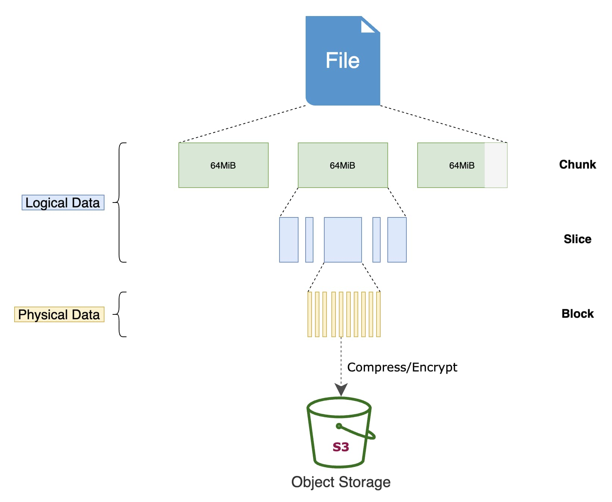
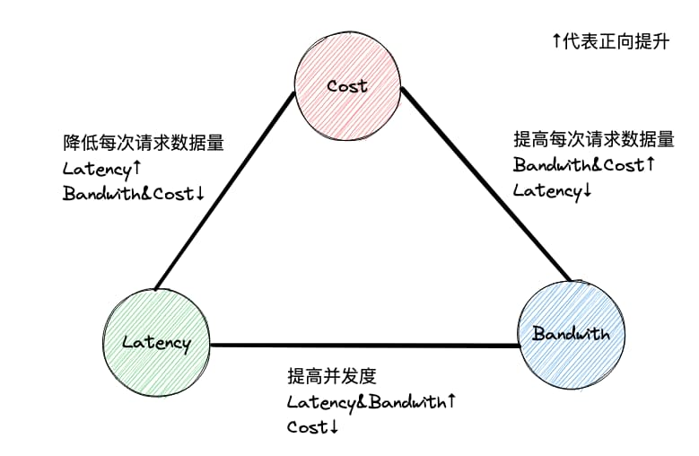

博主最近使用对象存储作为硬盘等块存储文件系统的冷存储替代方案，节约数据储存成本。本文介绍这个方案实现过程中的踩坑记录，以及阿里云 OSS 的几种使用方式的最佳实践与性能分析

<!--more-->

## 项目背景

随着我们系统的数据量越来越大，昂贵的 SSD 硬盘在机器成本中占了大头。但是绝大多数数据随着保存时间的增长会变成“冷数据”，即很少有读取需求。如果我们能将这些冷数据转移到更便宜的储存介质中就可以大幅降低成本

下面是阿里云几种文件存储服务的对比：

 类型  | 规格    | 延迟    | 带宽（MB/s） | 价格（元/GB/月） 
-----|-------|-------|----------|------------
 块存储 | 普通云盘  | 微秒级   | 30~40    | 0.3        
 块存储 | 高效云盘  | 微秒级   | 140      | 0.35       
 块存储 | SSD云盘 | 微秒级   | 300      | 1          
 NAS | 通用型   | 10ms  | 150      | 0.3        
 NAS | 极速型   | 2ms   | 600      | 1.62       
 OSS | 标准型   | 见下文性能分析 | 见下文性能分析    | 0.12 

其中 OSS 拥有极为明显的价格优势，是我们目前使用的 SSD 价格的 12%，是通用型 NAS 的 40%。如果将 1T 的 SSD 数据盘换成 OSS 节省的成本相当于一台 8C32G 的 ECS


因为技术选型原因，博主使用阿里云 OSS 提供的对象存储服务，下文中“对象存储”与“阿里云 OSS”可以等价互换


## OSS 读写方式

块储存和 NAS 原生支持挂载为文件系统，对现有系统无侵入。OSS 的读写方式则比较特殊，主要有以下几种：

### API

#### OSS API

使用 OSS 的客户端或者自行封装 OSS 提供的 Open API 即可使用 OSS 提供的对象存储服务，文档链接：[OSS API 参考](https://help.aliyun.com/document_detail/31948.html)

这里不得不吐槽下 OSS 官方 SDK，都 2202 年了还不提供异步接口，人家 AWS S3 早几年就支持了......

#### S3 API

OSS 兼容部分 S3 API，基本覆盖了上传、下载和查询元数据接口，相关文档：[AWS S3兼容性](https://help.aliyun.com/document_detail/389025.html)

理论上支持 S3 的工具也可在 OSS 上使用

### 挂载文件系统

#### Linux fuse

得益于 OSS 支持 S3 API，可以使用 [S3FS](https://github.com/s3fs-fuse/s3fs-fuse) 来将 OSS 挂载为本地目录

S3FS 使用 Linux fuse 技术在用户空间构建文件系统，部分兼容 POSIX。换句话说就是可以当成一块硬盘挂载使用，相关使用限制可以阅读项目文档 [limitations 部分](https://github.com/s3fs-fuse/s3fs-fuse#limitations)

S3FS 是一个纯粹的开源软件，主要贡献者是 Google 和 Yahoo 的两个老哥。缓存等功能还不成熟，稳定性既没有商业公司背书也没有找到大规模生产使用的案例

#### 虚拟文件系统

基于对象储存构建的分布式文件系统，比如 JuiceFS。它主要解决了三个问题：

1. 完全兼容 POSIX、HDFS
2. 支持通过 fuse、csi 挂载到服务器或 k8s pod 中，也可使用 S3 client、WebDAV client、Hadoop client 访问
3. 托管文件元数据，解决元数据访问的性能问题

JuiceFS 官方文档中有与 S3FS 的对比：[JuiceFS vs. S3FS](https://juicefs.com/docs/community/comparison/juicefs_vs_s3fs/)

JuiceFS 上储存的文件会被拆分成为一个个 4MB 的 Block 储存在对象储存中，这意味着不再能直接从 OSS 读取文件，必须依赖 JuiceFS server 的转换

## OSS 性能分析

将 OSS 挂载为文件系统的方案各有缺点，我们只能赤膊上阵用 OSS API 来改造我们的现有系统。首先要做的工作就是性能测试，看下 OSS 的性能是否能满足我们的需要。做性能分析之前需要先了解对象存储的特性，对其能达到的性能有一个预期：

- 无限的储存空间
- 文件一旦写入无法修改（Appendable 的文件可追加写入）
- 仅支持有限的 API：元数据操作如遍历文件性能差、无法重命名（相当于重新上传）、无法监听文件变更等等
- IOPS/QPS 很低且[受限](https://help.aliyun.com/document_detail/54464.html)，需尽量 batch 上传/下载，但访问延迟与每次请求的数据量正相关
- 单线程带宽有限，如需更高带宽要并发请求
- [计费方式](https://www.aliyun.com/price/product#/oss/detail/ossbag)为按储存容量和 API 调用次数计费

基于对象存储的以上特性，在访问的数据量一定时延迟、带宽、成本构成三元悖论，需要针对不同场景做出权衡：

- 每次请求上传/下载更多的数据可以提高带宽但是带来更大的延迟，反之可以降低延迟但是减少带宽
- 多个连接并发请求可以提升带宽并降低延迟，但是会提高请求的 QPS 进而提高成本

### 上传

OSS 提供三种上传 API：

- AppendObject
- MultipartUpload
- PutObject

其中 MultipartUpload 在所有分片全部上传完之前整个文件是不可见的，这种方式不适用于我们的场景首先 pass 掉

剩下 AppendObject 和 PutObject 对比：AppendObject 更加灵活，只不过是一些版本控制、加密等功能无法使用，并且 AppendObject 的写入性能相比 PutObject 更高：

- AppendObject：60MB/s
- PutObject：50MB/s


以上数据的测试方法均为阿里云 ECS 上使用 OSS 的内网接入点上传 1G 随机内容的文件。下文对下载性能的测试使用类似方法不再赘述


### 下载

三种上传 API 分别对应三种文件类型：

- Appendable
- Multipart
- Normal

这三种类型的文件均可使用 GetObject API 来下载某个区间的数据，Appendable 和 Normal 类型的文件下载性能测试如下：

- Appendable：
  - 单线程 6.6MB/s
  - 5 线程 27.9MB/s
  - 20 线程 108.0MB/s
- Normal：
  - 单线程 35.9MB/s
  - 5 线程 85.0MB/s
  - 20 线程 152.9MB/s

Normal 文件和 Appendable 文件下载性能相比于上传差距要大得多。特别是在并发线程数少的场景，Normal 文件相比于 Appendable 有巨大的性能优势。可见 Appendable 文件适合读写比小（读取与写入量的比值。这个值越低说明对读取的需求越小，即对读取性能要求更低）的文件

### 元数据操作

考虑到 OSS 不能重新写入文件，所以一但上传失败/中断就需要重新上传整个文件。为了避免失败重传整个大文件，我们需要将本地文件分割成一个个较小的文件切片再上传


分割后的文件也不能过于小，否则会影响 OSS 内部的预读策略


但是这种方案会导致 OSS 上的文件数量急剧增多，而且 ListObjects API 获取文件元数据性能差且每次最多只能返回 1000 个文件。我们最终采用本地管理元数据的方案：即本地维护一份 OSS 上文件路径、大小等信息。读取请求先遍历本地元数据，找到相应的文件路径后再从 OSS 获取数据

### 总结

最后总结下我们的系统如何平衡成本和性能：

- 读写比小的文件使用 AppendObject 追加上传，读取时加大并发换取更大的带宽
- 读写比大的文件本地缓存起来，攒够一定大小使用 PutObject 上传，保证性能的同时节约成本
- 元数据本地管理进一步降低 API 调用费
