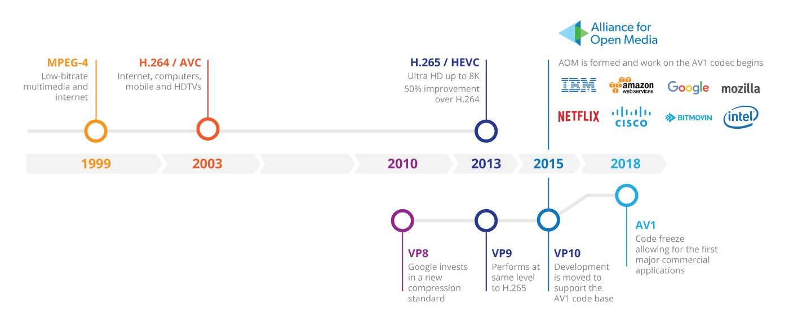

## 什么是 AV1

AV1 全称 AOMedia Video 1 是 AOM (Alliance for Open Media) 在 2018 年推出的新一代视频编码标准，其设计目的是提供更好的质量、更小的体积，以用于在互联网上传输高质量的视频。目前 Chrome 69 和 Firefox 63 中都添加了对 AV1 的支持（需要手动开启），LAV 在 [0.73](https://github.com/Nevcairiel/LAVFilters/releases/tag/0.73) 中开始支持对 AV1 的解码。

<!--more-->


更详细的介绍可以参考以下两篇文章：

- [mozilla research](https://research.mozilla.org/av1-media-codecs/)
- [AV1 or HEVC? How to choose the best video codec](https://www.theoplayer.com/blog/av1-hevc-comparative-look-video-codecs)

## 编译 AV1 codec

### 编译所需环境：

1.  [CMake](https://cmake.org/) version 3.5 or higher.
2.  [Git](https://git-scm.com/).
3.  [Perl](https://www.perl.org/).
4.  For x86 targets, [yasm](http://yasm.tortall.net/), which is preferred, or a recent version of [nasm](http://www.nasm.us/).
5.  Building the documentation requires [doxygen](http://doxygen.org/).
6.  Building the unit tests requires [Python](https://www.python.org/).
7.  Emscripten builds require the portable [EMSDK](https://kripken.github.io/emscripten-site/index.html).

### 环境搭建：

- cmake：[cmake 3.7.1](https://cmake.org/download/)
- make/gcc：[MinGW-W64](https://mingw-w64.org/) （一定要选 64 位的 MinGW）
- perl：[strawberry-perl-5.28.1.1-64bit](http://strawberryperl.com/download/5.28.1.1/strawberry-perl-5.28.1.1-64bit.msi)
- yasm：[yasm-1.3.0-win64](http://www.tortall.net/projects/yasm/releases/yasm-1.3.0-win64.exe)

安装上述环境并添加环境变量后即可开始编译

### 编译流程：

1.  clone 代码

```bash
git clone https://aomedia.googlesource.com/aom
```

2.  在 `aom` 文件夹外新建一个文件夹 `aom_build`

```bash
cd aom_build
cmake ../aom
make
```

3.  一切正常的话你会在 `aom_build` 中看到 `aomenc.exe` 和 `aomdec.exe`，这就是我们要的 codec

```bash
// aomenc --help 可以看到编码器版本
Included encoders:

    av1    - AOMedia Project AV1 Encoder 1.0.0-1047-gf4e775cf3 (default)

        Use --codec to switch to a non-default encoder.
```
