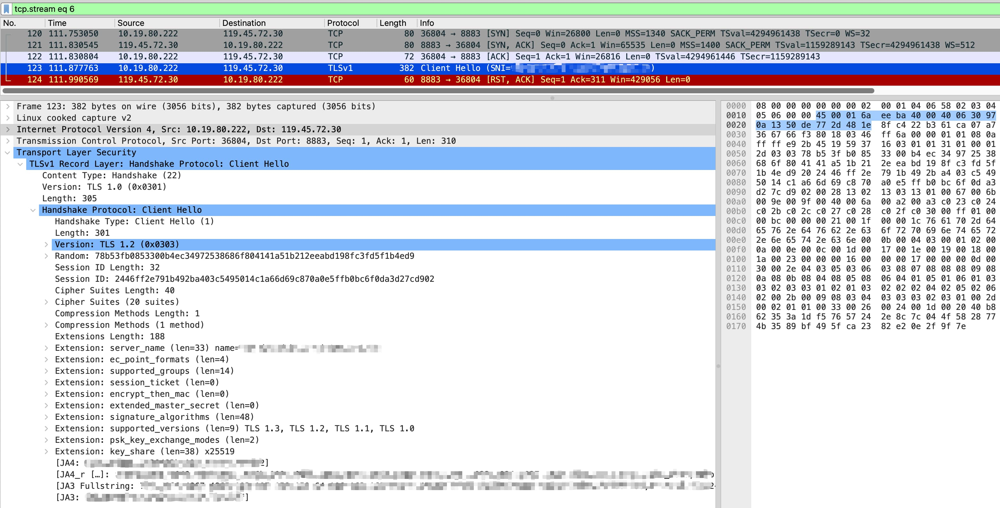
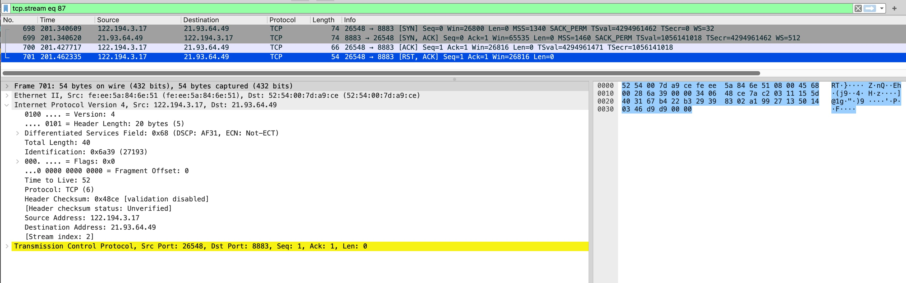

## 背景

某客户反馈其部分终端设备无法访问我方服务，故障现象呈现设备选择性断连的特征，需要我们协助排查。好在该问题可以稳定复现，所以我们请客户在测试环境中复现问题并进行抓包，于是便开始了本次排查之旅

## mTLS 认证排查

因为客户使用 mTLS 进行认证和加密连接，并且只有部分设备出现问题。所以优先怀疑设备客户端证书非法或者过期。我们的服务端实现了对客户端证书链的校验逻辑，在证书校验不通过时会记录审计日志。所以我们请客户在测试环境中复现问题并进行抓包，希望能够拿到用户设备使用的证书以便于我们进行排查：



看到这个抓包文件就发现事情并不这么简单：报文中并没有证书交换的过程，只有一个 `Client Hello` 报文，然后收到了 RST 报文导致连接重置。这说明服务端在没有接收到客户端证书的情况下断开了连接，我们在服务端的审计日志中没有在用户抓包时段看到任何证书校验失败的记录也佐证了这点

由于应用层无有效信息，需要进一步在服务端执行网络抓包以定位问题

## 网络链路分析

在开始服务端抓包之前首先需要梳理一下网络链路：客户的设备通过公网访问我们的服务，用户侧没有网关设备。但是在服务侧有接入网关和负载均衡器，用户的设备通过自定义的域名 CNAME 解析到我们的接入网关，接入网关会将请求转发到应用服务器。整个链路大致如下：

```
用户终端设备
    |
    |  公网
    |
公网接入网关
    |
    |  内网
    |
L4 负载均衡器
    |
    |  内网
    |
应用服务器
```

直觉上怀疑用户网络环境上的 DNS 配置有问题，导致流量没有打到我们服务的接入网关上，而是被劫持到其他地方。但是通过对比用户侧正常的设备和异常的设备的抓包，发现 DNS 解析的结果是一样的，说明 DNS 解析没有问题

接下来我们在应用服务器上进行抓包，验证客户设备的请求是否正常抵达，以排除网络路由的问题

## 抓包分析

通过和用户约定时间同时抓包发现，确实有请求到达了我们的应用服务器：



但是对比客户端抓包，并没有出现 `Client Hello` 报文，并且更奇怪的是服务端抓包显示 RST 报文来自对端！也就是说客户端和服务端均认为对方发了 RST 报文，那么大概率就是“中间人”同时向两侧发的 RST 报文

那么怎么快速判断所谓的“中间人”是哪一侧的网络设备呢？这里有个小技巧，可以通过 TTL 来判断：

服务端的流量记录：收到了三个来自客户端的报文

- SYN：TTL=52
- ACK：TTL=52
- RST：TTL=52

客户端的流量记录：这里客户端收到了三个来自服务端的报文

- SYN, ACK：TTL=50
- RST：TTL=64

可以看到客户端收到的报文的 TTL 值改变了，这说明客户端收到的 RST 报文不是服务端发的，而且相比于服务端的 TTL 值更大。可以推测出这个 RST 报文可能是来自于靠近用户侧的网络设备发出

## 结论

考虑到用户使用公网自定义域名访问，并且在发出 `Client Hello` 报文后就被重置连接，怀疑是遭遇了 SNI 阻断。向用户反馈了这个情况后，用户和他们的运营商进行了联系发现是运营商一侧的网络配置问题导致，本次事件也算是圆满解决了