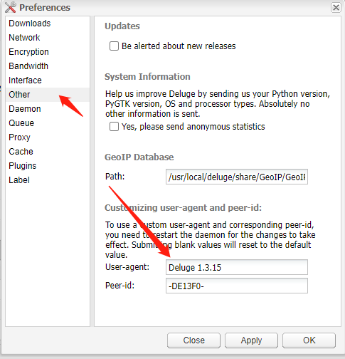

本文提供一种修改 Deluge 的 user-agent 和 peer-id 的方法，用于伪装其他 BT 下载工具，绕过某些限制

PS：附部分 BT 下载工具 user-agent 和 peer-id 列表

 <!--more-->


如果你不知道如何安装 Deluge 请先阅读 [Deluge 一键安装脚本]()


## TL;DR

可以使用 dzhuang 打包好的 docker iamge: [dzhuang/docker-deluge](https://hub.docker.com/r/dzhuang/docker-deluge)

在设置中直接修改 user-agent 和 peer-id




dzhuang 提供了[源码仓库](https://github.com/dzhuang/deluge-alpine-build)，请使用者自行评估


## 修改 user-agent

打开文件 `/usr/lib/python3/dist-packages/deluge/core/core.py`

修改 123 行左右：

```diff
# Start the libtorrent session.
- user_agent = 'Deluge/{} libtorrent/{}'.format(DELUGE_VER, LT_VERSION)
+ user_agent =  'Transmission/2.11'
```

## 修改 peer-id

修改 291 行左右：

```diff
peer_id = substitute_chr(peer_id, 6, release_chr)

- return peer_id
+ return '-TR2110-'
```


虽然这是 Deluge 2.0.3 的教程，但 Deluge 其他版本修改方式大同小异，搜索字符串 user_agent 和 peer_id 也能找到关键代码位置


## 部分 BT 下载工具 user-agent 和 peer-id 列表

| name              | user-agent              | peer-id  |
| ----------------- | ----------------------- | -------- |
| utorrentMac 1.6.4 | uTorrentMac/1640(27255) | -UM1640- |
| utorrent 2.2.1    | uTorrent/2210(25110)    | -UT2210- |
| Transmission 2.11 | Transmission/2.11       | -TR2110- |
| Deluge 1.3.5      | Deluge/1350             | -DE1350- |
