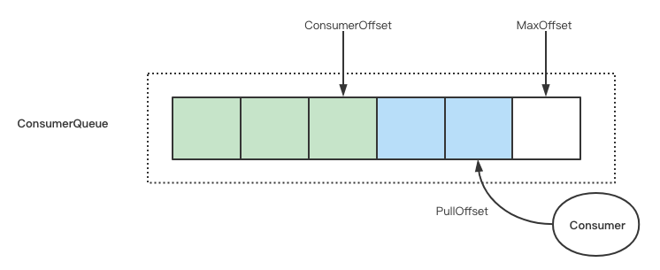
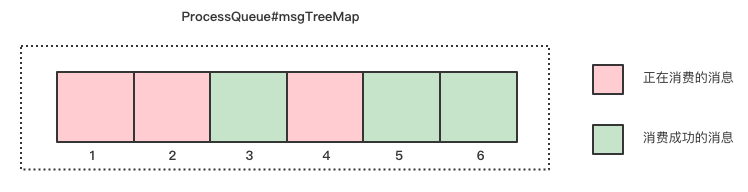

## 背景

消息堆积是消息中间件的一大特色，也是消息中间件的核心能力。但是消息堆积也是消费滞后的一种表现形式，过量的堆积难免会影响上下游的业务。所以对消费堆积量和延迟时间的监控意义重大，本文详解 RocketMQ 消费堆积量和消息消费延时这两个重要指标的含义和算法实现，说明其在对消息延时要求较高和启用消息过滤等场景中的局限并给出优化方法


本文适用于集群消费模式下使用 DefaultMQPushConsumer 进行消费的情况


## 消费位点的管理：ConsumerOffset、PullOffset 和 MaxOffset

RocketMQ 中每个 Topic 都会创建若干个 ConsumerQueue。消费者订阅某个 Topic 实际上会分配到一个或几个 ConsumerQueue，然后消费 ConsumerQueue 上的消息，所以 RocketMQ 对消费位点的管理也是基于 ConsumerQueue 的



上图中展示了三个和消费进度有关的位点：

- ConsumerOffset：消费者确认消费成功的位点，也称为 CommitOffset
- PullOffset：消费者拉取消息的位点
- MaxOffset：消费者可以消费到的最大位点

下面详细解释这三个位点的计算方法

### ConsumerOffset

消费者在每次拉取消息的请求中都会设置一个 commitOffset 字段（PullMessageRequestHeader#commitOffset）Broker 根据这个字段调用 ConsumerOffsetManager#commitOffset 来更新 offsetTable。offsetTable 的储存结构如下：

```json
{
  "offsetTable": {
    // topic@consumerGroup
    "test-topic@test-group": {
      // queueId: consumerOffset
      "0": 88526,
      "1": 88528
    }
  }
}
```

下面我们来分析一下消费者拉取请求中的 PullMessageRequestHeader#commitOffset 字段是如何计算出来的：

PullMessageRequestHeader 是在 PullAPIWrapper#pullKernelImpl 方法中构造的，而这个方法被 DefaultMQPushConsumerImpl#pullMessage 调用：

```java
long commitOffsetValue = 0L;
if (MessageModel.CLUSTERING == this.defaultMQPushConsumer.getMessageModel()) {
    commitOffsetValue = this.offsetStore.readOffset(pullRequest.getMessageQueue(), ReadOffsetType.READ_FROM_MEMORY);
    if (commitOffsetValue > 0) {
        commitOffsetEnable = true;
    }
}

this.pullAPIWrapper.pullKernelImpl(
    pullRequest.getMessageQueue(),
    subExpression,
    subscriptionData.getExpressionType(),
    subscriptionData.getSubVersion(),
    pullRequest.getNextOffset(),
    this.defaultMQPushConsumer.getPullBatchSize(),
    sysFlag,
    commitOffsetValue,
    BROKER_SUSPEND_MAX_TIME_MILLIS,
    CONSUMER_TIMEOUT_MILLIS_WHEN_SUSPEND,
    CommunicationMode.ASYNC,
    pullCallback,
    subProperties
);
```

消费者在内存中维护了一个 offsetStore，每次拉取消息时从 offsetStore 中读取 commitOffset 发送给 Broker

那么问题就变成了 offsetStore 是如何维护位点信息的：集群模式下 offsetStore 的实现是 RemoteBrokerOffsetStore，消费者处理消费结果时 ConsumeMessageConcurrentlyService#processConsumeResult 会调用 RemoteBrokerOffsetStore#updateOffset 方法更新位点：

```java
long offset = consumeRequest.getProcessQueue().removeMessage(consumeRequest.getMsgs());
if (offset >= 0 && !consumeRequest.getProcessQueue().isDropped()) {
    this.defaultMQPushConsumerImpl.getOffsetStore().updateOffset(consumeRequest.getMessageQueue(), offset, true);
}
```

分析上面代码可以看出更新的位点通过调用 ProcessQueue#removeMessage 获取。ProcessQueue 持有一个 TreeMap 作为消息本地缓存，消费者每次拉取的消息都会先缓存在 ProcessQueue 中，当消费完成时再从 ProcessQueue 中移除对应的消息：

```java
/**
* message list, contains message in waiting & consuming list
*/
private final TreeMap<Long, MessageExt> msgTreeMap = new TreeMap<Long, MessageExt>();

public long removeMessage(final List<MessageExt> msgs) {
    // 省略消息删除过程
    return msgTreeMap.isEmpty() ? (this.queueOffsetMax + 1) : msgTreeMap.firstKey();
}
```

ProcessQueue#removeMessage 的返回值是当前缓存的消息中最小的位点，也就是说消费者每次更新的 commitOffset 是**当前还未消费的第一个消息的位点**：



如上图所示的情况下更新的位点应该为 1 而不是 6

### PullOffset

Broker 在回复消费者拉取消息的响应中有 nextBeginOffset 字段（PullResult#nextBeginOffset）这个字段也就是 PullOffset

分析 PullMessageProcessor#processRequest 可以发现 nextBeginOffset 字段是从 DefaultMessageStore#getMessage 方法的返回值中提取的：

```java
getMessageResult = this.brokerController.getMessageStore().getMessage(requestHeader.getConsumerGroup(),
                    requestHeader.getTopic(), requestHeader.getQueueId(), requestHeader.getQueueOffset(),
                    requestHeader.getMaxMsgNums(), messageFilter);

responseHeader.setNextBeginOffset(getMessageResult.getNextBeginOffset());
```
分析 DefaultMessageStore#getMessage 方法发现 nextBeginOffset 是当前拉取到的消息的下一条消息的位点，这段源码太复杂就不贴出来了

### MaxOffset

RocketMQ 的消息是先储存在 CommitLog 中然后由 ReputMessageService 异步构建 ConsumerQueue 和 IndexFile，最终调用 ConsumeQueue#putMessagePositionInfo 写入磁盘

```java
this.byteBufferIndex.flip();
this.byteBufferIndex.limit(CQ_STORE_UNIT_SIZE); // CQ_STORE_UNIT_SIZE = 20
this.byteBufferIndex.putLong(offset);
this.byteBufferIndex.putInt(size);
this.byteBufferIndex.putLong(tagsCode);

MappedFile mappedFile = this.mappedFileQueue.getLastMappedFile(expectLogicOffset);
if (mappedFile != null) {
    return mappedFile.appendMessage(this.byteBufferIndex.array());
}
```

这里可以发现 ConsumeQueue 的每个 item 都是固定长度 20 字节。所以 MaxOffset 的计算就很简单了，用 ConsumeQueue 文件大小除以 20 即可

## 消费堆积算法

有了上述位点就可以很容易的算出三种消息堆积量：

<div>
$$
\begin{aligned}
未确认的消息量：ConsumerLag &= &MaxOffset\ -\ &ConsumerOffset \\
正在消费的消息量：InflightMessageCount &= &PullOffset\ -\ &ConsumerOffset \\
等待拉取的消息量：AvailableMessageCount &= &MaxOffset\ -\ &PullOffset
\end{aligned}
$$
</div>

RocketMQ 中默认的消费堆积是上式中的 ConsumerLag

消息延时的算法类似，将上式中的 offset 换成对应位点消息的时间即可

## 堆积计算优化

### 消息延时要求较高的场景

通过对 ConsumerOffset 计算方法的分析可以看出 ConsumerOffset 的更新是存在延迟的，这个延迟分为两个方面：

1. 拉取延时：ConsumerOffset 在每次拉取新消息时更新，而 RocketMQ 是使用长轮询方式更新消息，每次长轮询的默认超时时间是 30s。也就是说如果没有足够数量的消息产生，ConsumerOffset 要 30s 才能更新一次
2. 消费延时：消费者每次提交的 commitOffset 字段是当前还未消费的第一个消息的位点而不是最后一个消费成功的消息的位点。之前的消息未能结束消费的情况下后面已经消费完的消息位点就迟迟得不到更新

所以在消息数量很少但是消费速度很慢的场景下由 ConsumerOffset 计算出来的消息的堆积量和延迟时间的指标就会虚高，但是实际上这些消息已经被消费者拉取到并进行处理了。这时就应该使用 PullOffset 来计算堆积量

### 开启消息过滤时的堆积计算

因为堆积量是通过位点直接计算得来的，在消费者开启消息过滤时这种算法不能正确处理将被过滤掉的消息，所以会导致堆积量偏高。这种情况下可以计算一下当前 topic 中命中过滤规则的消息占总消息的比例，然后用这个比例乘以堆积量来估计一下真实的堆积量
