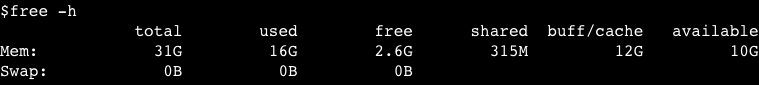
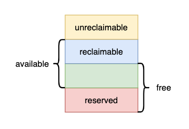

通过一个线 k8s 内存水位误报警深入分析 Linux 内存管理中各种内存指标计算的原理

TLDR：如果你的应用统会涉及较多的文件读写，可以将 k8s 内存水位告警指标由 container_memory_working_set_bytes 改为 container_memory_rss。这样可以防止 page cache 占用空闲内存带来的误报警

<!--more-->

## 问题描述

前些天我们的 k8s 线上集群触发内存水位报警，报警显示某个 Pod 的内存使用率高达 85%。然而登陆到 pod 上发现应用实际占用的内存占用只有 50%，但是用 free 命令看到的内存占用又是符合报警水位（total 31G，free 2.6G）



再细看一下 free 打印出的信息发现 buff/cache 占用有 12G，这部分内存用到哪里了？10G 的 available 是不是指这些 cache 中有 10G 是可以释放的？那不能释放的 2G 是用来做什么的？应用真实内存占用应该看哪个指标？接下来我们依次回答这些问题

## Linux 内存分类

我们知道 Linux 中一个非常重要的概念是万物皆文件，Linux 的内存实际上是外存上各种文件的缓存。也就是说我们申请的内存实际上对应一个真实的文件（各种设备/Socket），这种内存被称为 page cache

我们来看看 Linux 权威文档中是如何介绍这种内存的：

> The physical memory is volatile and the common case for getting data into the memory is to read it from files. <mark>Whenever a file is read, the data is put into the page cache to avoid expensive disk access on the subsequent reads.</mark> Similarly, when one writes to a file, the data is placed in the page cache and eventually gets into the backing storage device. The written pages are marked as dirty and when Linux decides to reuse them for other purposes, it makes sure to synchronize the file contents on the device with the updated data.
> ——[The Linux kernel user’s and administrator’s guide](https://www.kernel.org/doc/html/latest/admin-guide/mm/concepts.html#page-cache)

其中最关键的一句话：每当读取一个文件，数据会被缓存在 page cache 中以避免后续访问时重复读取磁盘带来的昂贵开销。也就是说我们平时访问文件（read 或 mmap 系统调用）都会创建对应的 page cache，这部分内存由操作系统管理，并不记录在用户程序的内存开销中

这个文档中同时也介绍了另外一种内存类型：匿名内存（anonymous memory）

> <mark>The anonymous memory or anonymous mappings represent memory that is not backed by a filesystem.</mark> Such mappings are implicitly created for program’s stack and heap or by explicit calls to mmap(2) system call. Usually, the anonymous mappings only define virtual memory areas that the program is allowed to access. The read accesses will result in creation of a page table entry that references a special physical page filled with zeroes. When the program performs a write, a regular physical page will be allocated to hold the written data. The page will be marked dirty and if the kernel decides to repurpose it, the dirty page will be swapped out.
> ——[The Linux kernel user’s and administrator’s guide](https://www.kernel.org/doc/html/latest/admin-guide/mm/concepts.html#anonymous-memory)

这里的匿名指的是不需要手动指定对应的文件，系统会为其指定一个填充为 0 的特殊文件（/dev/zero）。程序的堆栈就属于这种内存，此外还有一种匿名映射（anonymous mappings）也属于匿名内存


mmap 设置 flag 为 MAP_PRIVATE 时创建的内存才属于匿名内存，注意与 MAP_ANONYMOUS 区分
- MAP_ANONYMOUS 作用是不显式指定映射的文件（默认为 /dev/zero）
- MAP_PRIVATE 作用是使内存的修改对其他进程不可见（即 copy on write 模式）并且不会将脏页写回文件

MAP_ANONYMOUS 一般和 MAP_SHARED 或 MAP_PRIVATE 同时使用：
mmap 的 flag 设置为 MAP_ANONYMOUS|MAP_SHARED 时创建的内存属于 page cache，常用于在相关进程间共享内存
mmap 的 flag 设置为 MAP_ANONYMOUS|MAP_PRIVATE 时创建的内存属于匿名内存，常用于内存分配（glibc 分配大块内存）


现在可以回答第一个问题，buff/cache 占用的 12G 内存都用在哪里：我们的系统使用 mmap 映射了很多文件，buff/cache 占用的 12G 内存就是这些文件 page cache 占用的空间


这里的 buffer 指的是 buffer cache 块设备缓存，而 page cache 是页缓存。从名字就可以发现它们的数据是一样的，现代 Linux 中这两者也是融合的：buffer cache 的数据直接储存在 page cache 中


## Linux 内存回收策略

按照我们朴素的观点只有匿名内存是不可回收的， cache 都是可回收的。但是为什么 free 打印出的信息中 available(10G) 小于 buffer/cache(12G) 的值？

我们可以按照 Linux 文档的说明尝试清除 page cache（`echo 1 > /proc/sys/vm/drop_caches`）来验证这个假设

> Writing to this will cause the kernel to drop clean caches, as well as reclaimable slab objects like dentries and inodes.  Once dropped, their memory becomes free.
> 
> To free pagecache:
>	&nbsp;&nbsp;&nbsp;&nbsp;echo 1 > /proc/sys/vm/drop_caches
> To free reclaimable slab objects (includes dentries and inodes):
>	&nbsp;&nbsp;&nbsp;&nbsp;echo 2 > /proc/sys/vm/drop_caches
> To free slab objects and pagecache:
>	&nbsp;&nbsp;&nbsp;&nbsp;echo 3 > /proc/sys/vm/drop_caches
> 
> <mark>This is a non-destructive operation and will not free any dirty objects.</mark> To increase the number of objects freed by this operation, the user may run `sync' prior to writing to /proc/sys/vm/drop_caches.  This will minimize the number of dirty objects on the system and create more candidates to be dropped.
> ——[Documentation for /proc/sys/vm/*](https://www.kernel.org/doc/Documentation/sysctl/vm.txt)

我们发现 free 命令看到的 buff/cache 并没有全部被回收。文档中也给出了解释：脏页并不会回收（will not free any dirty objects），这里说的脏页分为以下几种：

1. 被修改但未写回磁盘的 page cache：用 sync 强制脏页落盘后再尝试 drop cache 即可回收
2. tmpfs/shmem：tmpfs 和共享内存（SysV shared memory 和 POSIX shared memory）
3. shared anonymous mmap：使用 flag 为 MAP_ANONYMOUS|MAP_SHARED 的 mmap 获得的内存

后两者在 free 命令的输出中既属于 buff/cache，也属于 shared。这些内存在主动释放前不能被回收

除了脏页外还有一些特殊的不可回收的页面：

1. 内核使用的页面：DMA buffer 等
2. 标记为 unreclaimable 的页面：如使用 mlock 锁定的内存


内核使用的页面也有可回收的，比如文件系统元数据（dentries/inodes）这种可以从存储设备中重新读取的页面。这些页面被称为 SReclaimable，可以使用 `echo 2 > /proc/sys/vm/drop_caches` 进行回收


## Linux 内存水位控制与可用内存计算

既然但是为什么 available 的值不等于 reclaimable + free？我们继续从 Linux 文档中寻找答案

> When the system is not loaded, most of the memory is free and allocation requests will be satisfied immediately from the free pages supply. As the load increases, the amount of the free pages goes down and when it reaches a certain threshold (<mark>low watermark</mark>), an allocation request will awaken the kswapd daemon. It will asynchronously scan memory pages and either just free them if the data they contain is available elsewhere, or evict to the backing storage device (remember those dirty pages?). As memory usage increases even more and reaches another threshold - <mark>min watermark</mark> - an allocation will trigger direct reclaim. In this case allocation is stalled until enough memory pages are reclaimed to satisfy the request.
> ——[The Linux kernel user’s and administrator’s guide](https://www.kernel.org/doc/html/latest/admin-guide/mm/concepts.html#reclaim)

这里提到了两个 watermark：

1. low watermark：当 free 内存低于 low watermark 时触发异步内存回收
2. min watermark：当内存低于 min watermark 时暂停内存分配，立即进行内存回收

也就是说系统中剩余的内存不能低于 min watermark，这是一个操作系统的保护机制：预留一部分内存给内存回收等关键程序使用。这些程序使用 PF_MEMALLOC 标识忽略 watermark 的限制，在需要的时候不必等待内存回收就可以立刻获得内存

可以通过 `cat /proc/zoneinfo` 看到 min watermark 的取值，单位是页。下面这个示例中系统预留了 10478 页，也就是大约 40M 的内存

```shell
cat /proc/zoneinfo

...
Node 0, zone   Normal
  pages free     780839
        min      10478
        low      13097
...
```

所以 free 的内存并不都是可分配的，需要减去系统保留内存，即 available = reclaimable + free - reversed




除了 watermark 以外还有 min_free_kbytes 和 watermark_scale_factor 等参数影响系统保留内存的计算，这部分内存本文中统称为 reversed 不再详述


## k8s 内存监控

上文中说的 buff/cache、free、available 都是从 free 命令看到的结果，而 k8s 的内存相关监控指标略有不同

- free 命令是从 `/proc/meminfo` 中取值计算，相关原理和各字段解释可以阅读这篇文章： [/PROC/MEMINFO之谜](http://linuxperf.com/?p=142)
- k8s cadvisor metrics 指标是从 `/sys/fs/cgroups/memory/memory.status` 中取值计算，可以阅读这篇文章来验证：[验证 Pod cgroup 限制](https://kubernetes.io/zh-cn/docs/concepts/scheduling-eviction/pod-overhead/#%E9%AA%8C%E8%AF%81-pod-cgroup-%E9%99%90%E5%88%B6)

这里给出部分 k8s cadvisor metrics 指标的解释：

| cadvisor 指标                      | 取值                      |
|------------------------------------|--------------------------|
| container_memory_usage_bytes       | 分配的总内存               |
| container_memory_working_set_bytes | 分配的总内存 - 不活跃的 page cache  |
| container_memory_rss               | 使用的匿名内存             |
| container_memory_cache             | page cache 占用内存       |

container_memory_working_set_bytes 是最常用的内存监控指标，也是判断 limit 的依据。

回到文章开头的问题，我们线上使用的报警指标就是 container_memory_working_set_bytes，这个指标是包含了一部分 page cache 的所以要偏高一些。用这个指标来配置告警如果应用使用 page cache 较多（比如打开大量文件）就会产生误报

监控内存水位是为了及时发现应用存在 OOM 的风险，实际上我们应该关心的是 available 指标。但是 k8s 又没有提供和 available 等价的 metrics，只能迂回使用 container_memory_rss 来配置告警，这个指标是应用真实占用的内存即 unreclaimable 部分
