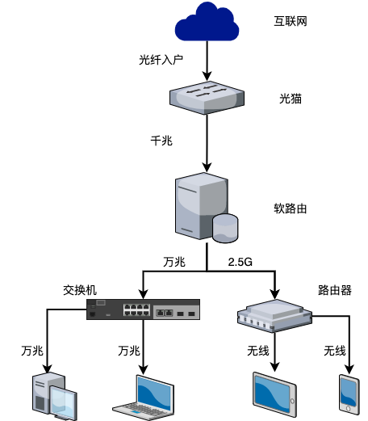

## 硬件设备

### 网线

网线用来连接各个网络设备。一般有双绞线（电口）和光纤（光口）两种。光纤网线用于带有光口网卡的设备，双绞线用于连接常见的 RJ45 网口。双绞线分 6 类线、7 类线等等很多等级，这里根据布线的需要选择即可：如果需要万兆网络就购买支持万兆速率的网线，如果需要连接比较远的设备就购买带屏蔽网的网线

### 网卡

用于连接网络的设备，可以在 windows 的设备管理->网络适配器中看到你电脑的网卡。网卡最重要的属性就是连接速度，根据最大连接速度有百兆、千兆、万兆网卡。连接网络时需要两个设备的网卡协商出一个连接速度，而这个速度并不是任意选择的，一般的千兆网卡只有 1000M、100M、10M 这三档可选。如果你要购买万兆网卡就要事先问好商家是否支持 2.5G 的连接速度，以免浪费路由器的 2.5G 网口

### 光猫

所谓光猫学名调制解调器，和 ADSL 时代的猫本质上没有什么区别，只不过是把电话线换成了光纤。它的作用是将光信号转换为电信号。运营商送的光猫一般还会带有路由器的功能。但是建议只使用它的调制解调能力即桥接模式，路由器通过 PPPoE 上网，这样可以少一层 NAT

### 路由器与交换机

路由器是负责使用 PPPoE 协议拨号上网和发射 WiFi 信号的设备
交换机负责本地网络内的数据交换，说人话就是负责你家手机和电脑之间传输文件

现在的家用路由器都带有基本的交换机功能，如果你需要组建更高速（万兆）家庭网络那么就需要购买专业的万兆交换机

### NAS

NAS 是一个专门用来存放文件的大容量主机。一般 NAS 都会配备多块硬盘，有专门的系统来管理这些硬盘，把他们合并为一个逻辑上的分区然后将这个分区挂载到你的 windows、macos 上

最后来说一下如何选择上述网络设备：
谈到选择网络设备，实际上就是选择需要的连接速度，所以首先说明下两台设备之间的连接速率是如何协商的：它取决于两台设备和网线的最大速率的最小值，比如一个万兆网卡、一个千兆网线、一个千兆网卡之间连接，他们的连接速率就是 1000M，如果将网线换成百兆网线那么连接速率就是 100M

如果需要组建千兆网络，那么你基本不用费心关注这些网络设备的参数，市面上售卖的网线、网卡、路由器都支持千兆网络，只要考虑网线是否够长、WiFi 信号是否足以覆盖全屋即可

如果需要组建万兆网络，就需要考虑购买的网络设备是否支持万兆速率。这里需要指出的是现在国内的运营商没有提供万兆网络入户，所以本系列的万兆网络指的是万兆内网。
现在主流路由器的网口是一个 2.5G wan + 数个千兆 lan，所以组建万兆网络需要购买万兆交换机或者使用带有万兆网卡的软路由。从功耗、性能和功能性的角度来考虑，万兆交换机是更好的选择。这里给出我自用的万兆网络拓补图

## 软件部分

### IP

ip 是一个上网设备的地址标志符，两个设备通过向对方的 ip 地址传送数据包来交换数据
对于家庭网络来说 ip 分为两种：运营商分配给路由器的 ip 和路由器分配给其他上网设备的内网 ip
当你的设备上网时需要使用的是运营商分配的 ip，这样服务器才能找到你的地址，而路由器通过 NAT 技术来将公网服务器发来的数据包转发到你的设备的内网 ip 地址上
但是运营商分配给路由器的 ip 通常不是公网 ip 而是经过了一层 NAT 的运营商内网 ip，别人不能直接通过这个 ip 连接到你。所以如果有搭建服务器或使用 PT 的需求要向运营商确认好是否能够分配一个公网 ip 给你

### PPPoE

PPPoE 协议可以理解为请求运营商分配给你一个 ip 给你的路由器。有了这个地址你的路由器就接入了互联网，可以被其他设备访问到

### DNS

前面说过两个设备如果想互相访问需要知道对方的 ip，但是平时访问百度时都是直接输入百度的域名（www.baidu.com）没有谁输入百度的 ip（220.181.38.148）DNS 就是负责把我们输入的域名转换为 ip
DNS 能不能快速的解析、能不能解析到一个离我们近的服务器在很大程度上决定了我们上网的速度

### DHCP

DHCP 是路由器上负责为下游设备自动分配 ip 和 DNS 服务器的软件，通过它可以为 NAS 分配一个静态地址或者为下游设备指定更快的 DNS 服务器

### 软路由

软路由是软件路由器的简称，其实就是包含 DNS、PPPoE、DHCP 这三种基础功能的服务器。一般的软路由系统比如 OpenWRT 还有丰富的拓展功能，比如用于分享文件的 NFS、SMB；用于下载的 Aria2、deluge；用于激活 windows 的 KMS 等等