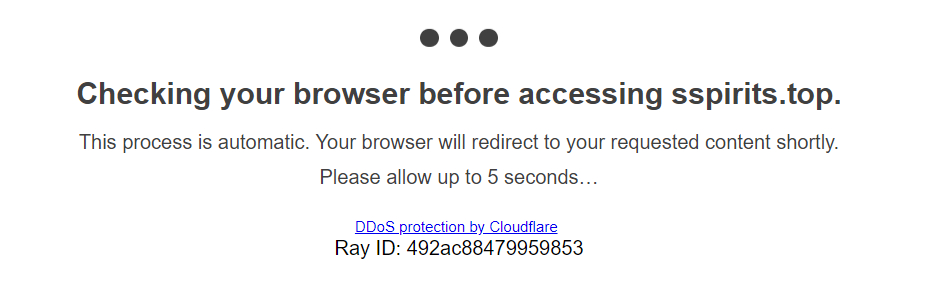
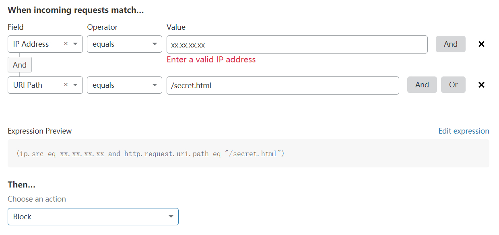
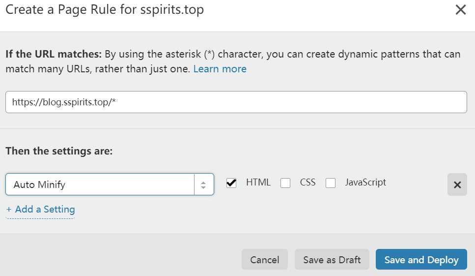

## 全能王 Cloudflare
 
 Cloudflare 是一家提供 DNS 和 CDN 等服务的公司，号称 `Powering over 39% of managed DNS domains` ，其提供的 CDN 服务在功能性（WAF、Page Rules、Argo、Load Balancing）上不知道甩掉国内同行几条街，而且基础功能和流量完全免费。但是基于国情在国内访问不是很理想，更建议体量大的静态资源使用国内 CDN 服务。
 
 Cloudflare 的接入方式默认只支持 DNS 接入，CNAME 接入需要 py（大雾）。这里简单介绍下 Cloudflare 的几个功能。
 
 ### 全站 HTTPS
 
 Cloudflare 免费提供泛域名证书，只要接入他家的 CDN 就可以体验到全站 HTTPS 的舒爽（手动狗头）。需要注意的是免费证书下载下来是自签名证书，只有在 Cloudflare 网络内受信，用它来开启个回源 HTTPS 还行，浏览器是不认的。控制台的 Crypto 标签下可以配置其他相关选项。
 
 ### 自动阻止恶意访问
 
 自动检测出恶意 IP 后使用 challenge page 来进一步甄别和阻止恶意访问（下图是 javascript challenge page），可以在控制台的 Firewall 标签页下调整 Security Level 和 Challenge Passage 的等级，或者在 IP Access Rules 下根据 IP、ASN、 国家等手动配置 。
 
 
 
 ### Web Application Firewall
 
 Cloudflare 提供的 WAF 可以说是相当强大的应用防火墙，免费用户拥有 5 条规则，可以根据 IP、Cookie、host、URI、威胁等级、是否是机器人等匹配规则指定阻止访问或者需要输入验证码等策略。
 
 这里给出一个例子，禁止除我的 IP 以外的用户访问某个敏感页：
 
 
 
 ### Page Rules
 
 对某些页面指定特定的 Cloudflare 设置（缓存等级、过期时间、开启 Always Online 等等），比如对某个子域名的所有 HTML 文件添加自动优化功能：
 
 
 
 ### 添加第三方 APP
 
 在控制台的 Apps 标签下可以添加第三方 App，比如接入 Google Analytics、加入本站使用 Cookie 的提示等等。
 
 ### 其他功能
 
 除了一般的 CDN 该有的功能以外还有自动跳转移动端页面、AMP 优化、 Rocket Loader、Always Online 等实用功能。以上介绍的都是免费功能，如果你愿意付费的话还能享受到 Argo、Load Balancing、Rate Limiting 等进阶功能。
 
 ## 国内 CDN 服务商
 
 前面说过 Cloudflare 虽然功能非常强大，可惜天朝自有国情在，所以主站使用 Cloudflare CDN，静态资源托管在国内云储存这种动静分离的方式可以有更好的体验。
 
 本站使用的是又拍云，我个人觉得又拍云性能和功能上比七牛要好一些，而且比阿里云要便宜 qwq。并且又拍云提供融合云储存，可以将增量文件同步到七牛或者阿里云，加入[又拍云联盟](https://www.upyun.com/league)可以获得 10GB 免费存储空间和 15GB 免费流量（HTTPS 也能用，这点要比七牛良心）
 