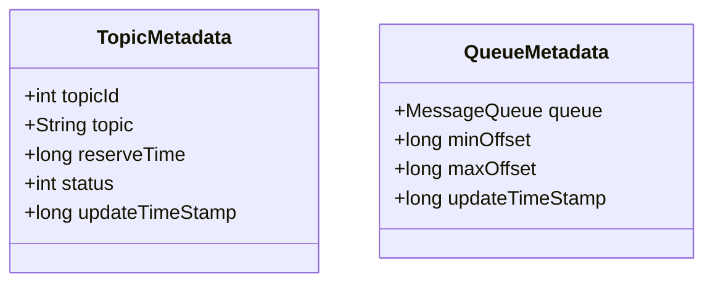
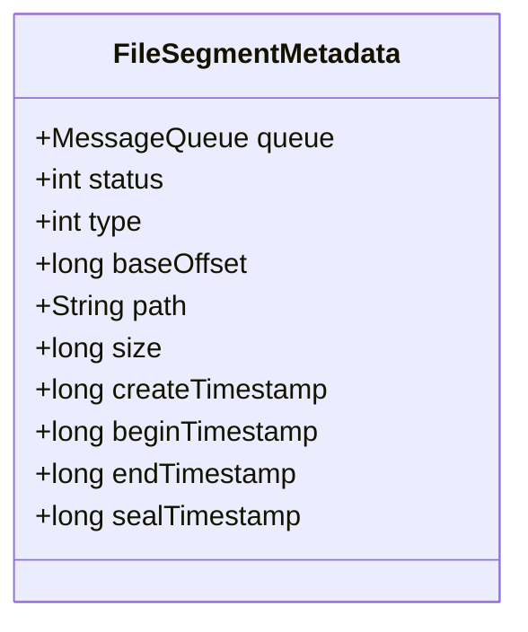

随着 RocketMQ 5.1.0 的正式发布，多级存储作为 RocketMQ 一个新的独立模块到达了 Technical Preview 里程碑：允许用户将消息从本地磁盘卸载到其他更便宜的存储介质，可以用较低的成本延长消息保留时间。本文详细介绍 RocketMQ 多级存储设计与实现

<!--more-->

## 设计总览

RocketMQ 多级存储旨在**不影响热数据读写**的前提下将数据卸载到其他存储介质中，适用于两种场景：

1. 冷热数据分离：RocketMQ 新近产生的消息会缓存在 page cache 中，我们称之为**热数据**；当缓存超过了内存的容量就会有热数据被换出成为**冷数据**。如果有少许消费者尝试消费冷数据就会从硬盘中重新加载冷数据到 page cache，这会导致读写 IO 竞争并挤压 page cache 的空间。而将冷数据的读取链路切换为多级存储就可以避免这个问题

2. 延长消息保留时间：将消息卸载到更大更便宜的存储介质中，可以用较低的成本实现更长的消息保存时间。同时多级存储支持为 topic 指定不同的消息保留时间，可以根据业务需要灵活配置消息 TTL

RocketMQ 多级存储对比 Kafka 和 Pulsar 的实现最大的不同是我们使用准实时的方式上传消息，而不是等一个 CommitLog 写满后再上传，主要基于以下几点考虑：

1. 均摊成本：RocketMQ 多级存储需要将全局 CommitLog 转换为 topic 维度并重新构建消息索引，一次性处理整个 CommitLog 文件会带来性能毛刺

2. 对小规格实例更友好：小规格实例往往配置较小的内存，这意味着热数据会更快换出成为冷数据，等待 CommitLog 写满再上传本身就有冷读风险。采取准实时上传的方式既能规避消息上传时的冷读风险，又能尽快使得冷数据可以从多级存储读取

## Quick Start

多级存储在设计上希望降低用户心智负担：用户无需变更客户端就能实现无感切换冷热数据读写链路，通过简单的修改服务端配置即可具备多级存储的能力，只需以下两步：

1. 修改 Broker 配置，指定使用 `org.apache.rocketmq.tieredstore.TieredMessageStore` 作为 `messageStorePlugIn`
2. 配置你想使用的储存介质，以卸载消息到其他硬盘为例：配置 `tieredBackendServiceProvider` 为 `org.apache.rocketmq.tieredstore.provider.posix.PosixFileSegment`，同时指定新储存的文件路径：`tieredStoreFilepath`


可选项：支持修改 `tieredMetadataServiceProvider` 切换元数据存储的实现，默认是基于 json 的文件存储


更多使用说明和配置项可以在 GitHub 上查看多级存储的 [README](https://github.com/apache/rocketmq/blob/develop/tieredstore/README.md)

## 技术架构



- 接入层：TieredMessageStore/TieredDispatcher/TieredMessageFetcher
  接入层实现 MessageStore 中的部分读写接口，并为他们增加了异步语意。TieredDispatcher 和 TieredMessageFetcher 分别实现了多级存储的上传/下载逻辑，相比于底层接口这里做了较多的性能优化：包括使用独立的线程池，避免慢 IO 阻塞访问热数据；使用预读缓存优化性能等

- 容器层：TieredCommitLog/TieredConsumeQueue/TieredIndexFile/TieredFileQueue
  容器层实现了和 DefaultMessageStore 类似的逻辑文件抽象，同样将文件划分为 CommitLog、ConsumeQueue、IndexFile，并且每种逻辑文件类型都通过 FileQueue 持有底层物理文件的引用。有所不同的是多级存储的 CommitLog 改为 queue 维度

- 驱动层：TieredFileSegment
  驱动层负责维护逻辑文件到物理文件的映射，通过实现 TieredStoreProvider 对接底层文件系统读写接口(Posix、S3、OSS、MinIO 等)。目前提供了 PosixFileSegment 的实现，可以将数据转移到其他硬盘或通过 fuse 挂载的对象存储上

### 消息上传

RocketMQ 多级存储的消息上传是由 dispatch 机制触发的：初始化多级存储时会将 TieredDispatcher 注册为 CommitLog 的 dispacher。这样每当有消息发送到 Broker 会调用 TieredDispatcher 进行消息分发，TieredDispatcher 将该消息写入到 upload buffer 后立即返回成功。整个 dispatch 流程中不会有任何阻塞逻辑，确保不会影响本地 ConsumeQueue 的构建



TieredDispatcher 写入 upload buffer 的内容仅为消息的引用，不会将消息的 body 读入内存。因为多级储存以 queue 维度构建 CommitLog，此时需要重新生成 commitLog offset 字段



触发 upload buffer 上传时读取到每条消息的 commitLog offset 字段时采用拼接的方式将新的 offset 嵌入到原消息中

#### 上传进度控制

每个队列都会有两个关键位点控制上传进度：

1. dispatch offset：已经写入缓存但是未上传的消息位点
2. commit offset：已上传的消息位点



类比消费者，dispatch offset 相当于拉取消息的位点，commit offset 相当于确认消费的位点。commit offset 到 dispatch offset 之间的部分相当于已拉取未消费的消息

### 消息读取

TieredMessageStore 实现了 MessageStore 中的消息读取相关接口，通过请求中的逻辑位点（queue offset）判断是否从多级存储中读取消息，根据配置（tieredStorageLevel）有四种策略：

- DISABLE：禁止从多级存储中读取消息
- NOT_IN_DISK：不在 DefaultMessageStore 中的消息从多级存储中读取
- NOT_IN_MEM：不在 page cache 中的消息即冷数据从多级存储读取
- FORCE：强制所有消息从多级存储中读取，目前仅供测试使用

```java
/**
  * Asynchronous get message
  * @see #getMessage(String, String, int, long, int, MessageFilter) getMessage
  *
  * @param group Consumer group that launches this query.
  * @param topic Topic to query.
  * @param queueId Queue ID to query.
  * @param offset Logical offset to start from.
  * @param maxMsgNums Maximum count of messages to query.
  * @param messageFilter Message filter used to screen desired messages.
  * @return Matched messages.
  */
CompletableFuture<GetMessageResult> getMessageAsync(final String group, final String topic, final int queueId,
    final long offset, final int maxMsgNums, final MessageFilter messageFilter);
```

需要从多级存储中读取的消息会交由 TieredMessageFetcher 处理：首先校验参数是否合法，然后按照逻辑位点（queue offset）发起拉取请求。TieredConsumeQueue/TieredCommitLog 将逻辑位点换算为对应文件的物理位点从 TieredFileSegment 读取消息

```java
// TieredMessageFetcher#getMessageAsync similar with TieredMessageStore#getMessageAsync
public CompletableFuture<GetMessageResult> getMessageAsync(String group, String topic, int queueId,
        long queueOffset, int maxMsgNums, final MessageFilter messageFilter)
```

TieredFileSegment 维护每个储存在文件系统中的物理文件位点，并通过为不同存储介质实现的接口从中读取所需的数据

```java
/**
  * Get data from backend file system
  *
  * @param position the index from where the file will be read
  * @param length the data size will be read
  * @return data to be read
  */
CompletableFuture<ByteBuffer> read0(long position, int length);
```

#### 预读缓存

TieredMessageFetcher 读取消息时会预读一部分消息供下次使用，这些消息暂存在预读缓存中

```java
protected final Cache<MessageCacheKey /* topic, queue id and queue offset */,
SelectMappedBufferResultWrapper /* message data */> readAheadCache;
```

预读缓存的设计参考了 TCP Tahoe 拥塞控制算法，每次预读的消息量类似拥塞窗口采用加法增、乘法减的机制控制：

- 加法增：从最小窗口开始，每次增加等同于客户端 batchSize 的消息量
- 乘法减：当缓存的消息超过了缓存过期时间仍未被全部拉取，在清理缓存的同时会将下次预读消息量减半

预读缓存支持在读取消息量较大时分片并发请求，以取得更大带宽和更小的延迟

某个 topic 消息的预读缓存由消费这个 topic 的所有 group 共享，缓存失效策略为：

1. 所有订阅这个 topic 的 group 都访问了缓存
2. 到达缓存过期时间

### 故障恢复

上文中我们介绍上传进度由 commit offset 和 dispatch offset 控制。多级存储会为每个 topic、queue、fileSegment 创建元数据并持久化这两种位点。当 Broker 重启后会从元数据中恢复，继续从 commit offset 开始上传消息，之前缓存的消息会重新上传并不会丢失





## 开发计划

面向云原生的存储系统要最大化利用云上存储的价值，而对象存储正是云计算红利的体现。 RocketMQ 多级存储希望一方面利用对象存储低成本的优势延长消息存储时间、拓展数据的价值；另一方面利用其共享存储的特性在多副本架构中兼得成本和数据可靠性，以及未来向 Serverless 架构演进

### tag 过滤

多级存储拉取消息时没有计算消息的 tag 是否匹配，tag 过滤交给客户端处理。这样会带来额外的网络开销，计划后续在服务端增加 tag 过滤能力

### 广播消费以及多个消费进度不同的消费者

预读缓存失效需要所有订阅这个 topic 的 group 都访问了缓存，这在多个 group 消费进度不一致的情况下很难触发，导致无用的消息在缓存中堆积

需要计算出每个 group 的消费 qps 来估算某个 group 能否在缓存失效前用上缓存的消息。如果缓存的消息预期在失效前都不会被再次访问，那么它应该被立即过期。相应的对于广播消费，消息的过期策略应被优化为所有 Client 都读取这条消息后才失效

### 和高可用架构的融合

目前主要面临以下三个问题：

1. 元数据同步：如何可靠的在多个节点间同步元数据，slave 晋升时如何校准和补全缺失的元数据
2. 禁止上传超过 confirm offset 的消息：为了避免消息回退，上传的最大 offset 不能超过 confirm offset
3. slave 晋升时快速启动多级存储：只有 master 节点具有写权限，在 slave 节点晋升后需要快速拉起多级存储断点续传

### 高级消息类型

#### 事务消息

事务半消息回查用到了 commitLog offset，而多级存储对消息的 commitLog offset 做了重新映射会导致兼容问题。当前默认禁止上传事务半消息 topic `RMQ_SYS_TRANS_HALF_TOPIC` 中的消息，确保其生命周期小于本地消息保留时间

#### 定时消息


本节中的定时消息特指在 [RIP-43](https://shimo.im/docs/gXqme9PKKpIeD7qo/read) 中引入的基于时间轮的定时消息实现


为了支持超过消息保留时间的定时时长，基于时间轮的定时消息会在按照 `timerRollWindowSlots` 配置指定的时间滚动定时消息。比如 broker 配置的消息保留时间为 3 天，timerRollWindowSlots 配置的滚动间隔为 2 天，消息的定时时间为 7 天，那么每隔两天消息会重复写入.所以只要 `timerRollWindowSlots` 配置的时间小于消息保留时间即可

为了避免消息频繁滚动带来的写放大，下一步计划在多级存储中实现多级时间轮机制，即将大于消息保留时间的定时消息写入多级存储中，在消息定时到期时读取回本地处理
