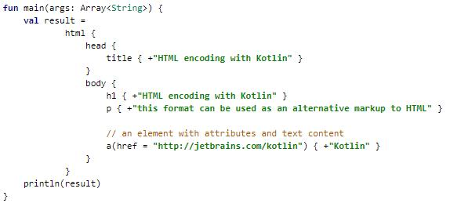

## 什么是 DSL

DSL(Domain Specific Language) 中文名称**特定领域专用语言**，与 GPL(General Purpose Language) 即**通用编程语言**相对。

维基百科中对 DSL 的定义如下：

> A **domain-specific language** (**DSL**) is a computer languagespecialized to a particular application domain.

也就是说，DSL 是一种表达能力有局限的语言。相比于常见的 C、Java、PHP 等语言，DSL 并不能解决所有问题；相反，DSL 的优势在于高效、跨平台。

常见的 DSL 语言：

- Regex
- SQL
- HTML & CSS

以前端开发为例，一般都是使用 HTML 或 XML 描述界面，然后用 js (Web) 或 java/kotlin (Android) 等语言编写逻辑。你会发现 DSL 描述界面比用代码创建组件要方便的多，而且写出的 HTML 或 XML 文件在任何语言任何系统下都可以解析。

## 在 Kotlin 中使用 DSL

上一节提到的 DSL 是作为一门单独的语言存在的 External DSL，某些语言为了引入 DSL 的特性加入了 Internal DSL 这种东西。比如在 Kotlin 中用代码构建一段 HTML：

你可以在 [Try Kotlin](https://try.kotlinlang.org/#/Examples/Longer%20examples/HTML%20Builder/HTML%20Builder.kt) 上找到这段示例。

所以，我们可以用这种特性极大的精简我们的代码（第二个例子使用的是 [Kotlin/anko](https://github.com/Kotlin/anko) 这个库）：

```kotlin
// Create Alert Dialog

// Android developer guide
val builder = AlertDialog.Builder(it)

builder.setTitle("Hi, I'm Roy")
.setMessage("Have you tried turning it off and on again?")
.setPositiveButton(R.string.fire,
DialogInterface.OnClickListener { dialog, id -> toast("Oh…")})

builder.create()

// Use Kotlin DSL
alert("Hi, I'm Roy", "Have you tried turning it off and on again?") {
    yesButton { toast("Oh…") }
}.show()
```

或是在代码中编写界面布局：

```kotlin
verticalLayout {
    val name = editText()
    button("Say Hello") {
        onClick { toast("Hello, ${name.text}!") }
    }
}
```

可以看到我们构建了由一个 EditText 和一个 Button 构成的界面，并且我们在描述界面的同时就完成了逻辑的编写。
