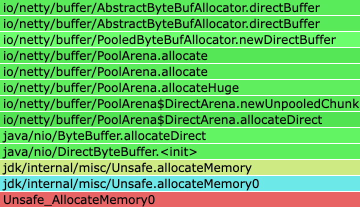

本文用一个线上问题的排查过程来介绍 Java 应用的内存管理，以及 Linux 内存分析工具的使用，供读者排查 Java 应用的内存泄露和 OOM 问题时参考

<!--more-->

## 前情提要

博主自信满满压测一晚，结果隔天早上查看监控发现 Java 进程占用内存远超预期，于是便开始了本文艰辛的排查之旅

这个场景的技术栈是 Java 17 + ZGC，但是本文介绍的方法也适用于排查其他版本 Java 应用的内存泄露和 OOM 问题

我们知道 Java 应用的内存可以分为三种：

1. 堆内存：Java 对象分配的空间
2. 堆外内存：方法区、线程栈、Direct Buffer 等
3. 非 JVM 内存：native library 分配的内存

博主的应用使用了 NIO ByteBuffer + Netty + RocksDB 可谓是五毒俱全，所以我们需要先确认内存泄露发生在哪个内存区域

## 分析堆内存溢出

堆内存泄露问题最容易分析：设置 VM 参数 `-XX:+HeapDumpOnOutOfMemoryError` 在应用崩溃时 dump 堆内存，或者使用 `jmap -dump:format=b,file=heap.bin <pid>` 手动 dump 堆内存。然后通过 MAT/JProfiler 等工具对大对象进行引用分析即可得知内存泄露的原因

不幸的是博主的应用没有生成堆转储文件，通过 JVM 监控也可以得知在运行期间，堆内存使用率几乎没有增长，那么泄漏必然是在堆外发生

## 分析堆外内存溢出

方法区、线程栈导致的堆外内存溢出会导致 JVM 崩溃并在运行目录下产生 `hs_err_pid<pid>.log` 文件，查看报错的线程栈可以分析出 VM 参数设置不合理或开启线程过多等原因

另外一种堆外内存是 DirectByteBuffer / FileChannel.map 等分配的内存，这部分内存可以使用 `-XX:MaxDirectMemorySize=size` 限制，但是这个选项只会影响到 java.nio 包下的内存分配，详见 JDK 的文档：

> -XX:MaxDirectMemorySize=size
>
> Sets the maximum total size (in bytes) of the java.nio package, direct-buffer allocations. Append the letter k or K to indicate kilobytes, m or M to indicate megabytes, or g or G to indicate gigabytes. By default, the size is set to 0, meaning that the JVM chooses the size for NIO direct-buffer allocations automatically.

博主应用的缓存池使用了 Netty 提供的 ByteBuf，底层正是使用 java.nio.DirectByteBuffer

堆外内存也受 JVM 管控，可以使用 JVM 提供的 Native Memory Tracking 来分析。添加 VM 参数 `-XX:NativeMemoryTracking=[off | summary | detail]` 来开启 NMT，重启 JVM 后即可使用 `jcmd` 工具来查看 NMT 数据：

```shell
jcmd <pid> VM.native_memory [summary | detail | baseline | summary.diff | detail.diff | shutdown] [scale= KB | MB | GB]
```

NMT 会输出类似下面的报告：

```shell
jcmd 1713702 VM.native_memory summary scale=MB
1713702:

Native Memory Tracking:

(Omitting categories weighting less than 1MB)

Total: reserved=207768MB, committed=6213MB
       malloc: 1823MB #670978
       mmap:   reserved=205945MB, committed=4390MB

-                 Java Heap (reserved=196608MB, committed=4096MB)
                            (mmap: reserved=196608MB, committed=4096MB) 
 
-                     Class (reserved=260MB, committed=14MB)
                            (classes #17028)
                            (  instance classes #16123, array classes #905)
                            (malloc=4MB #74947) 
                            (mmap: reserved=256MB, committed=11MB) 
                            (  Metadata:   )
                            (    reserved=128MB, committed=82MB)
                            (    used=82MB)
                            (    waste=0MB =0.43%)
                            (  Class space:)
                            (    reserved=256MB, committed=11MB)
                            (    used=10MB)
                            (    waste=0MB =4.21%)
 
-                    Thread (reserved=472MB, committed=50MB)
                            (thread #472)
                            (stack: reserved=471MB, committed=49MB)
                            (malloc=1MB #2839) 
                            (arena=1MB #941)
 
-                      Code (reserved=248MB, committed=83MB)
                            (malloc=6MB #23199) 
                            (mmap: reserved=242MB, committed=77MB) 
 
-                        GC (reserved=8336MB, committed=176MB)
                            (malloc=112MB #48322) 
                            (mmap: reserved=8224MB, committed=64MB) 
 
-                  Compiler (reserved=4MB, committed=4MB)
                            (malloc=4MB #2150) 
 
-                  Internal (reserved=6MB, committed=6MB)
                            (malloc=6MB #57737) 
 
-                     Other (reserved=1658MB, committed=1658MB)
                            (malloc=1658MB #613) 
 
-                    Symbol (reserved=18MB, committed=18MB)
                            (malloc=16MB #432773) 
                            (arena=2MB #1)
 
-    Native Memory Tracking (reserved=11MB, committed=11MB)
                            (malloc=1MB #7935) 
                            (tracking overhead=10MB)
 
-        Shared class space (reserved=16MB, committed=12MB)
                            (mmap: reserved=16MB, committed=12MB) 
 
-            Serviceability (reserved=1MB, committed=1MB)
                            (malloc=1MB #14544) 
 
-                 Metaspace (reserved=128MB, committed=83MB)
                            (mmap: reserved=128MB, committed=82MB) 
```

Java 11 之后 DirectByteBuffer 使用的内存被归入 Other 中（之前是 Internal），我们需要关注的是其中的 committed 部分，代表了真实使用的物理内存。这里可以发现 DirectByteBuffer 只占用了 1658MB 内存，并不是发生内存泄露的原因


根据 JDK 和操作系统版本的不同，committed 的数值可能会大于等于操作系统计算的 RSS。具体原因和修复方案可以参考 [JDK-8191369](https://bugs.openjdk.org/browse/JDK-8191369) 和 [JDK-8249666](https://bugs.openjdk.org/browse/JDK-8249666)


## 分析非 JVM 内存溢出

通过上述排查流程，我们已经确认了泄露的内存并不受 JVM 的管控，这就需要深入到对操作系统内存分配情况的分析

### 换用 jemalloc

Java 默认使用 glibc 的 malloc，有时会出现碎片问题，可以使用 jemalloc 替代并开启分析功能：

```shell
apt install libjemalloc-dev
export LD_PRELOAD=/usr/lib/x86_64-linux-gnu/libjemalloc.so.2
# 每分配 128K 内存记录堆栈信息，每分配 1GB 内存输出到文件
export MALLOC_CONF=prof:true,lg_prof_interval:30,lg_prof_sample:17
```

重启应用后在运行目录下会生成类似 `jeprof.<pid>.0.i0.heap` 的文件，我们可以使用 `jeprof` 来输出内存分配情况

```shell
jeprof --svg `which java` jeprof*.heap > jeprof.svg
```



这里看到分配内存占比 89% 的函数是 `Unsafe_AllocateMemory0`。但是 jemalloc 不能进一步分析 java 虚拟机的堆栈，我们需要进一步配合 [async-profler](https://github.com/async-profiler/async-profiler) 生成火焰图：

```shell
# 可以将 Unsafe_AllocateMemory0 换成其他任何想观测的函数名
./profiler.sh -d <duration> -e Unsafe_AllocateMemory0 -f unsafe_allocate.html <pid>
```



生成的火焰图中可以看到 Unsafe_AllocateMemory0 分配的内存实际上是 DirectByteBuffer 使用的，这和 NMT 的报告中显示的占用量基本一致，并不是导致内存占用异常的元凶

```text
Other (reserved=1658MB, committed=1658MB)
    (malloc=1658MB #613) 
```

### 分析内存分布

既然应用运行中没有明显的内存泄露，那么就需要看下消耗的内存用在了哪里：

```shell
cat /proc/2031108/status                  
Name:   java
...
RssAnon:          805844 kB
RssFile:           38036 kB
RssShmem:       12582912 kB
```

占用内存最多的 RssShmem 有 12G，这是个很不同寻常的情况，一般来说 page cache 以及 mmap 进行文件映射都会算到 RssFile 上。接下来需要进一步找到这 12G 的内存用在了哪里，我们可以使用 `pmap` 来查看内存分布：

```shell
pmap -x 2031108
Address           Kbytes     RSS   Dirty Mode  Mapping
0000040000000000 4194304 4194304 4194304 rw-s- memfd:java_heap (deleted)
0000040100000000 62914560       0       0 -----   [ anon ]
0000080000000000 4194304 4194304 4194304 rw-s- memfd:java_heap (deleted)
0000080100000000 62914560       0       0 -----   [ anon ]
0000100000000000 4194304 4194304 4194304 rw-s- memfd:java_heap (deleted)
0000100100000000 62914560       0       0 -----   [ anon ]
```

很容易发现疑似的内存区域，java 堆被映射到了三个虚拟内存地址上：40000000000、80000000000、100000000000。博主应用的堆大小设置为 4G，理论上映射了三次就产生了 12G 的 RssShmem 占用。为了验证这个猜想接下来 dump 这三段内存比较其中的内容：

```shell
dd if="/proc/2031108/mem" of="/dev/stdout" bs=1 skip=$((0x40000000000)) count=128 | hexdump
128+0 records in
128+0 records out
128 bytes copied, 0.000292939 s, 437 kB/s
0000000 0001 0000 0000 0000 1550 0000 0003 0000
0000010 e938 0005 0400 0000 e970 0005 0400 0000
0000020 e9c0 0005 0400 0000 0001 0000 0000 0000
0000030 1550 0000 0007 0000 0000 0000 0000 0000
0000040 0000 0000 0000 0000 0000 0000 0000 0000
*
0000070 0001 0000 0000 0000 1550 0000 0020 0000
0000080

dd if="/proc/2031108/mem" of="/dev/stdout" bs=1 skip=$((0x80000000000)) count=128 | hexdump
128+0 records in
128+0 records out
128 bytes copied, 0.000298448 s, 429 kB/s
0000000 0001 0000 0000 0000 1550 0000 0003 0000
0000010 e938 0005 0400 0000 e970 0005 0400 0000
0000020 e9c0 0005 0400 0000 0001 0000 0000 0000
0000030 1550 0000 0007 0000 0000 0000 0000 0000
0000040 0000 0000 0000 0000 0000 0000 0000 0000
*
0000070 0001 0000 0000 0000 1550 0000 0020 0000
0000080

dd if="/proc/2031108/mem" of="/dev/stdout" bs=1 skip=$((0x100000000000)) count=128 | hexdump
128+0 records in
128+0 records out
128 bytes copied, 0.000330489 s, 387 kB/s
0000000 0001 0000 0000 0000 1550 0000 0003 0000
0000010 e938 0005 0800 0000 e970 0005 0800 0000
0000020 e9c0 0005 0800 0000 0001 0000 0000 0000
0000030 1550 0000 0007 0000 0000 0000 0000 0000
0000040 0000 0000 0000 0000 0000 0000 0000 0000
*
0000070 0001 0000 0000 0000 1550 0000 0020 0000
0000080
```

可以发现这些内容是完全一致的，那么就找到了罪魁祸首：正是这三个堆内存映射造成了内存占用飙高的问题

## 知其所以然

我们发现了元凶首恶，但是还需要进一步分析为什么映射的内存会被算为 RssShmem 以及为什么会出现三次映内存映射

### 匿名文件映射

首先来看一下映射的文件 `memfd:java_heap (deleted)`，其中 `memfd` 是 Linux 的一个特性，可以创建一个匿名文件驻留在内存中。这个文件不会出现在文件系统中，只能通过 `/proc/<pid>/fd` 查看，映射的内容会在进程退出时被释放

这个文件的 fd 和普通的 fd 并无二致，自然也能使用 `mmap` 来创建文件映射，多次映射同一个文件会共享同一块物理内存，可以通过类似下面的代码来实现：


```c
// 1G
static int SIZE = 1024 * 1024 * 1024;

int fd = syscall(SYS_memfd_create, "shma", 0);
ftruncate(fd, SIZE);

void *ptr0 = mmap(NULL, SIZE, PROT_READ|PROT_WRITE, MAP_SHARED, fd, 0);
memset(ptr0, 'A', SIZE);

void *ptr1 = mmap(NULL, SIZE, PROT_READ|PROT_WRITE, MAP_SHARED, fd, 0);
memset(ptr1, 'B', SIZE);

void *ptr2 = mmap(NULL, SIZE, PROT_READ|PROT_WRITE, MAP_SHARED, fd, 0);
memset(ptr2, 'C', SIZE);
```

这段代码会创建一个匿名文件，然后映射三次并分别写入 A、B、C 三种字符：

```shell
cat /proc/2306924/status 
Name:   memfd_create
...
RssAnon:              96 kB
RssFile:            1320 kB
RssShmem:        3145540 kB

pmap -x 2306924              
2306924:   ./memfd_create
Address           Kbytes     RSS   Dirty Mode  Mapping
00007f1b16ee7000 1048576 1048576 1048576 rw-s- memfd:shma (deleted)
00007f1b56ee7000 1048576 1048576 1048576 rw-s- memfd:shma (deleted)
00007f1b96ee7000 1048576 1048576 1048576 rw-s- memfd:shma (deleted)

dd if="/proc/2306924/mem" of="/dev/stdout" bs=1 skip=$((0x00007f1b16ee7000)) count=128
CCCCCCCCCCCCCCCCCCCCCCCCCCCCCCCCCCCCCCCCCCCCCCCCCCCCCCCCCCCCCCCCCCCCCCCCCCCCCCCCCCCCCCCCCCCCCCCCCCCCCCCCCCCCCCCCCCCCCCCCCCCCCCCC128+0 records in
128+0 records out
128 bytes copied, 0.000432721 s, 296 kB/s
```

可以看到创建的匿名文件被映射了三次，并且对应进程的 RssShmem 也是 3G

### ZGC 中堆内存映射

需要回答的下一个问题是：为什么 Java 将堆内存映射三次？这源于 ZGC 引入的指针染色技术，即用对象指针中的某几位来作为 GC 标记，这样就不需要额外的对象头空间来记录 GC 标记了。比如我们用 16 进制下的对象指针最高位来作为 GC 标记，那么指向 0x13210 的对象 GC 标记是 0x1，地址是 0x3210

对于计算机来说，可以用掩码实现从对象指针中提取 GC 标记和对象地址：

```text
Pointer value:     0x13210 : 0001 0011 0010 0001 0000
Metadata mask:   & 0xf0000 : 1111 0000 0000 0000 0000
Metadata bits:     0x1     : 0001

Pointer value:     0x13210 : 0001 0011 0010 0001 0000
Address  mask:   & 0x0ffff : 0000 1111 1111 1111 1111
Address bits:       0x3210 :      0011 0010 0001 0000
```

每次访问对象时，都需要将 GC 标记位清零以得到真实的地址，这是不可忽略的开销。ZGC 使用多重映射技术巧妙的避免了这个问题。考虑到 0x13210、0x23210 都指向同一个对象，那么我们可以将这两个地址映射到同一块物理内存上，这样就可以避免每次访问对象时的掩码操作：

```text
+-----------+ 0x10000
|           |
|        X  | 0x13210 -----+       +----------------------+
|           |               \      |                      |
+-----------+ 0x20000        +---> | X @ offset 0x3210    | 
|           |               /      |                      |
|        X  | 0x23210 -----+       +----------------------+
|           |
+-----------+ 0x30000
```

我们将堆映射到 0x10000~0x20000 和 0x20000~0x30000 这两个虚拟内存空间上。只要相对于 0x10000 和 0x20000 的偏移量相同，就能访问到同一块物理内存

这是一种空间换时间的做法。实际上浪费的空间是虚拟内存的空间，用页表的开销换取了每次对象访问时的掩码操作，是一个非常值得的 trade off


更详细的设计可以参考 [OpenJDK Wiki](https://wiki.openjdk.org/display/zgc/Pointer+Metadata+using+Multi-Mapped+memory)



### 观测真实内存占用

Linux 中一个进程占用的内存有多种统计方式，可以分为 VSS、RSS、PSS、USS：

- VSS：Virtual Set Size，进程申请的虚拟内存大小
- RSS：Resident Set Size，进程的常驻内存大小，包括代码段、堆、栈、共享库、映射文件等
- PSS：Proportional Set Size，进程的比例内存大小，RSS 中的共享内存按照比例分摊到各个进程
- USS：Unique Set Size，进程独占的内存大小，RSS 中的共享内存不计入 USS

我们可以通过 PSS 来观测真实的内存占用情况，这里使用了 `/proc/[pid]/smaps_rollup` 来查看 PSS：

```shell
cat /proc/2306924/smaps_rollup
5626d2e58000-7ffca670f000 ---p 00000000 00:00 0                          [rollup]
Rss:             3147164 kB
Pss:             1048716 kB
Pss_Anon:            100 kB
Pss_File:             40 kB
Pss_Shmem:       1048575 kB
Shared_Clean:       1324 kB
Shared_Dirty:    3145728 kB
Private_Clean:        12 kB
Private_Dirty:       100 kB
Referenced:      3147164 kB
Anonymous:           100 kB
LazyFree:              0 kB
AnonHugePages:         0 kB
ShmemPmdMapped:        0 kB
FilePmdMapped:         0 kB
Shared_Hugetlb:        0 kB
Private_Hugetlb:       0 kB
Swap:                  0 kB
SwapPss:               0 kB
Locked:                0 kB
```

可以发现 Pss_Shmem 是 RssShmem 的三分之一，更能反应真实内存占用
