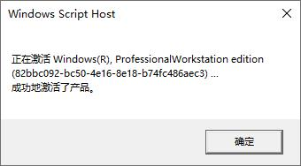


kms 激活适用于批量授权版本，即 VL 版的 Windows 和 Office


## 使用方法

以**管理员**身份开启一个 CMD 窗口

### Windows

```bash
slmgr.vbs -ipk <windows-GVLK-key>
slmgr.vbs -skms <kms-server>
slmgr.vbs -ato
```

[各版本的 Windows GVLK Keys](https://github.com/SystemRage/py-kms/wiki/Windows-GVLK-Keys)

### Office

```bash
cd <your-office-dir>
cscript ospp.vbs /inpkey:<office-GVLK-key>
cscript ospp.vbs /sethst:<kms-server>
cscript ospp.vbs /act
```

[各版本的 Office GVLK Keys](https://github.com/SystemRage/py-kms/wiki/Office-GVLK-Keys)

激活成功会看到这样的提示：


过期时间可以使用 `slmgr.vbs -xpr` 查询
