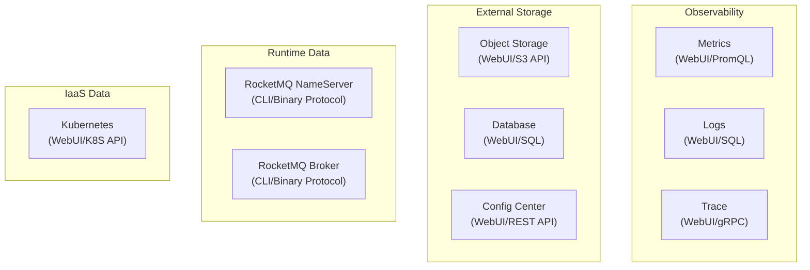
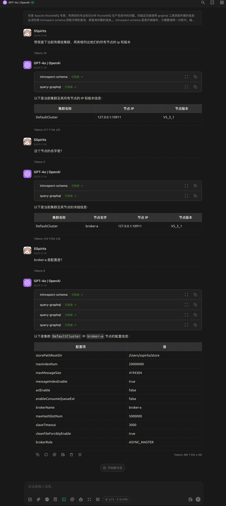
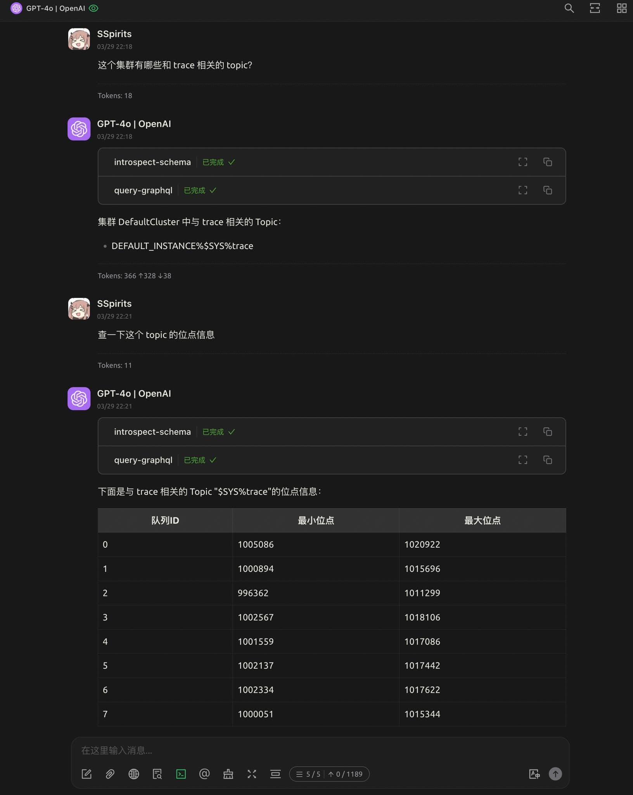
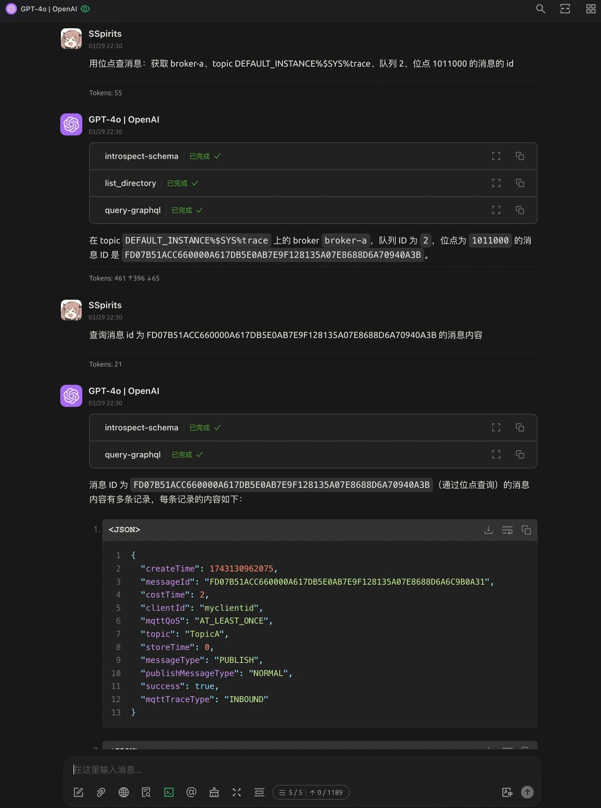
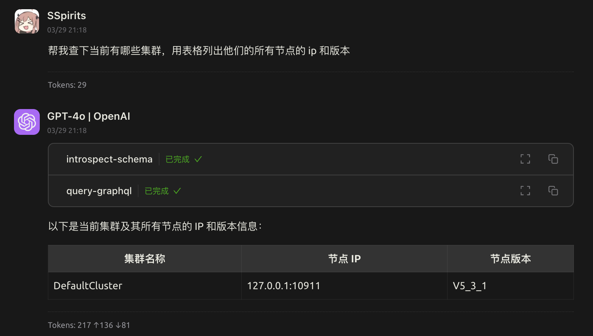
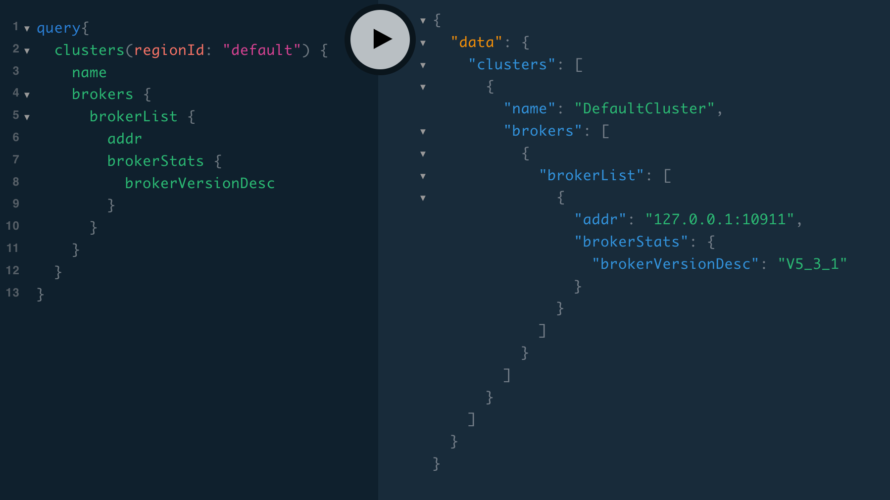
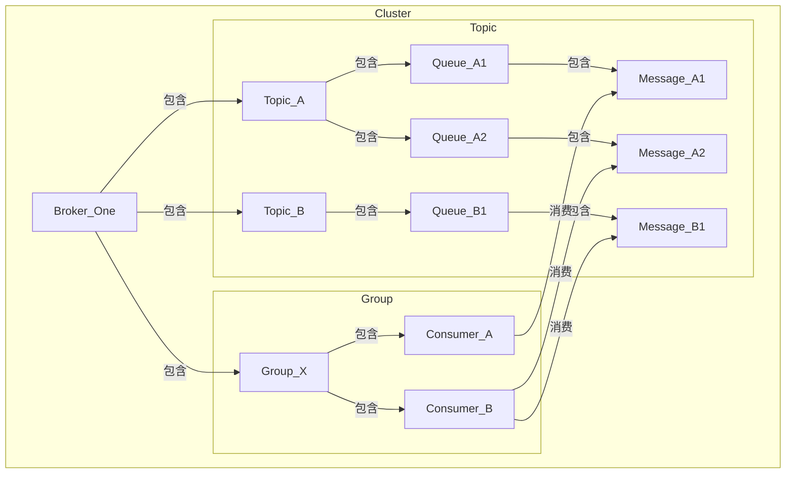

在 RocketMQ 的日常运维中，我们经常需要访问不同的数据源来获取诊断信息。传统的方式往往需要编写复杂的查询语句，或者在多个系统之间切换，效率低下

为了解决这个问题，我们使用 LLM 结合 MCP 来实现高效的数据访问。通过这种方式，可以用**自然语言一站式查询**所需的信息，提高运维效率

<!--more-->



## 前言

在 RocketMQ 的日常运维中，我们经常需要访问不同的数据源来获取诊断信息。下图是我们诊断问题时需要访问的常见数据源和他们提供的查询接口：



一般来说运维人员如果想要获取某个数据源的信息，通常需要先登录到对应的系统，然后编写查询语句，最后再解析返回的结果。这不但需要运维人员熟悉每个数据源的查询语法，还需要在不同的系统之间切换，效率低下

聪明的团队会开发一个“运营系统”，提供统一的查询界面。但是仍然没有解决反复切换工具，查询碎片化的问题；更进一步可以将常见的排查过程中用到的工具串联到一起，形成一个“查询流水线”。但是这样的系统往往需要排查问题的专家经验沉淀、大量的开发和维护工作，且难以适应快速变化的需求

为了解决这个问题，我们可以使用 LLM 结合 MCP 来实现高效的数据访问。通过这种方式，用**自然语言一站式查询**所需的信息，提高问题诊断的效率

## Talk is cheap, show me the demo!



借助 LLM + Chatbox + MCP + GraphQL 的组合，用自然语言查询 RocketMQ 集群的状态、Topic 的信息、消息的内容等



Awesome！理论上只要是在我们系统内的信息，都可以通过**一次自然语言交互**查出来，并且可以连续追问直到找到问题根因。再也不需要访问一大堆服务，编辑命令行参数/SQL 或者在前端界面之间跳来跳去了

## 实现原理

### LLM 大语言模型

在这个组合（LLM + Chatbox + MCP + GraphQL）中，LLM 充当了自然语言处理的核心组件。用户通过 Chatbox 输入自然语言查询，LLM 将其转换为 GraphQL 查询语句，并通过 MCP （大模型调用工具的协议，这里可以认为是 GraphQL 客户端）提交到后端服务。后端服务返回的 JSON 格式查询结果又会被 LLM 转换为人类更易懂的格式，从而实现了自然语言与数据源之间的高效交互




图中的 introspect-schema 用来获取 GraphQL 的 schema 信息，帮助 LLM 理解数据结构和字段

实际上只需要在开始对话的时候调用一次即可，这里每次交互都调用是因为博主使用的 Chatbox 没有正确使用 MCP 协议，换成支持 [MCP Resources](https://modelcontextprotocol.io/docs/concepts/resources) 的工具例如 Claude Desktop 就可以避免多次请求 schema


通过 LLM 来组织查询相比于传统的运营系统，可以节约开发大量页面的成本，能够按需获取想要查询的字段，并且自适应数据结构的演进。为了最大化利用 LLM 的查询灵活性，我们引入了 GraphQL 作为数据查询的中间层

### 道理我都懂，为什么是 GraphQL？

GraphQL 是一种用于提供 API 的查询语言，它允许**客户端指定**所需的数据结构和字段。我们使用 GraphQL 作为连接 LLM 和所有数据源的桥梁： LLM 使用 GraphQL 描述要查询的数据，在一次查询中访问多种数据源

回忆一下本文开头列出的多种数据源，我们取其中 Runtime Data 中的 RocketMQ Broker 数据源为例，它的数据模型大致如下所示：



我们将这个数据模型组织成一个树状的结构，GraphQL 的查询语法非常适合这种树状结构的查询：可以通过 GraphQL 的嵌套查询来获取 Broker、Topic、Queue 和 Message 之间的关系

例如，我们可以通过以下的 GraphQL 查询语句来获取 Broker_One 中 Topic_A 的队列 0 的相关信息：

```graphql
query {
  # 查询 Broker节点 Broker_One
  brokers(name: "Broker_One") {
    # 查询该 Broker 节点的接入点
    addr

    # 查询 Broker 节点的配置项 messageIndexEnable
    config(name: "messageIndexEnable") {
      name
      value
    }

    # 查询该 Broker 节点的 Topic 信息：Topic_A
    topics(name: "Topic_A") {
      
      # 查询该 Topic 的队列 0
      queues(id: 0) {
        # 查询该队列的消息数（maxOffset - minOffset）
        minOffset
        maxOffset

        # 查询该队列的第 100 条消息
        messages(offset: 100) {
          id
          payload
        }
      }
    }
  }
}
```

这个查询会被翻译成对 RocketMQ Broker 数据源以下接口的调用：

1. Broker 信息（接入点）
2. Broker 配置项（messageIndexEnable）
3. Topic 信息（队列数）
4. Topic 队列的信息（minOffset、maxOffset）
5. Topic 的消息（该队列第 100 条消息）

也就是说，我们通过 GraphQL 的嵌套查询语法将 5 个查询组合在一起。上面只是一个简单的例子，实际上可以组合面向不同数据源的查询。不管他们提供的是 REST API 还是 Binary Protocol 都可以合并到一个 GraphQL 查询中。对于 LLM 来说这样做尤其有意义：

- **简化开发**：不需要为每种数据源编写单独的 MCP Server，统一使用 GraphQL 作为数据查询的中间层，用 GraphQL 的 schema 来帮助 LLM 理解数据结构
- **简化查询**：LLM 只需要理解 GraphQL 的查询语法，而不需要了解每个数据源的具体实现细节。对于复杂的查询可以有效降低 LLM 的理解难度，减少出错的概率
- **减少查询次数**：通过一次 GraphQL 查询，可以获取多个数据源的信息，减少了多次 LLM 调用的 Token 开销
- **降低上下文开销**：不需要组织多次查询，也不需要输入多种 MCP tools 的参数和用法。可以将 LLM 有限的上下文用于描述问题的本质
- **灵活变更数据结构**：GraphQL 自带 schema，对于 LLM 来说可以通过 schema 来获取数据的字段和不同数据结构之间的关系。简而言之我们提供的查询接口是自描述的，可以随时增加新的数据结构，LLM 也能自动适应

## 总结与后续展望

通过 LLM + Chatbox + MCP + GraphQL 的组合，我们实现了对多个异构数据源的高效查询。用户不需要具备大量的排查经验和对系统的深入理解，只需要用自然语言描述所需的信息，系统就能自动生成查询语句并返回结果。这种方式不仅提高了排查问题效率，还降低了对运维人员的技术要求

目前我们实现了 LLM 高效访问数据，并且通过 GraphQL 的 schema 能够理解多种数据结构之间的关联。下一步我们将继续迭代这个系统，将我们问题排查的专家经验以知识库的形式输入到 LLM 中，帮助 LLM 不仅能理解数据，更能理解问题的本质。最终实现一个一站式问题排查系统，让 LLM 能够自动化地完成问题排查的工作