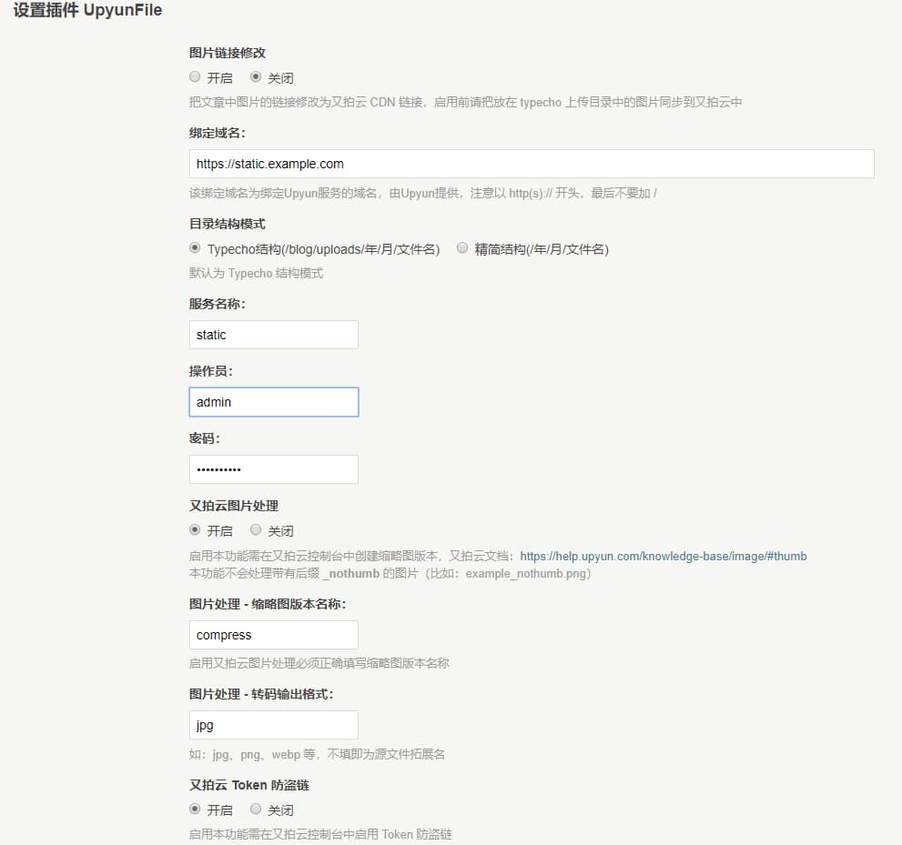

## 说明

本插件 [ShadowySpirits/UpyunFile](https://github.com/ShadowySpirits/UpyunFile) 是又拍云文件上传插件，基于 [codesee/UpyunFile](https://github.com/codesee/UpyunFile) 二次开发。

相比于原插件：

- 修复了启用本插件会影响其他替换内容插件生效的 Bug
- 修复了某些情况下图片链接替换失败的 Bug
- 新增：接入又拍云图片处理功能
- 新增：为博客静态资源加入 Token 防盗链

 <!-- More -->


又拍云 SDK 仅支持 PHP >= 5.6 的环境


## 使用方法

1.  在 [Release](https://github.com/ShadowySpirits/UpyunFile/releases) 中下载此插件的最新版，上传至网站的 /usr/plugins/ 目录下。务必保持本插件文件夹名称为 **UpyunFile**，不能随意更改
2.  启用该插件，正确填写相关信息，保存即可

## 注意事项

1.  启用又拍云图片处理需在又拍云控制台中创建缩略图版本并填入插件相应位置，文档：[https://help.upyun.com/knowledge-base/image/#thumb](https://help.upyun.com/knowledge-base/image/#thumb)；又拍云图片处理会忽略带有后缀 `_nothumb` 的图片（比如：example_nothumb.png）
2.  如你创建的缩略图版本开启了转码功能，则需将输出格式填入插件相应位置
3.  只有 `JPG、JPEG、PNG、BMP` 这 4 种格式的图片才会进行处理
4.  启用 Token 防盗链需在又拍云控制台中启用 Token 防盗链并将密钥填入插件相应位置
5.  自定义目录结构可以在 Typecho 根目录下的 config.inc.php 中添加代码 `define('__TYPECHO_UPLOAD_DIR__', '/path/to/uploads');` 并设置目录结构为 `Typecho结构`。


Token 防盗链功能只能修改 HTML 代码中的 CDN 链接，如果需要引入字体图片等资源请内联 CSS


## 更新记录：

**v0.9.0：**

- 升级 SDK，修复 Bug，加入新功能

**v1.0.0：**

- 控制台的文件管理中现在可以正常查看有 Token 防盗链保护的图片
- 又拍云图片处理会忽略带有后缀 `_nothumb` 的图片（比如：example_nothumb.png）
- 优化代码

**v1.0.2：**

- 修复某些情况下重复添加 Token 的 bug

**v1.0.3：**

- 优化代码
- 增强兼容性

**v1.0.4：**

- 解决兼容性问题


如果你有使用上的问题请在提问时写清楚你的 **php** 和 **typecho** 版本以及**报错信息**，否则一律不予回复

