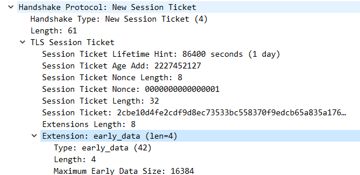
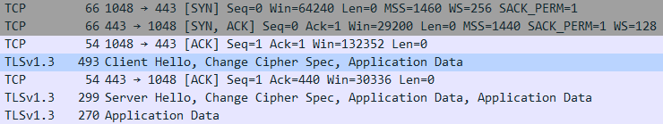
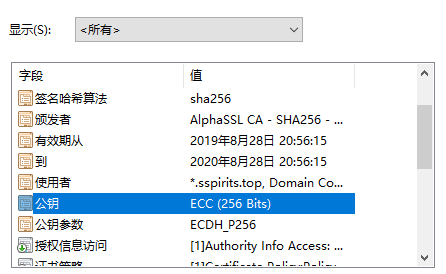

本文描述的优化技巧基于 Nginx 1.17、OpenSSL 1.1.1d、TLS1.2 和 TLS1.3

<!--more-->

## TLS1.2 Session 复用

session 复用有两种方式，我选择的是 Session Identifier，下面讨论下这两种方式的机制：

### Session Identifier

客户端保存 session ID，在发起 Client Hello 时将上次使用的 session ID 发送给服务端，服务端根据收到的 session ID 找到保存好的对称密钥。

nginx 中的配置：

```nginx
# 指定缓存大小为 30m
ssl_session_cache     shared:SSL:30m;
# 指定缓存时间为 1 天
ssl_session_timeout   1d;
# 这里需要关闭默认开启的 ssl_session_tickets
ssl_session_tickets   off;
```

这里有两个问题：

- 服务器缓存 session 信息会对服务器性能造成影响
- 不支持分布式部署，缓存只在单机上保存。这个问题可以使用 OpenResty 配合 Redis 解决：
  ```nginx
  ssl_session_fetch_by_lua_file   lua/session_fetch.lua;
  ssl_session_store_by_lua_file   lua/session_store.lua;
  ssl_session_timeout             1d;
  ssl_session_tickets             off;
  ```

### Session Ticket

服务器将 session 信息加密后保存在 session ticket 中交由客户端保存，客户端会在 client hello 的拓展中加上 session ticket，服务器解密后就可以恢复会话信息

这个方式安全性要差一些：

- Nginx 和 Apache 都只在重启后才会更改加密使用的密钥
- session ticket 不具有前向保密性，并且一旦 session ticket 被解密会使 TLS 的前向保密性机制完全失效。相关讨论可以参考[这篇文章](https://www.imperialviolet.org/2013/06/27/botchingpfs.html)：

## TLS1.3 Early data（0-RTT）

TLS 1.3 中抛弃了之前的两种 session 复用方式，转而采用 PSK 复用：

**和 TLS1.2 的对比：**
| | TLS1.2 首次连接 | TLS1.2 会话复用 | TLS1.3 首次连接 | TLS1.3 会话复用 |
| ---- | ---- | ---- | ---- | ---- |
|DNS 解析| 1-RTT| 0-RTT| 1-RTT| 0-RTT|
|TCP 握手| 1-RTT| 1-RTT| 1-RTT| 1-RTT|
|TLS 握手| 2-RTT| 1-RTT| 1-RTT| 0-RTT|
|HTTP Request| 1-RTT| 1-RTT| 1-RTT| 1-RTT|
|总计| 5-RTT| 3-RTT| 4-RTT| 2-RTT|

### 实现机制

第一次连接建立后服务器向客户端发送 New Session Ticket 包，其中的 early_data 拓展指定了是否能使用 Early data（0-RTT 连接）及其参数



第二次连接客户端发送 Client Hello 时同时发送 Early data



可以使用 openssl 测试：

```bash
openssl s_client -connect :443 -tls1_3 -sess_in session.pem -early_data request.txt
```

[完整测试脚本](https://gist.github.com/5e639bfaf012ad5840f36a591f7d4904#file-test-early-data-sh)

更多细节参考 RFC 8446：[https://tools.ietf.org/html/rfc8446#section-2.3](https://tools.ietf.org/html/rfc8446#section-2.3)

这种方式虽然可以省下一个 RTT 但是牺牲了前向安全性和抵抗重放攻击的能力

在 nginx 中开启 Early data 的方式：

```nginx
ssl_early_data      on;
# 可选项，表示此 HTTP 请求在 Early data 中发送
proxy_set_header    Early-Data $ssl_early_data;
```

## OCSP stapling

OCSP stapling 是一项 TLS 的拓展：

服务器将 OCSP response 缓存在服务器中，然后把它们作为 TLS 握手的一部分发送给客户端。因此，客户端在和一个支持 OCSP Stapling 技术的服务器通信时，它可以同时接收到服务器证书和该证书的状态

这项技术有效的保护了用户的隐私同时保证了 OCSP 的可用性

Nginx 中开启 OCSP stapling：

```nginx
ssl_stapling           on;
ssl_stapling_verify    on;
resolver               1.1.1.1 1.0.0.1 8.8.8.8 8.8.4.4 208.67.222.222 208.67.220.220 valid=60s;
resolver_timeout       2s;
```

要注意的是如果你的 CA 提供的 OCSP 需要验证的话，必须用 `ssl_trusted_certificate` 指定 CA 的中级证书和根证书（PEM 格式，放在一个文件中）的位置，否则会报错 `[error] 17105#17105: OCSP_basic_verify() failed`

## Strict SNI

为 Nginx 开启严格的 SNI 匹配，防止使用 ip 或错误域名的访问暴露证书

Nginx 本身不提供这个功能，1.15.10 以后的版本可以使用这个 patch：

```nginx
# run in nginx directory
curl https://github.com/hakasenyang/openssl-patch/blob/master/nginx_strict-sni_1.15.10.patch | patch -p1
```

然后在 http 模块中开启

```nginx
strict_sni           on;
strict_sni_header    on;
```

## 使用 ECC 证书

ECC 证书即使用 ECDSA（Elliptic Curve Digital Signature Algorithm）的证书，拥有更小的密钥长度和与主流算法相比更好的加密强度（相当于 RSA 3072）

下图即是一个 ECC 证书：



## 密码套件选择

我选用的服务器偏好密码套件：

密钥交换算法：ECDH （具有前向安全性并且比 DH 资源消耗低）

签名算法：ECC

对称加密算法：AES-GCM （是一种 AEAD 算法并且加密解密均可并行计算）

完整配置：

```nginx
ssl_ecdh_curve              X25519:P-256:P-384:P-224:P-521;
ssl_ciphers                 [TLS_AES_256_GCM_SHA384|TLS_AES_128_GCM_SHA256|TLS_CHACHA20_POLY1305_SHA256]:[ECDHE-ECDSA-AES128-GCM-SHA256|ECDHE-ECDSA-CHACHA20-POLY1305|ECDHE-RSA-AES128-GCM-SHA256|ECDHE-RSA-CHACHA20-POLY1305]:ECDHE-ECDSA-AES256-GCM-SHA384:ECDHE-RSA-AES256-GCM-SHA384:DHE-RSA-AES128-GCM-SHA256:DHE-RSA-AES256-GCM-SHA384;
ssl_prefer_server_ciphers   on;
```

### 等价加密算法组

上文中 `[XXX|XXX]` 是等价密码组的写法，在开启 `ssl_prefer_server_ciphers on` 的情况下给予客户端在有限的几种密码套件之间选择最合适的一种

本站使用这项技术为不支持 AES-NI 的设备自动协商 CHACHA20-POLY1305 算法
OpenSSL 中不支持此项技术，可以使用 boringssl 或打上[这个 patch](https://github.com/hakasenyang/openssl-patch/blob/master/openssl-equal-1.1.1d_ciphers.patch)：

PS. ARMv8 中就提供了 AES 指令集支持，都 9102 年了，新手机基本上没有不支持的

### DH 参数

为上文中 DHE 和 ECDHE 指定一个更强的参数（这里是 4096 位）

step 1. 使用 openssl 生成 `dhparam.pem` 文件

```nginx
openssl dhparam -out dhparam.pem 4096
```

step 2. 配置 nginx 参数

```nginx
ssl_dhparam    path-to-dhparam-file
```
