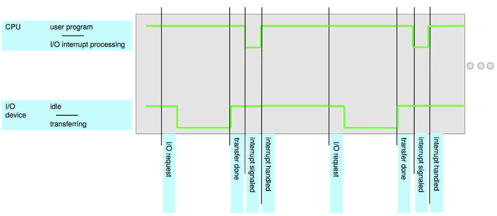
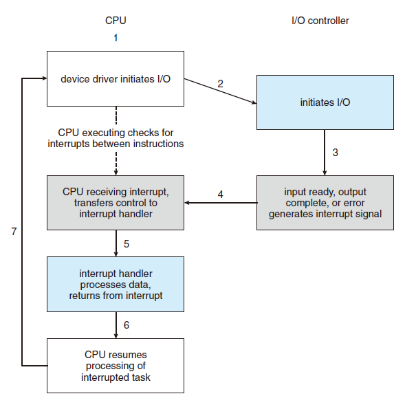
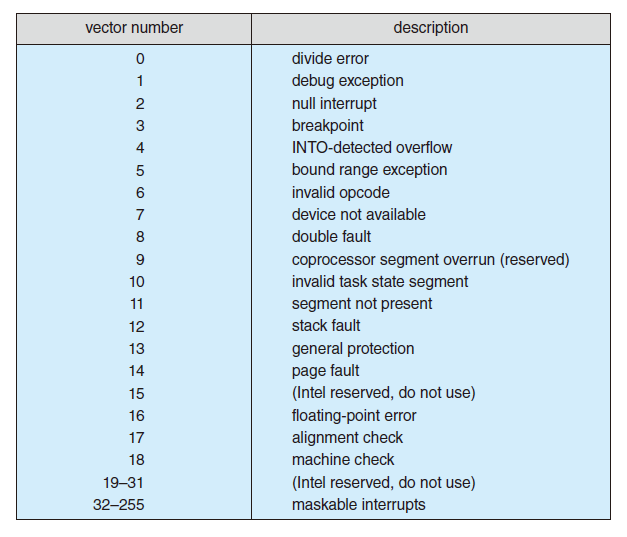

> **中断**（英语：Interrupt）是指处理器接收到来自硬件或软件的信号，提示发生了某个事件，应该被注意，这种情况就称为中断。[^1]
>
> In summary, interrupts are used throughout modern operating systems to handle asynchronous events.[^2]

[^1]: 维基百科
[^2]: 《Operating System Concepts》

我们考虑这样一个场景：从键盘读入一个字符。从 CPU 的角度来看这种 I/O 操作的速度远慢于 CPU 频率，所以在 CPU 发出读入字符的指令后需要消耗数百上千个时钟周期来轮询是否有数据返回（这被称为忙等待 Busy waiting），在这个过程中其他操作被阻塞，直到键盘返回数据。显然这样的低效率逻辑是不可接受的。我们需要的是一种**异步机制**：需要时再通知 CPU 来处理，这样可以最大程度的减少 CPU 的等待时间。

如图所示，每当 I/O 设备完成动作时都会触发中断，然后 CPU 停止正在进行的工作，去处理相应的中断

下面我们通过**硬件中断**（Hardware Interrupt）来详细介绍一下中断机制：

1.  CPU 通知设备驱动程序开始一个 I/O 操作，然后去处理其他应用程序
2.  设备控制器处理 I/O 操作并在完成时发送中断信号
3.  CPU 检测到中断信号暂停正在处理的程序转而处理中断

这就是整个硬件中断的原理，但是我们还需要讨论几个细节问题

- CPU 如何检测中断信号
- CPU 如何处理不同类型的中断
- 如何决定是否延迟执行或优先执行某个中断

为了回答上面 3 个问题，我们首先要知道什么是中断信号。每个设备的驱动程序都提供**中断服务程序**（interrupt service routine，ISR）用于响应中断，这些中断服务程序的地址储存在一个被称为**中断向量**（interrupt vector）的数组中，而中断信号给出了对应设备的中断服务程序在中断向量中的索引。


在大多数的操作系统中，中断向量并不直接储存中断服务程序的地址，而是存储着多个数组的首地址，每个数组中包含一类中断处理程序的地址。CPU 通过中断信号的索引找到对应类别的数组，然后通过遍历该数组来找到相应的处理程序。这种机制被称为 **interrupt chaining**，下图是 Intel 处理器的中断向量。


CPU 硬件有被称为**中断请求线**（interrupt-request line）的机制，CPU 在执行每条指令后检测到该线中是否有中断信号，如果有则以这个中断信号作为索引从中断向量中取出中断服务程序的地址，然后去执行相应的程序。

为了解决第 3 个问题，操作系统需要多级中断机制，以便操作系统可以区分高优先级和低优先级中断，并且可以对不同紧急程度的中断进行响应。大多数 CPU 有两个中断请求线。一种是**不可屏蔽的中断**（nonmaskable interrupt）：它被用于及时响应不可恢复的错误。第二种是**可屏蔽的中断**（maskable interrupt）：CPU 可以通过不同中断的优先级决定是否延迟响应或者先响应高优先级中断。

除了硬件中断外还有一种“**软中断**”（Software interrupt），它通常在程序抛出异常以及系统调用中触发。软中断相关内容在内核态及系统调用中介绍。
