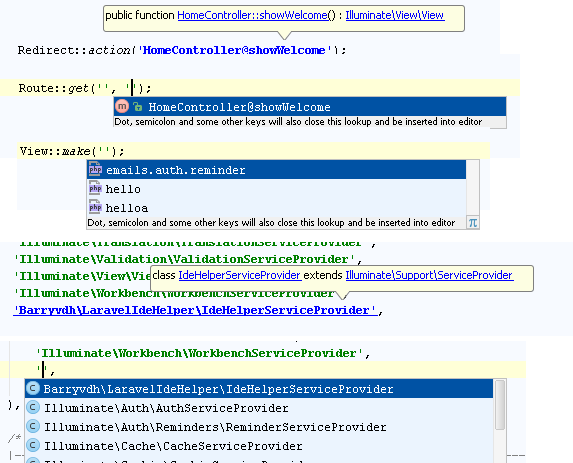

因为某些原因需要搞个 laravel 项目，于是乎翻出此前的文章补充记录下 laravel 开发准备工作。

 <!--more-->

本教程适用环境：

- [Laravel 5.5](https://laravel.com/)
- [PhpStorm](https://www.jetbrains.com/phpstorm/)

## 安装 laravel

- 安装 php
- 安装 composer
- 换源：`composer config -g repo.packagist composer https://packagist.laravel-china.org`
- 全局安装 `laravel/installer`：`composer global require laravel/installer`
- 创建 laravel 项目：`laravel new blog`

## 安装 laravel-ide-helper

Laravel 本身的依赖注入，服务提供者等特性使得 IDE 很难做到代码检查和智能提示，所以需要安装 [barryvdh/laravel-ide-helper](https://github.com/barryvdh/laravel-ide-helper) 来辅助进行代码补全和追踪。

```bash
composer require --dev barryvdh/laravel-ide-helper
```

然后运行下列代码命令生成代码提示文件：

```bash
php artisan ide-helper:generate
php artisan ide-helper:meta
```

你可以设置 `composer.json` 使每次自动更新后重新生成代码提示文件：

```json
"scripts":{
    "post-update-cmd": [
        "Illuminate\\Foundation\\ComposerScripts::postUpdate",
        "php artisan ide-helper:generate",
        "php artisan ide-helper:meta"
    ]
}
```

### 可选设置项：

1.  添加对 migration 的代码提示的支持：

    发布配置文件 `config/ide-helper.php`

    ```bash
    php artisan vendor:publish --provider="Barryvdh\LaravelIdeHelper\IdeHelperServiceProvider" --tag=config
    ```

    更改 `include_fluent` 设置

    ```php
    'include_fluent' => true
    ```

    然后重新生成代码提示文件

    ```bash
    php artisan ide-helper:generate
    ```

2.  添加对 Model 的代码提示的支持：

    这里使用 **@mixin** 注解来标注文档

    > PhpStorm interprets _@mixin_ regardless of PHP version just the same way it interprets “_use trait_” (see [WI-1730](http://youtrack.jetbrains.com/issue/WI-1730) for details)

    在你的模型类或者 `Illuminate\Database\Eloquent\Model` 前加上 `/** @mixin \Eloquent */`

    ```php
       namespace Illuminate\Database\Eloquent;

       use ...;

       /** @mixin \Eloquent */
       abstract class Model implements ArrayAccess, Arrayable, Jsonable, JsonSerializable, QueueableEntity, UrlRoutable
       { ... }
    ```

## 安装 Laravel Plugin

[Laravel Plugin](https://plugins.jetbrains.com/plugin/7532-laravel-plugin) 是一个增强 PhpStorm 对 Laravel 支持的插件，功能截图如下：




此插件依赖于 [barryvdh/laravel-ide-helper](https://github.com/barryvdh/laravel-ide-helper)

在 `Settings > Plugins` 中搜索 **Laravel Plugin** 进行安装

## 本地化

### 生成 Application Key

```bash
php artisan key:generate
```

### 修改时区

```php
// config/app.php
'timezone' => 'Asia/Shanghai'
```

### 安装语言包

安装 [overtrue/laravel-lang](https://github.com/overtrue/laravel-lang) :

```bash
composer require --dev overtrue/laravel-lang
```

将 `config/app.php` 中

`Illuminate\Translation\TranslationServiceProvider::class`

替换为

`Overtrue\LaravelLang\TranslationServiceProvider::class`

并修改 `locale`

```php
'locale' => 'zh-CN'
```
