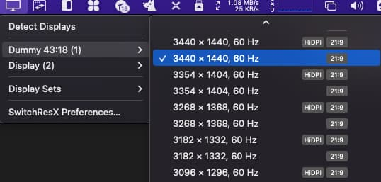

PVE 虚拟化黑苹果显卡直通教程（核显&独显通用），低延迟远程访问方案：VNC、ARD、ToDesk、ParSec、Jump Desktop  等远程桌面协议/软件测试横评

<!--more-->

## 适用场景

博主曾经用笔记本装黑苹果做过一段时间的主力机，但是因为有使用 Windows 的强需求，双系统切换不方便所以最终换回的 Windows。当时就在想如果有一台服务器跑着 MacOS，随时可以从主力机 Windows 远程访问岂不是两全其美。但是近年矿潮显卡价格虚高，实在是没有入手的欲望，最近趁矿难显卡价格下跌入手一块 AMD RX460 实践一下这个想法

阅读本文需要的前置步骤：

1. 一台运行 PVE 的主机
2. 在 PVE 上成功安装黑苹果（使用 ）
3. 至少进入黑苹果一次开启 `设置->共享->屏幕共享`（显卡直通可能会导致 PVE 自带的 VNC 卡在白苹果界面）

黑苹果能否成功运行和硬件以及驱动有很大的关系，而使用 PVE 使用的 KVM 虚拟化技术可以最大程度上屏蔽硬件的差异提高成功率，借助 [KVM-Opencore](https://github.com/thenickdude/KVM-Opencore) 项目提供的驱动可以做到开箱即用，不用折腾

PVE 和黑苹果安装教程这里推荐两篇博客，写的非常详细

- [Installing macOS 12 “Monterey” on Proxmox 7](https://www.nicksherlock.com/2021/10/installing-macos-12-monterey-on-proxmox-7)
- [国光的 PVE 生产环境配置优化记录](https://www.sqlsec.com/2022/04/pve.html)


对于国光这篇文章有一处勘误，文章中说到 PVE 7.1 不能显卡直通，实际上我测试是可以的，读者可以在下文中找到我使用的软件版本


## 主要配置

### 硬件配置

CPU: i5 10400
GPU: UHD630、AMD RX460

其他硬件均虚拟化

### 软件版本

虚拟化平台：PVE 

主要软件包版本：

```bash
~ pveversion -v
proxmox-ve: 7.1-1 (running kernel: 5.13.19-6-pve)
pve-manager: 7.1-12 (running version: 7.1-12/b3c09de3)
pve-kernel-helper: 7.1-14
pve-kernel-5.13: 7.1-9
...
```

MacOS 版本：macOS Monterey 12.3.1(21E258)（使用 [OSX-KVM](https://github.com/thenickdude/OSX-KVM) 项目制作镜像）
OpenCore&EFI 版本：[KVM-Opencore v16](https://github.com/thenickdude/KVM-Opencore/releases/tag/v16)

## 显卡直通

因为我是通过远程访问使用黑苹果，所以并没有把要直通的 GPU 设置为主 GPU，这是本文和其他直通教程的主要区别。这样做的好处是可以用 PVE 的后台直接查看黑苹果启动情况、进入 Recovery 模式等

参考 [Arch Linux wiki](https://wiki.archlinux.org/title/PCI_passthrough_via_OVMF_(%E7%AE%80%E4%BD%93%E4%B8%AD%E6%96%87))

### 启用 IOMMU

这里引用 Arch Linux wiki 中对 IOMMU 的介绍：

> IOMMU 是 Intel VT-d 和 AMD-Vi 的通用名称。
> VT-d 指的是直接输入/输出虚拟化(Intel Virtualization Technology for Directed I/O)，不应与VT-x(x86平台下的Intel虚拟化技术，Intel Virtualization Technology)混淆。VT-x 可以让一个硬件平台作为多个“虚拟”平台，而 VT-d 提高了虚拟化的安全性、可靠性和 I/O 性能。

首先在 BIOS 中开启 VT-d

然后修改内核参数开启 IOMMU：

```diff
- GRUB_CMDLINE_LINUX_DEFAULT="quiet"
+ GRUB_CMDLINE_LINUX_DEFAULT="quiet intel_iommu=on iommu=pt pcie_acs_override=downstream video=efifb:off"
```

这里解释下这几个参数的作用：

- intel_iommu=on：开启 IOMMU，对于 AMD CPU 需要使用 amd_iommu=on
- iommu=pt：pt 是 passthrough 的缩写，可以提高性能
- pcie_acs_override=downstream: 可以将同一 Group 中的设备分开直通
- video=efifb:off：禁用 efifb 驱动，防止出现报错 BAR 3: cannot reserve [mem]

更新内核参数

```bash
update-grub
```

重启后可以用以下脚本测试

```bash
bash -c "$(curl -fsSL https://gist.githubusercontent.com/ShadowySpirits/018ea8675100baf768afff0d835e7862/raw/8e1c12f5766f0d308628ad1373b2f8603c523480/check_iommu.sh)"
```

如果你遇到网络问题可以直接复制并执行以下脚本内容：

```bas
#!/bin/bash
shopt -s nullglob
for g in $(find /sys/kernel/iommu_groups/* -maxdepth 0 -type d | sort -V); do
    echo "IOMMU Group ${g##*/}:"
    for d in $g/devices/*; do
        echo -e "\t$(lspci -nns ${d##*/})"
    done;
done;

```

看到类似以下信息说明 IOMMU 开启成功

```
IOMMU Group 0:
        00:00.0 Host bridge [0600]: Intel Corporation Comet Lake-S 6c Host Bridge/DRAM Controller [8086:9b53] (rev 05)
IOMMU Group 1:
        00:01.0 PCI bridge [0604]: Intel Corporation 6th-10th Gen Core Processor PCIe Controller (x16) [8086:1901] (rev 05)

...

IOMMU Group 6:
        00:1c.0 PCI bridge [0604]: Intel Corporation Device [8086:a394] (rev f0)
        03:00.0 VGA compatible controller [0300]: Advanced Micro Devices, Inc. [AMD/ATI] Baffin [Radeon RX 460/560D / Pro 450/455/460/555/555X/560/560X] [1002:67ef] (rev cf)
        03:00.1 Audio device [0403]: Advanced Micro Devices, Inc. [AMD/ATI] Baffin HDMI/DP Audio [Radeon RX 550 640SP / RX 560/560X] [1002:aae0]
```


如果上面没有开启 `pcie_acs_override=downstream` 就只能将整个 Group 下的设备都直通给某个虚拟机


### 隔离 GPU

我们需要使用占位驱动程序（vfio）接管显卡，这样才能后续将显卡分配给虚拟机

在 PVE 宿主机的 /etc/modules 中添加 vfio 模块

```
vfio
vfio_iommu_type1
vfio_pci
vfio_virqfd
```

修改 /etc/modprobe.d/vfio.conf 将显卡的供应商-设备 ID 传递给 vfio 驱动，供应商-设备 ID 可以在上面脚本的输出的 `[]` 中找到，多个设备用 `,` 分隔

```
options vfio-pci ids=device_id1,device_id2 disable_vga=1
```

以我的 RX460 为例，它的供应商-设备 ID 是 1002:67ef 和 1002:aae0

```
IOMMU Group 6:
        00:1c.0 PCI bridge [0604]: Intel Corporation Device [8086:a394] (rev f0)
        03:00.0 VGA compatible controller [0300]: Advanced Micro Devices, Inc. [AMD/ATI] Baffin [Radeon RX 460/560D / Pro 450/455/460/555/555X/560/560X] [1002:67ef] (rev cf)
        03:00.1 Audio device [0403]: Advanced Micro Devices, Inc. [AMD/ATI] Baffin HDMI/DP Audio [Radeon RX 550 640SP / RX 560/560X] [1002:aae0]
```

所以需要添加的内容是：

```
options vfio-pci ids=1002:67ef,1002:aae0 disable_vga=1
```


然后在 PVE 宿主机的 /etc/modprobe.d/blacklist.conf 中禁用其他显卡驱动，防止这些驱动在 vfio 前加载

```
# NVIDIA
blacklist nvidiafb
blacklist nouveau
blacklist nvidia
blacklist snd_hda_intel

# Intel
blacklist snd_hda_codec_hdmi
blacklist i915

# AMD
blacklist radeon
```

最后应用更改并重启

```bash
update-initramfs -u
```

重启后就可以将显卡分配给虚拟机了：

在设备中选择添加 PCI 设备，然后选择你要添加的显卡即可（独显核显都可以）



不同的显卡这里选择的选项不太一样，根据我的试验：
直通 UHD630 只需要勾选 `全功能（All Functions）`
直通 AMD RX460 除了 `主 GPU（Primary GPU）` 外的选项都需要勾选


直通之后 PVE 自带的 VNC 可能会卡在白苹果界面，其实系统已经正常启动，可以使用 MacOS 自带的 VNC 进行连接


## 远程访问

### 分辨率调整

当你通过 PVE 自带的 VNC 连接黑苹果的时候会发现有一个分辨率为 1080p 的内置显示器，并且没有其他分辨率的选项，所以需要一些奇技淫巧来强制修改分辨率：

这里用到两个软件：BetterDummy 和 SwitchResX

首先使用 BetterDummy 创建一个和你物理显示器比例一致的虚拟显示器并设为主显示器


然后使用 SwitchResX 修改虚拟显示器分辨率为你物理显示器的原生分辨率




不推荐使用带有 HiDPI 的分辨率，因为 HiDPI 是一种超采样技术（HiDPI 原理可以参考[这篇文章](https://blog.skk.moe/post/hidpi-what-why-how/)）靠渲染更多的像素来使图像“看起来”更清晰。但是大部分远程桌面软件都会将原生分辨率压缩为当前物理屏幕分辨率进行传输，所以开启 HiDPI 除了会浪费计算资源、增加延迟外没有任何意义


（可选）使用 SwitchResX 关闭默认显示器
这个步骤不是必须的，如果你的远程桌面软件无法选择用于串流的显示器（比如 VNC Viewer）可以关闭默认显示器来强制软件使用虚拟显示器


### 原生方案

MacOS 原生提供 VNC 和 ARD 两种协议进行远程访问，可以在 `设置->分享` 中开启

#### VNC

自带的 VNC 是阉割版的，体验上做的很差：不支持调整画质、分辨率，不支持选择显示器（多显示器会横向拼接显示内容）从 Windows 访问键位映射有问题并且无法修改，卡顿严重，拖动窗口的时候尤其明显。唯一的优点是画质非常好，是本文介绍的所有方案中唯一一个使用原生分辨率传输（开启 HiDPI 画质明显提升）

#### ARD

ARD 属于是 VNC 套壳，可以使用 Apple 官方的 [Apple Remote Desktop](https://apps.apple.com/us/app/apple-remote-desktop/id409907375?mt=12) 软件（售价高达 518，不会真有冤大头会买吧。。。）连接黑苹果主机。相比于 VNC，ARD 支持选择显示器，提供 4 挡可调的图像质量，在保证画质的前提下提供不错的延迟表现。并且除了远程桌面以外还提供命令执行、系统报告、文件传输等系统管理功能，缺点是只支持 MacOS（Windows 下可以使用支持 VNC 协议的软件连接，但是会退化成和原生 VNC 一样的垃圾体验）

#### 自建 VNC Server

既然自带的 VNC 如此不堪使用，ARD 又不提供 Windows 客户端，我们只能求助于第三方软件来提供满血版 VNC 协议支持。这里推荐 [Real VNC](https://www.realvnc.com/en/connect/download/vnc/macos/)，可以兼具 VNC 高画质和 ARD 的低延迟，除了不支持 HiDPI 外基本上能提供和连接显示器一致的体验

### 第三方软件/私有协议

#### ToDesk

ToDesk 在我的体验中卡顿非常严重。除了提供免费的内网穿透以外，相比其他方案基本上毫无优势可言，如果你有公网 IP 的话不要选择它。所以名气大的（尤其是国产软件）不一定真的好用。。。

#### ParSec

ParSec 的原本用途是游戏串流，提供精细的配置项可供选择，细节上体验很舒适。相比于其他方案它的延迟和画面质量很稳定，不会在画面快速变化时卡顿或者糊掉，并且支持播放被控主机声音。可能是现在 Mac 版还处于 Beta 阶段的原因，ParSec 对性能要求很高，RX460 在 2560×1440 分辨率下延迟 20ms 左右，3440×1440（2k 带鱼屏）分辨率下延迟 40ms 左右

#### Jump Desktop

Jump Desktop 是老牌 mac 远程桌面应用，使用私有的 Fluid 协议。延迟低、带宽占用低，但是画面也是最糊的，特别是窗口拖动等画面快速变化的场景涂抹感非常严重。Jump Desktop 支持自定义任何按键或是组合键的映射，和 ParSec 一样也支持播放被控主机声音

## 总结与性能测试

测试环境：

GPU： 直通 RX460 GeekBench 5 Metal 分 21000 左右，性能大致相当于 M1 核显
网络：内网（网络延迟 <1ms）
分辨率：3440x1440（非 HiDPI）
软件版本：各软件均使用当前最新免费/试用版，画质选择最高一档

| 软件/协议    | 延迟         | 画质               | 按键映射                 | 多显示器       | 声音   | 文件传输 | 连接方式          |
|--------------|--------------|--------------------|--------------------------|----------------|--------|----------|-------------------|
| 原生 VNC     | 高           | 最好（支持 HiDPI） | 不支持修改               | 拼接所有显示器 | 不支持 | 不支持   | 直连              |
| RealVNC      | 低（2ms）    | 最好               | 自定义任何按键映射         | 服务端配置     | 不支持 | 支持     | 直连              |
| ARD          | 中等         | 一般（滚动时画面会糊）| 不支持修改               | 客户端选择     | 不支持 | 支持     | 直连              |
| ToDesk       | 高          | 一般（有明显涂抹感） | 自定义功能键映射         | 客户端选择     | 不支持 | 支持     | 免费内网穿透      |
| ParSec       | 中等（40ms）         | 较好（有轻微涂抹感）   | 不支持修改               | 客户端选择     | 支持   | 不支持   | 直连（自动 UPNP） |
| Jump Desktop | 低（10ms）   | 差（画面最糊）     | 自定义任何按键映射 | 客户端选择     | 支持   | 不支持   | 直连（自动 UPNP） |


除 ToDesk 外的方案若想要通过公网访问均需要被控端具备公网 IP 并配置端口映射或自行搭建内网穿透
ParSec 和 Jump Desktop 会通过 UPNP 帮你自动映射端口，并且登陆它们的账号可以直接看到你的被控端主机，不用通过 IP 手动添加主机，尤其适用于你的公网 IP 是动态 IP 的情况
