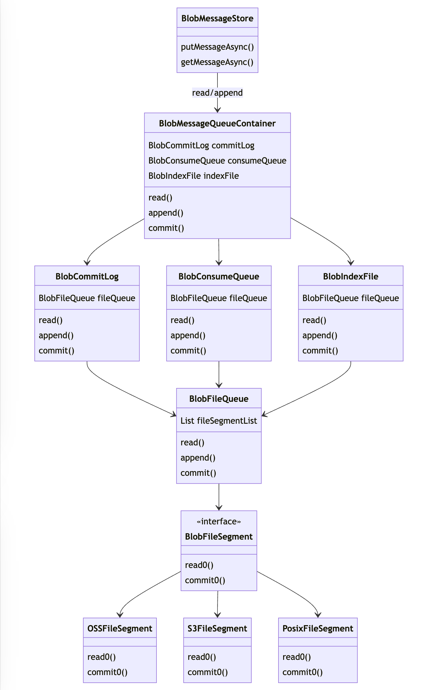

# Tiered storage for RocketMQ

## Status

- Current State: Proposed
- Authors: [SSpirits](https://github.com/ShadowySpirits)
- Shepherds: [Yukon](https://github.com/zhouxinyu), [Zhanhui Li](https://github.com/lizhanhui)
- Mailing List discussion: [dev@rocketmq.apache.org](mailto:dev@rocketmq.apache.org)
- Pull Request: #PR_NUMBER
- Released: <released_version>

## Background & Motivation

### What do we need to do

- Will we add a new module? -- Yes.
- Will we add new APIs? -- Yes.
- Will we add new features? -- Yes.

### Why should we do that

- Are there any problems with our current project?

  No. But we propose to extend the ability of RocketMQ Store module.

  Currently, RocketMQ only supports storing messages in the local disk and writes all messages to CommitLog based on the append-only mode. This storage model brings extremely high throughput and support for a large number of topics, but faces the following problems at the same time:

  1. Only supports fixed message reserve time, and cannot set Topic level ttl
  2. MessageStore only provides synchronous read API. If there are a large number of old message reads (page cache miss), worker thread will be blocked and other requests will be suspended.
  3. Topic partitions are bound to Broker and cannot be migrated, making it impossible to reduce the size of the cluster without loss of historical messages.

  Tiered storage described in this proposal can solve the above three problems: blob store provides a cheaper, larger, and expandable storage pool, so we can flexibly set the message reverse time according to needs. We build a message-level CommitLog to better support stream computing and message-level TTL, which will be discussed in detail below. Moreover, use asynchronous API to release rare Processer and Netty threads and separate the reading request of new and old data to avoid the impact of page cache miss on Broker service quality. Last but not least, the messages stored on blob store can be easily read by other Brokers, which allows us to simply reduce the size of cluster without worrying that loss historical messages.

- What can we benefit from proposed changes?

  Tiered storage can bring the following enhancements to the storage layer:

  1. Extend the message reserve time for stream computing and message archive.
  2. Reduce the pressure of old message reading on disk IO.
  3. Separating the message partition from Broker, so that cluster can be scaled down without sacrificing.

## Goals

- What problem is this proposal designed to solve?

  1. Implement asynchronous interface of the read API for storage layer.
  2. Implement a tiered storage module based on blob store.
  3. Introduce the ability to proxy another Broker to read messages.

## Non-Goals

- What problem is this proposal NOT designed to solve?

  1. It does not completely solve the problem of binding Topic partition to Broker, but only provides the ability to read from other nodes after the original Broker goes offline.
  2. Compact Topic is not supported yet by design.

- Are there any limits to this proposal?

  Nothing specific.

## Changes

### Architecture

This proposal plans to use a plugin store (extend AbstractPluginMessageStore) to achieve tiered storage capabilities and provide a decorator for DefaultMessageStore so that Broker can extend message reserve time without modification: users can simply change the messageStorePlugIn configuration to enable tiered storage.

As shown in the above architecture diagram, tiered storage module uses a file structure similar to the current store module, which is still CommitLog, ConsumeQueue, and IndexFile. The main difference is that CommitLog belongs to the topic level. Tiered storage provides an adaptation layer specially designed for object storage. Users can choose the blob store service they use such as S3, OSS, MinIO, etc.

#### Access layer

Including the BlobMessageStore in the diagram above, access layer implement read and write interface compatible with MessageStore. MessageStore needs to be modified to provide asynchronous interfaces, and tiered storage needs to use separate thread pools to avoid slow IO from blocking access to hot data.

#### Transformer layer

Including the BlobCommitLog, BlobConsumeQueue and BlobIndexFile in the diagram above, transformer layer serialize and deserialize data/metadata to storage format.

Data:
CommitLog now belongs to the Topic level to adapt to the characteristics of object storage and provide message-level TTL, which requires modifying the physical offset in the message and ConsumeQueue item.

Metadata:
Every file that stores message data should have related metadata. These metadata is used to manage syncing progress and recover data from crash. Moreover, migrate metadata from one broker to another to read historical messages of any topic partition from any node.

#### Adaptation layer

The adaptation layer including BlobFileQueue and BlobFileSegment aims to provide blob store access interface. BlobFileSegment abstracts platform-independent blob store access interfaces, and implements these interfaces with specific APIs to adapt to different blob store services, such as S3FileSegment, OSSFileSegment. Even though tiered storage is designed for blob store, it can also implement PosixFileSegment to adpat all distributed store services providing POSIX api.

### Interface Design/Change

- Method signature changes -- Add some async function in the Store module.
- Method behavior changes -- Nothing specific.
- CLI command changes -- Nothing specific.
- Log format or content changes -- Nothing specific.

### Compatibility, Deprecation, and Migration Plan

This proposal needs to modify API specification of MessageStore to add asynchronous interfaces. This only involves changes inside the server side, without relying on a specific client version or changing the way that client is used. It is completely transparent to applications connected to RocketMQ.

### Implementation Outline

We split this proposal into several tasks:

- Task1: Add asynchronous interfaces to MessageStore.
- Task2: Implement tiered storage.
- Task3: Implement tiered storage metadata migration to access messages from other Brokers.

## Rejected Alternatives

None.

### How do alternatives solve the issue you proposed?

None.

java -cp base-1.0-SNAPSHOT-all.jar moe.lv5.poc.base.db.mysql.DeleteUnusedDelayMsgKt \
--username metaq_trans \
--password Rocketmq\!666 \
--host rm-bp18x9d2trpw432746o.mysql.rds.aliyuncs.com \
--port 3306 \
--db metaq_trans \
--table metaq_0_normal \
--topic VIP-TIMER \
--tag EXPIRES_AT_DATE_LUCKDRAW \
--broker cn-qingdao-public-share-12-0 \
--limit 1