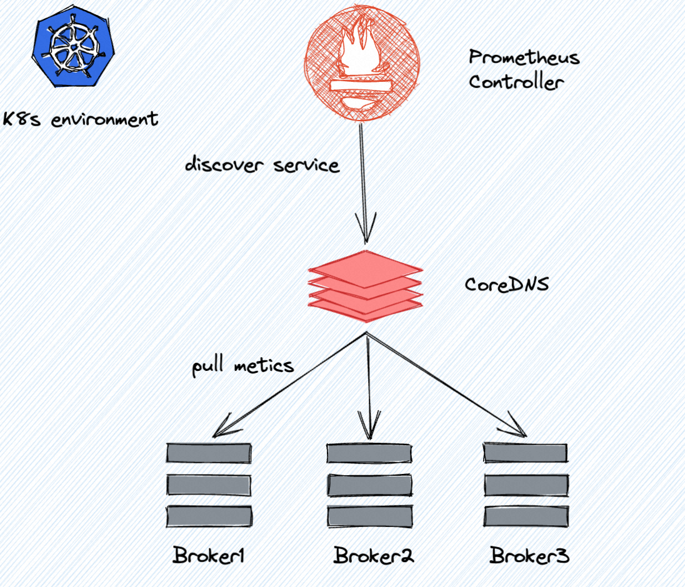
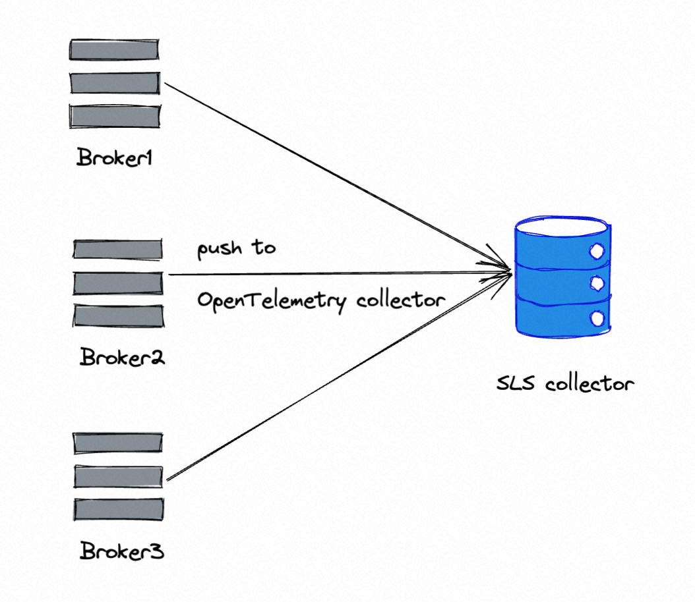
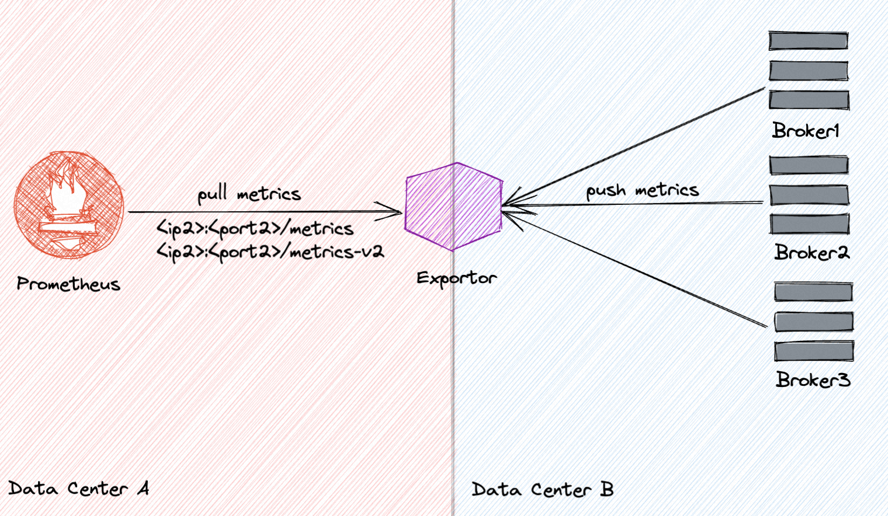

# Observability improvement for RocketMQ

## Status

- Current State: Proposed
- Authors: [SSpirits](https://github.com/ShadowySpirits), [aaron-ai](https://github.com/aaron-ai), [WentingYang](https://github.com/yangwenting-ywt)
- Shepherds: [Yukon](https://github.com/zhouxinyu), [Zhanhui Li](https://github.com/lizhanhui)
- Mailing List discussion: [dev@rocketmq.apache.org](mailto:dev@rocketmq.apache.org)
- Pull Request: #PR_NUMBER
- Released: <released_version>

## Background & Motivation

### What do we need to do

- Will we add a new module? -- No.
- Will we add new APIs? -- No.
- Will we add new features? -- Yes.

### Why should we do that

- Are there any problems with our current project?

  Currently, the RocketMQ kernel doesn't support metrics natively. Rocketmq community has a project, rocketmq-exporter, to grab broker runtime data and export it to Prometheus. This project suffers some limits:

  1. Inconvenience: user who wants to build a monitor system must deploy a standalone component.
  2. Performance: rocketmq-exporter grabs metrics data using mqadmin tools, which puts additional pressure on broker and client.
  3. Standard: currently, rocketmq-exporter doesn't follow the Prometheus metrics naming convention. This will bring confusion to users who want to build their monitoring system.
  4. Applicability: rocketmq-exporter only supports broker metrics. With the release of RocketMQ 5.0, more modules also need to expose metrics.

- What can we benefit from proposed changes?

  1. Provides out-of-the-box metrics for broker and proxy. No need to deploy any other component.
  2. Adapt to community observability standard.
  3. More metrics and more accuracy.

## Goals

- What problem is this proposal designed to solve?

  1. Redesign metrics. Embrace OpenTelemetry specification and community.
  2. Implement a metrics architecture for RocketMQ modules, such as broker, proxy, etc.
  3. Support pull (by Prometheus) and push (to OpenTelemetry collector) mode to get metrics data.
  4. Maintain compatibility. Users who use rocketmq-exporter could seamlessly migrate to the new metrics system.

## Non-Goals

- What problem is this proposal NOT designed to solve?

  The goal of this RIP only involves metrics. Tracing and logging are out of scope.

- Are there any limits to this proposal?

  Nothing specific.

## Changes

### Architecture

This RIP will not involve too many architectural changes. It implements a metrics manager like BrokerStatsManger to collect and export metrics. The metrics manager provides two ways to export metrics: pull or push. 

Pull mode is designed to be compatible with Prometheus. Typical, in the K8S deployment environment, Prometheus can directly pull metrics data from the endpoint provided by broker. There is no need to deploy additional components.

Push mode is recommended by OpenTelemetry, which means it needs to deploy a collector to transfer metrics data.

This RIP does not discuss the metrics specification details, which will be addressed in further issues.

### Interface Design/Change

- Method signature changes -- Nothing specific.
- Method behavior changes -- Nothing specific.
- CLI command changes -- Nothing specific.
- Log format or content changes -- Nothing specific.

### Compatibility, Deprecation, and Migration Plan

Some users are now using rocketmq-exporter. New metrics require compatibility with current usage. And the control panel, such as Prometheus, is not necessarily deployed under the same network as broker. So It is also meaningful to design a proxy mode of rocketmq-exporter to access new metrics data.

We could implement an OpenTelemetry collector in rocketmq-exporter: Broker export metrics data to rocketmq-exporter, and rocketmq-exporter provide a new endpoint for Prometheus access.

### Implementation Outline

We split this proposal into several tasks:

- Task1: Define the specification of metric.
- Task2: Implement metrics collector and exporter framework in broker and proxy.
- Task3: Develop metrics for broker and proxy.
- Task4: Backport new metrics to rocketmq-exporter.
- Task5: Other ecosystem work, like document, Grafana dashboard template, etc.

## Rejected Alternatives

Keep the status quo, and continue to use rocketmq-exporter.

### How do alternatives solve the issue you proposed?
