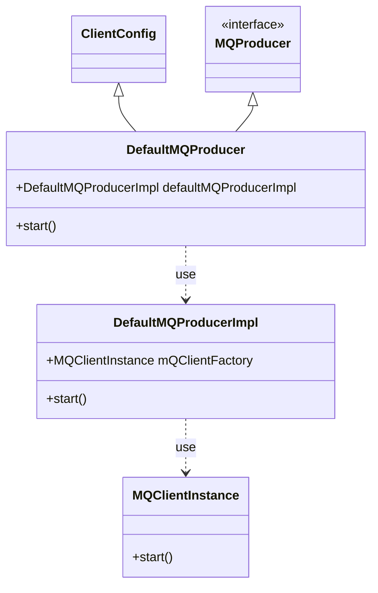
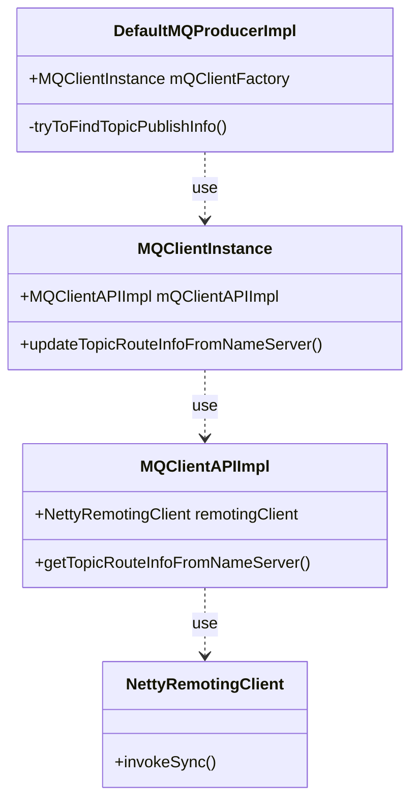
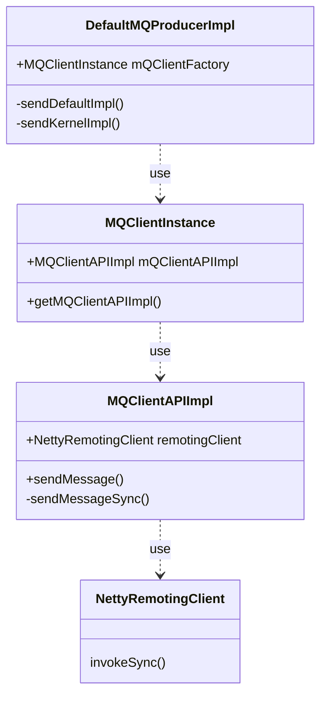
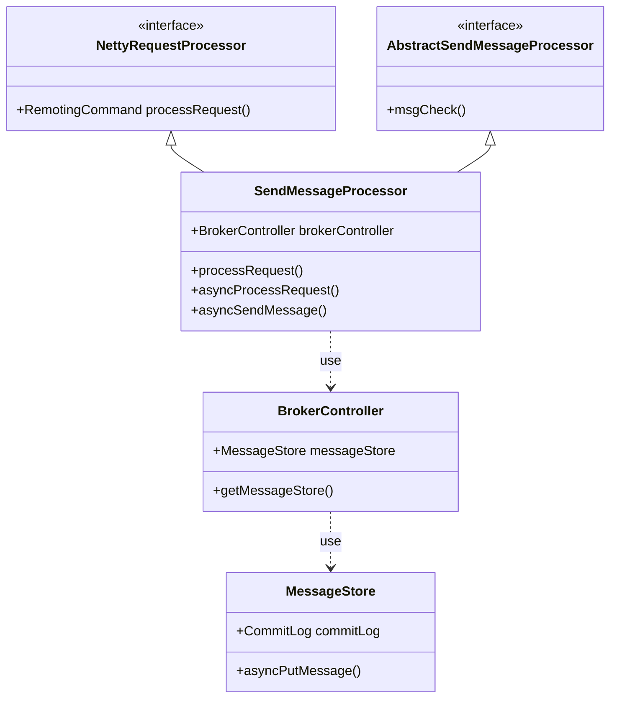
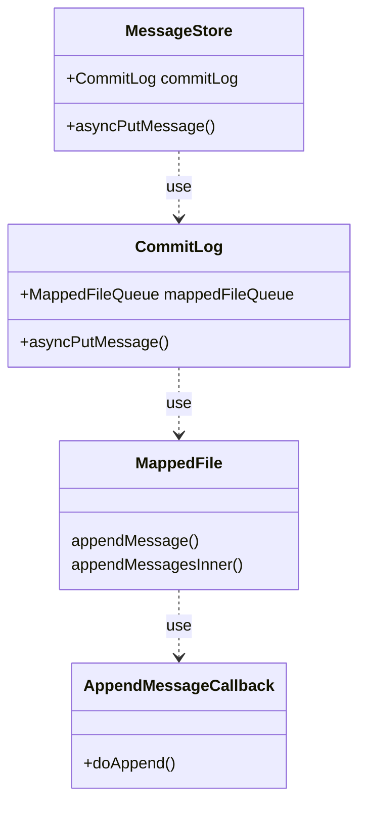
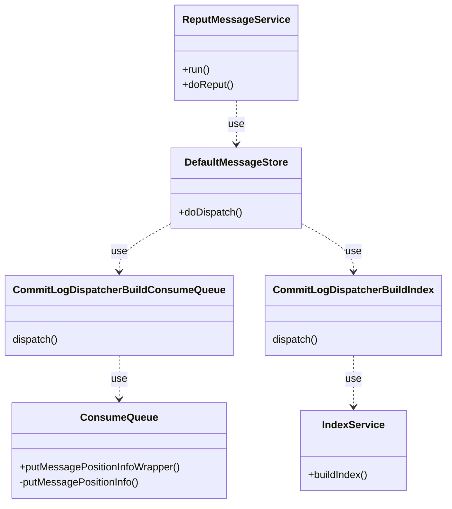
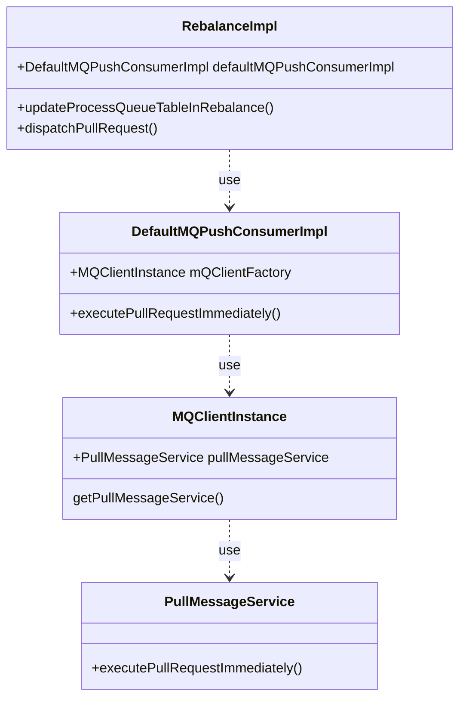
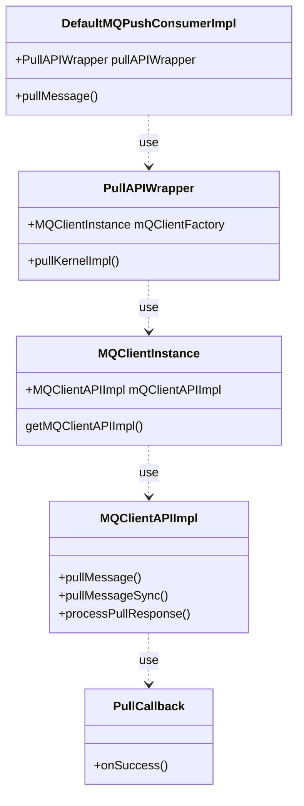
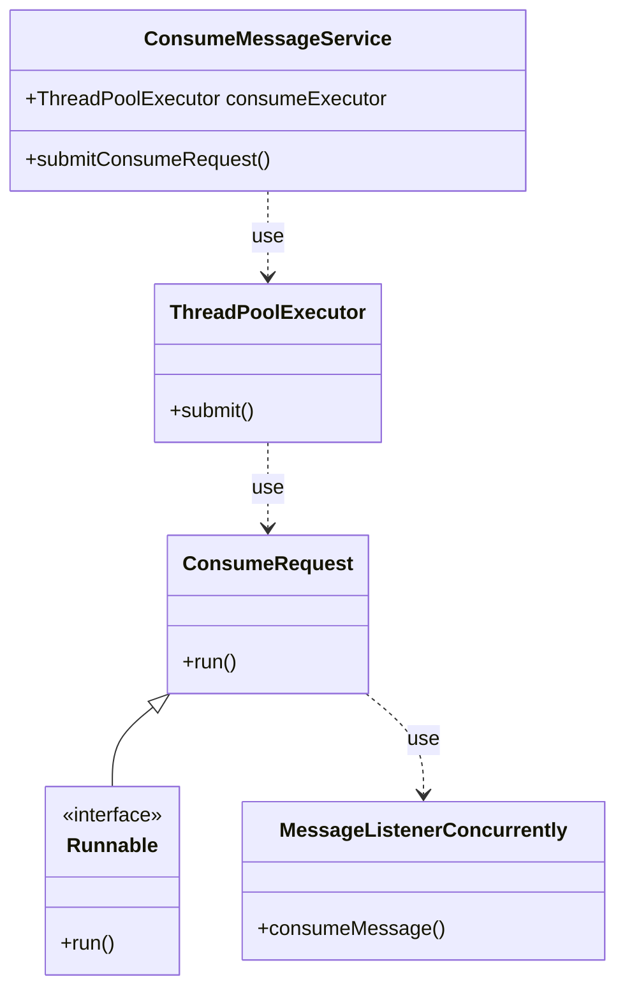

本文是 RocketMQ 消息生命周期系列的第一篇，通过分析 RocketMQ 消息发送、储存、消费的全流程介绍一条消息的生命周期

<!--more-->


基于 RocketMQ 4.9.1，仅讨论普通消息及 Push 模式消费者


## 发送消息

首先从官方给出的[生产者示例](https://github.com/apache/rocketmq/blob/caadd816b4b7c818ac4fa5ee34857259449543b6/example/src/main/java/org/apache/rocketmq/example/simple/Producer.java)开始：

```java
public class Producer {
    public static void main(String[] args) throws MQClientException, InterruptedException {

        DefaultMQProducer producer = new DefaultMQProducer("ProducerGroupName");
        producer.start();

        for (int i = 0; i < 128; i++)
            try {
                {
                    Message msg = new Message("TopicTest",
                        "TagA",
                        "OrderID188",
                        "Hello world".getBytes(RemotingHelper.DEFAULT_CHARSET));
                    SendResult sendResult = producer.send(msg);
                    System.out.printf("%s%n", sendResult);
                }

            } catch (Exception e) {
                e.printStackTrace();
            }

        producer.shutdown();
    }
}
```

可以发现这段代码做了三件事情：

1. 构造 Producer
2. 生成 Message
3. 使用 Producer 发送 Message

我们依次来分析这三步

### 构造 Producer

构造 `DefaultMQProducer` 只是一个壳子，真正的实现在 `DefaultMQProducerImpl` 类, 我们来看一下 `DefaultMQProducerImpl#start` 方法

```java
public void start(final boolean startFactory) throws MQClientException {
    switch (this.serviceState) {
        case CREATE_JUST:
            this.serviceState = ServiceState.START_FAILED;

            ...

            this.mQClientFactory = MQClientManager.getInstance().getOrCreateMQClientInstance(this.defaultMQProducer, rpcHook);

            ...

            if (startFactory) {
                mQClientFactory.start();
            }

            log.info("the producer [{}] start OK. sendMessageWithVIPChannel={}", this.defaultMQProducer.getProducerGroup(),
                this.defaultMQProducer.isSendMessageWithVIPChannel());
            this.serviceState = ServiceState.RUNNING;
            break;
        case RUNNING:
        case START_FAILED:
        case SHUTDOWN_ALREADY:
            throw new MQClientException("The producer service state not OK, maybe started once, "
                + this.serviceState
                + FAQUrl.suggestTodo(FAQUrl.CLIENT_SERVICE_NOT_OK),
                null);
        default:
            break;
    }
    ...
}
```

其中最核心的部分是调用 `MQClientManager#getOrCreateMQClientInstance` 创建 MQClientInstance 单例。由此我们知道了 RocketMQ Producer 相关类的结构：



继续分析 `MQClientInstance#start` 方法：

```java
// If not specified,looking address from name server
if (null == this.clientConfig.getNamesrvAddr()) {
    this.mQClientAPIImpl.fetchNameServerAddr();
}
// Start request-response channel
this.mQClientAPIImpl.start();
// Start various schedule tasks
this.startScheduledTask();
// Start pull service
this.pullMessageService.start();
// Start rebalance service
this.rebalanceService.start();
```

可以看到 MQClientInstance 持有了一系列用于和后端交互的对象：

- mQClientAPIImpl 负责处理 rpc
- `MQClientInstance#startScheduledTask` 方法中启动了更新 Topic 路由、上报消费位点等定时任务
- pullMessageService 负责消费者拉取消息
- rebalanceService 负责消费者负载均衡

不同类型的客户端（如 DefaultMQProducer、TransactionMQProducer）负责实现不同消息类型的特定逻辑，底层的 MQClientInstance 负责和 Broker 和 NameServer 交互

### 生成消息

调用 Message 类的构造函数即可生成一条消息，可以按需设置参数

```java
public Message(String topic, String tags, String keys, byte[] body)
```


和 kafka 不同，Rocketmq 的消费者并没有绑定 topic 和 schema，可以向任意 topic 发送消息


### 发送消息

#### 消息路由

生成消息时我们并没有指定要将消息发送到哪台 broker 上，需要有一个路由发现机制：根据 topic 自动发现 broker 地址

在启动 producer 之前，我们会设置服务发现组件 NameServer 的地址

```java
producer.setNamesrvAddr("127.0.0.1:9876");
```

Producer 请求 NameServer 来获取 Topic 对应的 Broker 地址，调用链如下：



`MQClientInstance#updateTopicRouteInfoFromNameServer` 方法封装了从 NameServer 请求 Topic 路由信息的细节:

```java
public boolean updateTopicRouteInfoFromNameServer(final String topic, boolean isDefault, DefaultMQProducer defaultMQProducer) {
    ...

    // 调用 MQClientAPIImpl#getTopicRouteInfoFromNameServer 发起 RPC 请求
    topicRouteData = this.mQClientAPIImpl.getTopicRouteInfoFromNameServer(topic, clientConfig.getMqClientApiTimeout());

    ...

    // 更新所有 Producer 和 consumer 的路由信息
    // Update Pub info
    if (!producerTable.isEmpty()) {
        TopicPublishInfo publishInfo = topicRouteData2TopicPublishInfo(topic, topicRouteData);
        publishInfo.setHaveTopicRouterInfo(true);
        Iterator<Entry<String, MQProducerInner>> it = this.producerTable.entrySet().iterator();
        while (it.hasNext()) {
            Entry<String, MQProducerInner> entry = it.next();
            MQProducerInner impl = entry.getValue();
            if (impl != null) {
                impl.updateTopicPublishInfo(topic, publishInfo);
            }
        }
    }

    // Update sub info
    if (!consumerTable.isEmpty()) {
        Set<MessageQueue> subscribeInfo = topicRouteData2TopicSubscribeInfo(topic, topicRouteData);
        Iterator<Entry<String, MQConsumerInner>> it = this.consumerTable.entrySet().iterator();
        while (it.hasNext()) {
            Entry<String, MQConsumerInner> entry = it.next();
            MQConsumerInner impl = entry.getValue();
            if (impl != null) {
                impl.updateTopicSubscribeInfo(topic, subscribeInfo);
            }
        }
    }
}
```

#### 选择写入的 Broker

Producer 从 NameServer 获取到 Topic 的路由信息后，需要从所有 Broker 中选择一台来发送消息。默认的算法会让我们的消息均匀分布在所有的 Broker 上，当然也可以使用自定义的负载均衡算法：

```java
// 使用默认负载均衡算法
SendResult send(final Message msg)
    throws MQClientException, RemotingException, MQBrokerException, InterruptedException;

// 自定义负载均衡算法，多用于顺序消息
SendResult send(final Message msg, final MessageQueueSelector selector, final Object arg)
    throws MQClientException, RemotingException, MQBrokerException, InterruptedException;
```

本文只讨论普通消息，也就是默认负载均衡算法实现 `DefaultMQProducerImpl#selectOneMessageQueue`

```java
// TopicPublishInfo 是从 NameServer 获取到的路由信息
public MessageQueue selectOneMessageQueue(final TopicPublishInfo tpInfo, final String lastBrokerName)
```

最终调用 `TopicPublishInfo#selectOneMessageQueue` 简单的取模运算选择一个 Broker 的队列作为本条消息的目的地

```java
public MessageQueue selectOneMessageQueue(final String lastBrokerName) {
    if (lastBrokerName == null) {
        return selectOneMessageQueue();
    } else {
        for (int i = 0; i < this.messageQueueList.size(); i++) {
            int index = this.sendWhichQueue.incrementAndGet();
            int pos = Math.abs(index) % this.messageQueueList.size();
            if (pos < 0)
                pos = 0;
            MessageQueue mq = this.messageQueueList.get(pos);
            // 规避上一次选择的 Broker
            if (!mq.getBrokerName().equals(lastBrokerName)) {
                return mq;
            }
        }
        return selectOneMessageQueue();
    }
}
```


这里的 `Math.abs(index)` 是为了避免自增超过 Integer 的上限溢出为负数
相关原理可以阅读这篇文章：[由 Math.abs 谈负数转换与绝对值运算]()


#### 发送 RPC

本文只讨论普通消息，也就是 `DefaultMQProducerImpl#sendDefaultImpl`，调用链路如下：



`DefaultMQProducerImpl#sendDefaultImpl` 方法中会更新 Topic 路由、选择要发送的目的 Broker 和队列，然后调用 `DefaultMQProducerImpl#sendKernelImpl` 将用户构建的 Message 包装为发送消息的 RPC 需要的格式，最后调用 `MQClientAPIImpl#sendMessage` 发送出去

#### 异常处理

既然发送消息是一次 RPC 调用那么失败在所难免，RocketMQ 提供了失败重试机制：

Producer 的参数 `DefaultMQProducer#retryTimesWhenSendFailed` 控制最大重试次数，默认值是 2 也就是重试两次

`DefaultMQProducer#sendDefaultImpl` 方法中会捕获发送异常并重新进行发送

```java
private SendResult sendDefaultImpl(
    Message msg,
    final CommunicationMode communicationMode,
    final SendCallback sendCallback,
    final long timeout
) throws MQClientException, RemotingException, MQBrokerException, InterruptedException {
    ...

    int timesTotal = communicationMode == CommunicationMode.SYNC ? 1 + this.defaultMQProducer.getRetryTimesWhenSendFailed() : 1;
    int times = 0;
    for (; times < timesTotal; times++) {
        MessageQueue mqSelected = this.selectOneMessageQueue(topicPublishInfo, lastBrokerName);
        try {
            sendResult = this.sendKernelImpl(msg, mq, communicationMode, sendCallback, topicPublishInfo, timeout - costTime);
        } catch ...
    }
}
```

如果重试次数达到上限仍未发送成功会将最后一次失败的异常向调用方抛出


`DefaultMQProducer#sendKernelImpl` 方法中会调用 `MessageClientIDSetter.setUniqID` 为消息设置 messageId（消息属性中的 UNIQ_KEY 字段），但是发送失败触发的重试并不会覆盖这个字段，所以某些特殊异常情况下可能会有多个相同 messageId 的消息存在


## 储存消息

### 处理 RPC

RocketMQ 的网络层基于 Netty 实现的 `BrokerController#registerProcessor` 方法中注册了继承自 `NettyRequestProcessor` 的类来处理不同的 RPC，其中 `SendMessageProcessor` 类来处理发送消息相关的 RPC。我们只要分析 `SendMessageProcessor#processRequest` 方法即可，调用链如下：



`SendMessageProcessor#processRequest` 中先调用 `AbstractSendMessageProcessor#msgCheck` 方法检查 Broker 状态是否正常、当前消息的 Topic 是否已经创建等，然后将 Producer 发送过来的消息包装为 MessageExtBrokerInner，加入从请求中提取的信息和当前 Broker 的详情（如 BornTimeStamp、BornHost、StoreHost 等），最后调用 `MessageStore#asyncPutMessage` 方法将消息写入储存层

### 储存消息

#### 写入 MappedFile

`MessageStore#asyncPutMessage` 中先对储存层状态和消息长度进行检查后就调用 `CommitLog#asyncPutMessage` 向文件系统中写入消息，储存层整个调用链如下：



每台 Broker 中消息写入都是一个串行的流程，`CommitLog#asyncPutMessage` 方法中会进行加锁操作


消息的 StoreTimeStamp 字段是消息开始写入 MappedFile 的时间，并不是消息落盘时间


```java
public CompletableFuture<PutMessageResult> asyncPutMessage(final MessageExtBrokerInner msg) {
    // 将消息序列化为二进制格式
    PutMessageResult encodeResult = putMessageThreadLocal.getEncoder().encode(msg);
    if (encodeResult != null) {
        return CompletableFuture.completedFuture(encodeResult);
    }
    msg.setEncodedBuff(putMessageThreadLocal.getEncoder().encoderBuffer);


    putMessageLock.lock();
    try {
        MappedFile mappedFile = this.mappedFileQueue.getLastMappedFile();
        long beginLockTimestamp = this.defaultMessageStore.getSystemClock().now();
        // 设置消息的储存时间，因为消息的写入需要加锁，所以同一 Broker 的消息储存时间是单调递增的
        msg.setStoreTimestamp(beginLockTimestamp);

        result = mappedFile.appendMessage(msg, this.appendMessageCallback, putMessageContext);
    } finally {
        beginTimeInLock = 0;
        putMessageLock.unlock();
    }
}
```

`MappedFile` 类将硬盘中的 CommitLog 文件映射为虚拟内存：

```java
// MappedFile#init
private void init(final String fileName, final int fileSize) throws IOException {
    this.file = new File(fileName);
    this.fileChannel = new RandomAccessFile(this.file, "rw").getChannel();
    this.mappedByteBuffer = this.fileChannel.map(MapMode.READ_WRITE, 0, fileSize);
}
```

`MappedFile#appendMessagesInner` 将消息写入 CommitLog 文件映射的 mappedByteBuffer 中：

```java
// MappedFile#init
private AppendMessageResult appendMessagesInner(final MessageExt messageExt, final AppendMessageCallback cb, PutMessageContext putMessageContext) {
    // 获取写入消息的 ByteBuffer
    ByteBuffer byteBuffer = writeBuffer != null ? writeBuffer.slice() : this.mappedByteBuffer.slice();
    byteBuffer.position(currentPos);
    AppendMessageResult result;
    // 将消息写入 ByteBuffer
    result = cb.doAppend(this.getFileFromOffset(), byteBuffer, this.fileSize - currentPos, (MessageExtBrokerInner) messageExt, putMessageContext);
}
```

获取到要写入的 ByteBuffer 后调用 `AppendMessageCallback#doAppend` 方法将消息序列化并写入 ByteBuffer 中，`AppendMessageCallback` 的默认实现是 `CommitLog` 的内部类 `DefaultAppendMessageCallback`

#### 消息落盘

`CommitLog#asyncPutMessage` 方法在成功将消息写入 MappedFile 提供的 ByteBuffer 后会提交刷盘任务：

```java
public CompletableFuture<PutMessageResult> asyncPutMessage(final MessageExtBrokerInner msg) {
    // 提交刷盘任务
    CompletableFuture<PutMessageStatus> flushResultFuture = submitFlushRequest(result, msg);
    // 提交复制任务
    CompletableFuture<PutMessageStatus> replicaResultFuture = submitReplicaRequest(result, msg);
}
```

根据 Broker 配置选择同步刷盘或异步刷盘


只有 Broker 为同步刷盘并且 Message 的 WAIT 属性（默认为 true）为 true 时发送消息 RPC 才会等待刷盘结果，否则直接返回发送成功


```java
public CompletableFuture<PutMessageStatus> submitFlushRequest(AppendMessageResult result, MessageExt messageExt) {
    // 同步刷盘
    if (FlushDiskType.SYNC_FLUSH == this.defaultMessageStore.getMessageStoreConfig().getFlushDiskType()) {
        final GroupCommitService service = (GroupCommitService) this.flushCommitLogService;
        if (messageExt.isWaitStoreMsgOK()) {
            GroupCommitRequest request = new GroupCommitRequest(result.getWroteOffset() + result.getWroteBytes(),
                    this.defaultMessageStore.getMessageStoreConfig().getSyncFlushTimeout());
            flushDiskWatcher.add(request);
            service.putRequest(request);
            return request.future();
        } else {
            service.wakeup();
            return CompletableFuture.completedFuture(PutMessageStatus.PUT_OK);
        }
    }
    // 异步刷盘
    else {
        if (!this.defaultMessageStore.getMessageStoreConfig().isTransientStorePoolEnable()) {
            flushCommitLogService.wakeup();
        } else  {
            commitLogService.wakeup();
        }
        return CompletableFuture.completedFuture(PutMessageStatus.PUT_OK);
    }
}
```

最终调用 `MappedFile#flush` 方法将映射文件虚拟内存中的脏页写回硬盘

```java
public int flush(final int flushLeastPages) {
    ...

    // 强制将脏页写回磁盘
    if (writeBuffer != null || this.fileChannel.position() != 0) {
        this.fileChannel.force(false);
    } else {
        this.mappedByteBuffer.force();
    }

    ...
}
```

### 构建索引 ConsumeQueue

消息写入到硬盘后并不能立刻为消费者所见，因为消费者并不直接读取 CommitLog 文件，而是读取 ConsumeQueue。只有将消息分发到对应队列的 ConsumeQueue 中消费者才能拉取这条消息，这个过程在 RocketMQ 中被称为 `Dispatch`

Dispatch 工作由 `ReputMessageService` 来执行，调用链如下：



`ReputMessageService#doReput` 定期检查 CommitLog 的位点，将还没有构建 ConsumeQueue 的消息分发出去，最终调用 `ConsumeQueue#putMessagePositionInfo` 方法构建 ConsumeQueue，每个 ConsumeQueue 的结构如下：

```java
private boolean putMessagePositionInfo(final long offset, final int size, final long tagsCode, final long cqOffset) {
    this.byteBufferIndex.flip();
    // ConsumeQueue 的每个 item 都是固定 20 字节的长度
    this.byteBufferIndex.limit(CQ_STORE_UNIT_SIZE);
    // 消息在 CommitLog 文件中的 offset
    this.byteBufferIndex.putLong(offset);
    // 消息大小
    this.byteBufferIndex.putInt(size);
    // 消息 tag 的 HashCode，用于 tag 过滤消息
    this.byteBufferIndex.putLong(tagsCode);
}
```

## 消费消息

分析消费逻辑之前我们也先看一下官方示例：

```java
public class PushConsumer {

    public static void main(String[] args) throws InterruptedException, MQClientException {
        DefaultMQPushConsumer consumer = new DefaultMQPushConsumer("CID_JODIE_1");
        // 设置订阅的 topic 和 tag
        consumer.subscribe("TopicTest", "*");
        // 设置消费者第一次上线从何处开始消费
        consumer.setConsumeFromWhere(ConsumeFromWhere.CONSUME_FROM_FIRST_OFFSET);
        // 设置消费消息的逻辑
        consumer.registerMessageListener(new MessageListenerConcurrently() {

            @Override
            public ConsumeConcurrentlyStatus consumeMessage(List<MessageExt> msgs, ConsumeConcurrentlyContext context) {
                System.out.printf("%s Receive New Messages: %s %n", Thread.currentThread().getName(), msgs);
                return ConsumeConcurrentlyStatus.CONSUME_SUCCESS;
            }
        });
        consumer.start();
        System.out.printf("Consumer Started.%n");
    }
}
```

相比于 Producer，Consumer 的逻辑就要晦涩很多，除了设置了一些参数和注册一个回调以外没有更多的信息。所以我们先从 Consumer 的服务发现机制开始分析

### 负载均衡

上文提到消费者从 ConsumeQueue 中消费消息，而负载均衡的工作就是为每个客户端计算自己要处理的 ConsumeQueue 并且创建和 ConsumeQueue 一一对应的 ProcessQueue，具体实现逻辑是 `RebalanceImpl#rebalanceByTopic`：

```java
private void rebalanceByTopic(final String topic, final boolean isOrder) {
    // 获取所有 MessageQueue，Topic 路由发现机制前文已经介绍这里不再赘述
    Set<MessageQueue> mqSet = this.topicSubscribeInfoTable.get(topic);
    // 获取当前 group 所有在线的消费者
    List<String> cidAll = this.mQClientFactory.findConsumerIdList(topic, consumerGroup);

    ...

    // 排序
    Collections.sort(mqAll);
    Collections.sort(cidAll);

    // 获取当前客户端配置的负载均衡策略
    AllocateMessageQueueStrategy strategy = this.allocateMessageQueueStrategy;

    List<MessageQueue> allocateResult = null;

    ...

    // 根据指定的负载均衡策略计算自己要负责的队列
    allocateResult = strategy.allocate(
        this.consumerGroup,
        this.mQClientFactory.getClientId(),
        mqAll,

    ...

    // 根据计算结果创建 ProcessQueue （用于拉取、消费消息的数据结构）
    boolean changed = this.updateProcessQueueTableInRebalance(topic, allocateResultSet, isOrder);
    if (changed) {
        ...

        // 如果 ProcessQueue 有更新则进行一些处理工作
        this.messageQueueChanged(topic, mqSet, allocateResultSet);
    }
}
```


负载均衡相关最佳实践可以阅读这篇文章：[RocketMQ 负载均衡时机和影响]()


### 拉取消息

有了负载均衡机制创建出的 ProcessQueue 就可以开始拉取消息了，创建 ProcessQueue 的同时会立即提交拉取消息的任务，调用链路如下：



`RebalanceImpl#updateProcessQueueTableInRebalance` 方法会创建拉取消息任务并将任务提交到 PullMessageService 的任务队列中：

```java
private boolean updateProcessQueueTableInRebalance(final String topic, final Set<MessageQueue> mqSet, final boolean isOrder) {
    ...

    List<PullRequest> pullRequestList = new ArrayList<PullRequest>();
    ProcessQueue pq = new ProcessQueue();
    long nextOffset = -1L;
    try {
        // 从 Broker 获取上次拉取的位点
        nextOffset = this.computePullFromWhereWithException(mq);
    } catch (Exception e) {
        log.info("doRebalance, {}, compute offset failed, {}", consumerGroup, mq);
        continue;
    }

    if (nextOffset >= 0) {
        ProcessQueue pre = this.processQueueTable.putIfAbsent(mq, pq);
        if (pre != null) {
            log.info("doRebalance, {}, mq already exists, {}", consumerGroup, mq);
        } else {
            log.info("doRebalance, {}, add a new mq, {}", consumerGroup, mq);
            // 构造拉取消息任务
            PullRequest pullRequest = new PullRequest();
            pullRequest.setConsumerGroup(consumerGroup);
            pullRequest.setNextOffset(nextOffset);
            pullRequest.setMessageQueue(mq);
            pullRequest.setProcessQueue(pq);
            pullRequestList.add(pullRequest);
            changed = true;
        }
    }

    ...

    // 提交拉取消息任务
    this.dispatchPullRequest(pullRequestList);
}
```

PullMessageService 会定时从任务队列中获取 PullRequest 并调用 `DefaultMQPushConsumerImpl#pullMessage` 拉取消息


拉取到的消息不会立即消费而是会被先缓存到 ProcessQueue 中，可以通过如下参数调整 ProcessQueue 的缓存大小：

- pullThresholdForQueue：每个队列消息缓存数量，默认值 1000
- pullThresholdSizeForQueue：每个队列消息缓存大小，默认值 100，单位 MiB
- pullThresholdForTopic：每个 Topic 消息缓存数量，默认值 -1
- pullThresholdSizeForTopic：每个 Topic 消息缓存大小，默认值 -1，单位 MiB
  

#### 发送 RPC

`DefaultMQPushConsumerImpl#pullMessage` 方法拉取消息的调用链路如下：



虽然这个调用链路很长，但是其中核心的方法只有两个：

`PullAPIWrapper#pullKernelImpl` 通过 PullRequest 和 Consumer 的配置构造拉取请求：

```java
public PullResult pullKernelImpl(
    final MessageQueue mq,
    final String subExpression,
    final String expressionType,
    final long subVersion,
    final long offset,
    final int maxNums,
    final int sysFlag,
    final long commitOffset,
    final long brokerSuspendMaxTimeMillis,
    final long timeoutMillis,
    final CommunicationMode communicationMode,
    final PullCallback pullCallback
) throws MQClientException, RemotingException, MQBrokerException, InterruptedException {
    ...

    PullMessageRequestHeader requestHeader = new PullMessageRequestHeader();
    requestHeader.setConsumerGroup(this.consumerGroup);
    requestHeader.setTopic(mq.getTopic());
    requestHeader.setQueueId(mq.getQueueId());
    // 设置开始拉取的位点
    requestHeader.setQueueOffset(offset);
    requestHeader.setMaxMsgNums(maxNums);
    requestHeader.setSysFlag(sysFlagInner);
    // 设置当前消费到的位点
    requestHeader.setCommitOffset(commitOffset);
    requestHeader.setSuspendTimeoutMillis(brokerSuspendMaxTimeMillis);
    // 设置订阅语句：订阅的 TAG 或 SQL 语句
    requestHeader.setSubscription(subExpression);
    requestHeader.setSubVersion(subVersion);
    // 设置过滤方式：TAG 或 SQL92
    requestHeader.setExpressionType(expressionType);

    String brokerAddr = findBrokerResult.getBrokerAddr();
    if (PullSysFlag.hasClassFilterFlag(sysFlagInner)) {
        brokerAddr = computePullFromWhichFilterServer(mq.getTopic(), brokerAddr);
    }

    PullResult pullResult = this.mQClientFactory.getMQClientAPIImpl().pullMessage(
        brokerAddr,
        requestHeader,
        timeoutMillis,
        communicationMode,
        pullCallback);

    return pullResult;
}
```

`PullCallback#onSuccess` 主要做了三件事：

1. 将消息缓存在 ProcessQueue 中
2. 提交消息消费任务
3. 提交消息拉取任务

```java
// DefaultMQPushConsumerImpl#pullMessage
PullCallback pullCallback = new PullCallback() {
    @Override
    public void onSuccess(PullResult pullResult) {
        // 将消息缓存在 ProcessQueue 中
        boolean dispatchToConsume = processQueue.putMessage(pullResult.getMsgFoundList());

        // 提交消息消费任务
        DefaultMQPushConsumerImpl.this.consumeMessageService.submitConsumeRequest(
            pullResult.getMsgFoundList(),
            processQueue,
            pullRequest.getMessageQueue(),
            dispatchToConsume);

        // 根据 PullInterval 决定是否立刻开始下一轮拉取
        if (DefaultMQPushConsumerImpl.this.defaultMQPushConsumer.getPullInterval() > 0) {
            DefaultMQPushConsumerImpl.this.executePullRequestLater(pullRequest,
                DefaultMQPushConsumerImpl.this.defaultMQPushConsumer.getPullInterval());
        } else {
            DefaultMQPushConsumerImpl.this.executePullRequestImmediately(pullRequest);
        }
    }
}
```

#### Broker 处理 RPC

相比于消息储存逻辑，消息拉取就要简单的多，分为如下三个步骤：

1. 根据请求的 tag 在 ConsumeQueue 中遍历匹配的消息
2. 匹配成功后从 ConsumeQueue 中获取消息在 CommitLog 中的位点和大小
3. 将消息从 ConmitLog 中读取出来并返回给客户端

具体实现在 `DefaultMessageStore#getMessage` 方法中：

```java
public GetMessageResult getMessage(final String group, final String topic, final int queueId, final long offset, final int maxMsgNums, final MessageFilter messageFilter) {
    ...

    // 遍历 ConsumeQueue
    for (; i < bufferConsumeQueue.getSize() && i < maxFilterMessageCount; i += ConsumeQueue.CQ_STORE_UNIT_SIZE) {
        long offsetPy = bufferConsumeQueue.getByteBuffer().getLong();
        int sizePy = bufferConsumeQueue.getByteBuffer().getInt();
        long tagsCode = bufferConsumeQueue.getByteBuffer().getLong();

        // 通过 HashCode 进行 TAG 匹配
        if (messageFilter != null
            && !messageFilter.isMatchedByConsumeQueue(isTagsCodeLegal ? tagsCode : null, extRet ? cqExtUnit : null)) {
            if (getResult.getBufferTotalSize() == 0) {
                status = GetMessageStatus.NO_MATCHED_MESSAGE;
            }

            continue;
        }

        // 从 CommitLog 读取消息
        SelectMappedBufferResult selectResult = this.commitLog.getMessage(offsetPy, sizePy);

        // 再次匹配确认没有发生哈希碰撞
        if (messageFilter != null
            && !messageFilter.isMatchedByCommitLog(selectResult.getByteBuffer().slice(), null)) {
            if (getResult.getBufferTotalSize() == 0) {
                status = GetMessageStatus.NO_MATCHED_MESSAGE;
            }
            // release...
            selectResult.release();
            continue;
        }

        getResult.addMessage(selectResult);
    }

    ...

    return getResult;
}
```

### 消费消息

上文提到 `PullCallback#onSuccess` 调用 `ConsumeMessageService#submitConsumeRequest` 提交消息消费任务，我们从这里开始分析消息消费的调用链路：



`ConsumeMessageService#submitConsumeRequest` 提交消费任务实际上是向消费线程池中提交了一个 `ConsumeRequest`，`ConsumeRequest` 调用用户实现的 listener 来执行真正的消费逻辑
