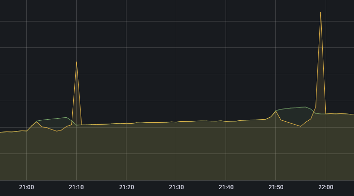
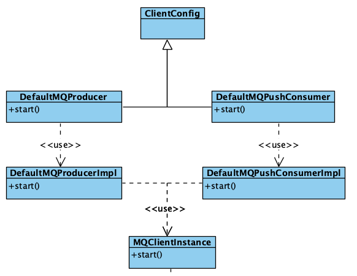
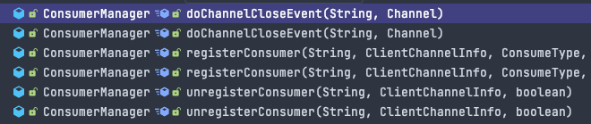
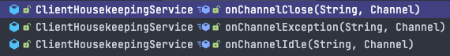

本文综合 RocketMQ client 与 broker 的源码介绍负载均衡机制发生的时间、客户端发生负载对消费的影响（消息堆积/消费毛刺等）并且给出一些最佳实践的推荐

<!--more-->

## 写在前面

网上大多数讲 RocketMQ 负载均衡的文章只介绍几种分配 MessageQueue 的策略或是长篇大论分析客户端 RebalanceService 的代码。但是其实负载均衡是客户端与服务端互相配合的过程，本文综合服务端和客户端代码回答如下三个问题：

1. 何时会发生负载均衡
2. 负载均衡对消费有何影响
3. 如何减少负载均衡对消费的影响

如果不想看详细分析，这里直接给出结论：

负载均衡时机：

- 主动负载均衡
  1. 启动时立即进行负载均衡
  2. 定时（默认 20s）负载均衡一次
- 被动负载均衡（收到 broker 通知）
  1. 客户端上下线
  - 上线
    1. 新客户端发送心跳到 broker
  - 下线
    1. 客户端发送下线请求到 broker
    2. 底层连接异常：响应 netty channel 的 IDLE/CLOSE/EXCEPTION 事件
  2. 订阅关系变化：订阅新 topic 或有旧的 topic 不再订阅

负载均衡对消费的影响：

1. 对于新分配的队列可能会重复消费，这也是官方要求消费要做好幂等的原因
2. 对于不再负责的队列会短时间消费停止，如果原本的消费 TPS 很高或者正好出现生产高峰就会造成消费毛刺



## 源码分析

首先明确下上下文：源码分析基于 [RocketMQ release-4.9.3](https://github.com/apache/rocketmq/tree/release-4.9.3) 分支的代码以及集群消费模式的 push 消费者。广播模式不在本文的讨论范围内

### Client 主动触发

在同一个 JVM 中不管创建多少 consumer，它们总是共享同一个 MQClientInstance，这个 MQClientInstance 接管和所有 consumer 和 broker 的交互以及协调负载均衡



MQClientInstance 有两个负载均衡相关的方法：`rebalanceImmediately` 和 `doRebalance`
前者在消费者启动和收到 Broker 通知时唤醒 RebalanceService 进行负载均衡，而 RebalanceService 调用后者执行负载均衡逻辑
跟踪 `doRebalance` 方法，我们发现实际的负载均衡逻辑在 `RebalanceImpl#rebalanceByTopic` 中实现：

```java
private void rebalanceByTopic(final String topic, final boolean isOrder) {
    // 获取所有 MessageQueue
    Set<MessageQueue> mqSet = this.topicSubscribeInfoTable.get(topic);
    // 获取当前 group 所有在线的消费者
    List<String> cidAll = this.mQClientFactory.findConsumerIdList(topic, consumerGroup);

    ...

    // 排序
    Collections.sort(mqAll);
    Collections.sort(cidAll);

    // 获取当前客户端配置的负载均衡策略
    AllocateMessageQueueStrategy strategy = this.allocateMessageQueueStrategy;

    List<MessageQueue> allocateResult = null;

    ...

    // 根据指定的负载均衡策略计算自己要负责的队列
    allocateResult = strategy.allocate(
        this.consumerGroup,
        this.mQClientFactory.getClientId(),
        mqAll,

    ...

    // 根据计算结果创建 ProcessQueue （用于拉取、消费消息的数据结构）
    boolean changed = this.updateProcessQueueTableInRebalance(topic, allocateResultSet, isOrder);
    if (changed) {
        ...

        // 如果 ProcessQueue 有更新则进行一些处理工作
        this.messageQueueChanged(topic, mqSet, allocateResultSet);
    }
}
```

通过分析以上代码我们可以看出负载均衡的实际工作是计算出当前客户端分配的 MessageQueue，并且保持 ProcessQueue 与分配到的 MessageQueue 一一对应，创建 ProcessQueue 的具体流程在 `RebalanceImpl#updateProcessQueueTableInRebalance` 方法中：

```java
private boolean updateProcessQueueTableInRebalance(final String topic, final Set<MessageQueue> mqSet, final boolean isOrder) {
    // 删除不再负责的 MessageQueue 对应的 ProcessQueue
    Iterator<Entry<MessageQueue, ProcessQueue>> it = this.processQueueTable.entrySet().iterator();
    while (it.hasNext()) {
        Entry<MessageQueue, ProcessQueue> next = it.next();
        MessageQueue mq = next.getKey();
        ProcessQueue pq = next.getValue();

        if (mq.getTopic().equals(topic)) {
            if (!mqSet.contains(mq)) {
                // 停止 ProcessQueue 的消费
                pq.setDropped(true);
                // 向 Broker 更新 offset，如果是顺序消费会释放申请的锁
                if (this.removeUnnecessaryMessageQueue(mq, pq)) {
                    it.remove();
                    changed = true;
                    log.info("doRebalance, {}, remove unnecessary mq, {}", consumerGroup, mq);
                }
            }
        }
    }

    // 为新分配的 MessageQueue 创建 ProcessQueue
    List<PullRequest> pullRequestList = new ArrayList<PullRequest>();
    for (MessageQueue mq : mqSet) {
        if (!this.processQueueTable.containsKey(mq)) {
            ...

            ProcessQueue pq = new ProcessQueue();

            ...

            if (nextOffset >= 0) {
                ProcessQueue pre = this.processQueueTable.putIfAbsent(mq, pq);
            }
            ...
        }
    }
}
```

### Broker 通知触发

通过上文我们知道除了 RebalanceService 定时进行负载均衡以外，还可以调用 `MQClientInstance#rebalanceImmediately` 方法立刻触发负载均衡。这个方法会在消费者启动和收到 Broker 通知时调用（`ClientRemotingProcessor#notifyConsumerIdsChanged`）
而 Broker 会在如下几个方法中发送通知：



我们依次分析这三个方法：

`ConsumerManager#registerConsumer` 方法处理来自客户端的心跳请求

```java
public boolean registerConsumer(final String group, final ClientChannelInfo clientChannelInfo,
    ConsumeType consumeType, MessageModel messageModel, ConsumeFromWhere consumeFromWhere,
    final Set<SubscriptionData> subList, boolean isNotifyConsumerIdsChangedEnable) {

    ...

    // 是否是新客户端
    boolean r1 = consumerGroupInfo.updateChannel(clientChannelInfo, consumeType, messageModel, consumeFromWhere);

    // 更新订阅数据，当订阅新 topic 或有旧的 topic 不再订阅时返回 true
    boolean r2 = consumerGroupInfo.updateSubscription(subList);

    if (r1 || r2) {
        // 可以在 BrokerConfig 中配置，默认为 true
        if (isNotifyConsumerIdsChangedEnable) {
            // 通知客户端进行负载均衡
            this.consumerIdsChangeListener.handle(ConsumerGroupEvent.CHANGE, group, consumerGroupInfo.getAllChannel());
        }
    }

    ...
}
```

`ConsumerManager#unregisterConsumer` 方法处理来自客户端的下线请求，和 `ConsumerManager#registerConsumer` 类似，不再赘述

`ConsumerManager#doChannelCloseEvent` 方法在如下三个方法中调用



这三个方法在 `NettyRemotingAbstract#run` 中调用，处理 netty channel 的事件：

```java
@Override
public void run() {
    ...

    final ChannelEventListener listener = NettyRemotingAbstract.this.getChannelEventListener();

    while (!this.isStopped()) {
        try {
            NettyEvent event = this.eventQueue.poll(3000, TimeUnit.MILLISECONDS);
            if (event != null && listener != null) {
                switch (event.getType()) {
                    case IDLE:
                        listener.onChannelIdle(event.getRemoteAddr(), event.getChannel());
                        break;
                    case CLOSE:
                        listener.onChannelClose(event.getRemoteAddr(), event.getChannel());
                        break;
                    case CONNECT:
                        listener.onChannelConnect(event.getRemoteAddr(), event.getChannel());
                        break;
                    case EXCEPTION:
                        listener.onChannelException(event.getRemoteAddr(), event.getChannel());
                        break;
                    default:
                        break;

                }
            }
        } catch (Exception e) {
            log.warn(this.getServiceName() + " service has exception. ", e);
        }
    }
}
```

也就是说 channel 事件 IDLE/CLOSE/EXCEPTION 都会触发重新负载均衡，除了底层连接的变化外 Broker 也会在长时间没收到客户端心跳时主动断开连接触发负载均衡，详见 `ConsumerManager#scanNotActiveChannel`：

```java
public void scanNotActiveChannel() {
Iterator<Entry<Channel, ClientChannelInfo>> itChannel = channelInfoTable.entrySet().iterator();
      ...

      while (itChannel.hasNext()) {
          Entry<Channel, ClientChannelInfo> nextChannel = itChannel.next();
          ClientChannelInfo clientChannelInfo = nextChannel.getValue();
          long diff = System.currentTimeMillis() - clientChannelInfo.getLastUpdateTimestamp();
          // 默认两分钟
          if (diff > CHANNEL_EXPIRED_TIMEOUT) {
              // 关闭连接
              RemotingUtil.closeChannel(clientChannelInfo.getChannel());
              itChannel.remove();
          }
      }

      ...
}
```

最后总结一下在如下场景 Broker 会主动通知客户端触发负载均衡：

1. 客户端上下线
   - 上线
     1. 新客户端发送心跳到 broker
   - 下线
     1. 新客户端发送下线请求到 broker
     2. 底层连接异常：响应 netty channel 的 IDLE/CLOSE/EXCEPTION 事件
2. 订阅关系变化：订阅新 topic 或有旧的 topic 不再订阅

## 最佳实践

### 避免频繁上下线

从上述源码分析可以看出，负载均衡是一个非常频繁的操作，并不是每一次负载均衡都会对消费产生影响。负载均衡对客户端的影响反映在对 ProcessQueue 的变更上。因为没有一个协调机制确保新旧 ProcessQueue 的创建顺序，所以可能会发生两种情况：

1. 旧 ProcessQueue 销毁早于新 ProcessQueue 创建：此时消费短暂停止，会造成消费延迟
2. 新 ProcessQueue 创建早于旧 ProcessQueue 销毁：此时会有短暂的时间两个消费者同时消费同一个队列，会消费位点回退或重复消费，这也是官方要求消费要做好幂等的原因

所以为了避免负载均衡的影响应该尽量减少客户端的上下线，同时做好消费幂等


在有应用重启或下线前要调用 `shutdown` 方法，这样 Broker 收到客户端的下线请求后会立刻触发负载均衡


### 选择合适的负载均衡策略

前文已经介绍了负载均衡对客户端的影响反映在对 ProcessQueue 的变更上，每次需要变更的 ProcessQueue 的数量和受到影响的客户端数量是由负载均衡策略决定的

如果我们有 4 个客户端，24 个队列，当第二个客户端下线时：

以默认的负载均衡策略（AllocateMessageQueueAveragely）为例，重建 ProcessQueue 的队列数量为 8
默认的负载均衡策略能将队列尽量均衡的分配到每个客户端，但是每次负载均衡重建 ProcessQueue 数量较多，尤其是在客户端数量很多的场景

| 客户端  | 队列分配变化   | 队列数变化 |
|---------|----------------|------------|
| Client1 | 1~6 -> 1~8     | 6 -> 8     |
| Client2 | 7~12 -> -      | 6 -> 0     |
| Client3 | 13~18 -> 9~16  | 6 -> 8     |
| Client4 | 19~24 -> 17~24 | 6 -> 8     |

以一致性哈希算法（AllocateMessageQueueConsistentHash）为例，重建 ProcessQueue 的队列数量为 6（不考虑虚拟节点）
基于一致性哈希算法的负载均衡策略每次负载均衡会重建尽可能少的 ProcessQueue 数量，但是可能会出现负载不均的情况

| 客户端  | 队列分配变化   | 队列数变化 |
|---------|----------------|------------|
| Client1 | 1~6 -> 1~9     | 6 -> 9     |
| Client2 | 7~12 -> -      | 6 -> 0     |
| Client3 | 13~18 -> 10~18 | 6 -> 9     |
| Client4 | 19~24 -> 19~24 | 6 -> 8     |


以上两个示例是对简单情况的模拟，在生产中需要根据需要选择合适的负载均衡策略


### 客户端参数保持一致

RocketMQ 的负载均衡是每个客户端独立进行计算，所以务必要保证每个客户端的负载均衡算法和订阅语句一致


负载均衡策略不一致会导致多个客户端分配到相同队列或有客户端分不到队列
订阅语句不一致会导致有消息未能消费

