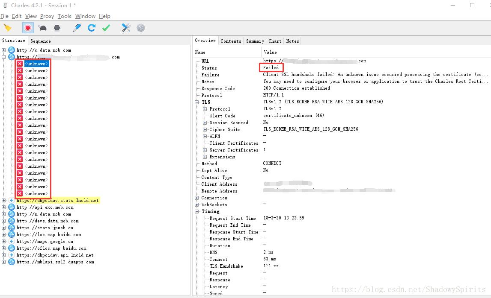
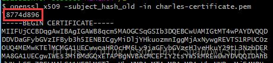
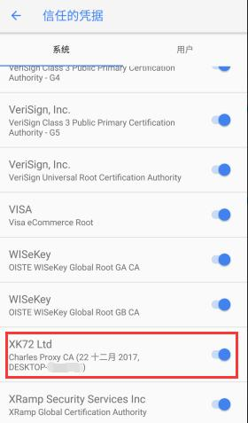

## 背景

使用抓包软件（以 Charles 为例）抓取 APP 的 https 请求时，Android 和 Charles 都正确安装了证书却出现抓包失败，报错：

Client SSL handshake failed: An unknown issue occurred processing the certificate (certificate_unknown)

## 原因

Android7.0 之后默认不信任用户添加到系统的 CA 证书：

> To provide a more consistent and more secure experience across the Android ecosystem, beginning with Android Nougat, compatible devices trust only the standardized system CAs maintained in AOSP.（[文档链接](https://android-developers.googleblog.com/2016/07/changes-to-trusted-certificate.html)）

也就是说对基于 SDK24 及以上的 APP 来说，即使你在手机上安装了抓包工具的证书也无法抓取 https 请求

## 解决方案

### 一、官方解决方案（需修改代码）

- 官方文档：https://developer.android.google.cn/training/articles/security-config.html
- 详细演示：https://blog.csdn.net/mrxiagc/article/details/75329629

### 二、将抓包软件的证书安装成系统证书（需 ROOT）

系统证书目录：`/system/etc/security/cacerts/`

其中的每个证书的命名规则如下：
`<Certificate_Hash>.<Number> `
文件名是一个 Hash 值，而后缀是一个数字。

文件名可以用下面的命令计算出来：

`openssl x509 -subject_hash_old -in <Certificate_File>`

后缀名的数字是为了防止文件名冲突的，比如如果两个证书算出的 Hash 值是一样的话，那么一个证书的后缀名数字可以设置成 0，而另一个证书的后缀名数字可以设置成 1

#### 操作步骤：

将抓包软件的证书用上述命令计算出 Hash 值，将其改名并复制到系统证书目录

此时你应该可以在 设置->安全->加密与凭据->信任的凭据 的系统标签页看到你新加入的证书，将其启用即可顺利抓包

