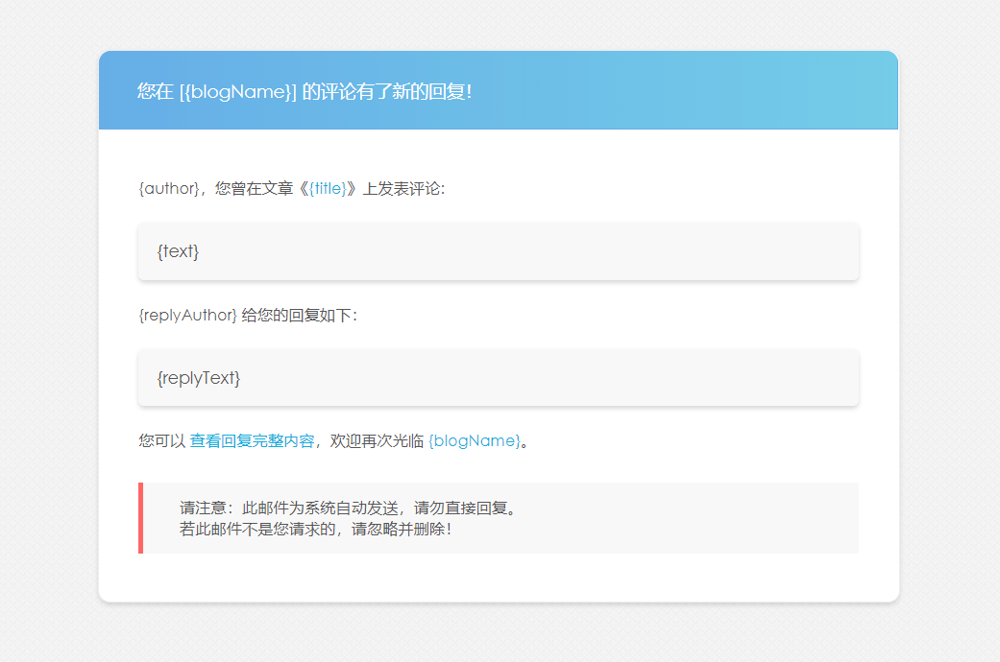

## 插件简介

Comment2Mail 是 Typecho 评论邮件通知插件，支持 SMTP、Mailgun 两种接口，其中 SMTP 接口采用非阻塞方式发送邮件

在评论审核通过、用户评论文章、用户评论被回复时发送邮件通知

详见 GitHub：[ShadowySpirits/Comment2Mail](https://github.com/ShadowySpirits/Comment2Mail)

## 安装方法

1.  至 [Releases](https://github.com/ShadowySpirits/Comment2Mail/releases) 中下载最新版本插件，上传至网站的 /usr/plugins/ 目录下
2.  启用该插件，正确填写相关信息

## 鸣谢

本插件模板参考自 [ylqjgm/LoveKKComment](https://github.com/ylqjgm/LoveKKComment)

