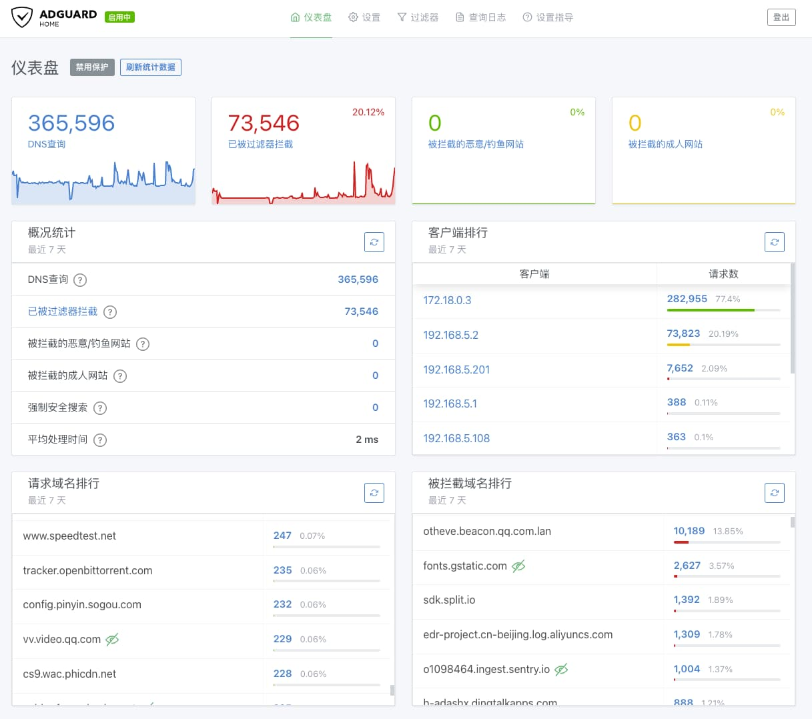

这篇文章记录了对几种分流上网方案（iptables、OSPF、DNS 等）的尝试与优劣比较，文中会详细介绍博主目前使用的基于 DNS 的分流方案的原理与配置教程

## 前言

本文适合使用软路由做透明代理的同学阅读，并且需要有一定的网络基础知识。如果你是一个小白那么直接跳到`极简配置`部分照着操作即可

博主尝试过如下几种思路实现策略路由（PBR, [Policy Based Routing](https://en.wikipedia.org/wiki/Policy-based_routing)）

1. iptables 给链接打标
2. OSPF 等路由协议
3. Clash、V2ray 等代理工具
4. DNS 分流

前两者的思路类似，都是使用中国 ip 白名单来将国外 ip 转发到旁路由等透明代理设备上。但是无论是 iptables 还是 OSPF 配置都非常复杂，特别是 OSPF 等路由协议科班出身的人都不一定玩得转。我们配置家庭网络追求的是简单好用，使用这样复杂的方案前期调试以及后期更新 ip 列表都很不方便

使用代理工具的分流功能做策略路由简单实用，Clash、V2ray 等客户端都会有开箱即用的配置提供。但是缺点也很明显：所有的流量都会经过代理程序，无法做到分设备代理，对于有有 BT、PCDN 等需求只想部分设备走代理的同学不太适用

使用 DNS 分流方案拥有 iptables 和 OSPF 做策略路由的丰富功能，并且兼具使用代理工具分流配置简单的优点

1. 丰富的分流策略：可以按国内外 ip 分流也可以按域名分流
2. 配置简单：最简单的使用方法只需修改 Clash 的配置即可
3. 去广告：可以阻断广告域名的 DNS 解析来禁止广告加载
4. 分设备代理：对需要代理的设备使用分流 DNS 转发到代理服务器，其他设备使用上游公共 DNS 直连出公网

但是这个方案也有缺点，对于直接使用 ip 的软件就无能为力了。当然这种情况非常罕见（目前博主只发现 Telegram），而且只需额外添加一条静态路由即可解决


什么？你问我 DNS 是啥玩意？那我建议你~~关掉本文~~，或者阅读这篇文章：[详解 DNS 与 CoreDNS 的实现原理](https://draveness.me/dns-coredns/)


## 网络架构

需要两个额外组件（极简配置下这两个组件合二为一）：

1. 做透明代理的软路由，可以是主路由也可以是旁路由
2. 分流 DNS

原理其实很简单：分流 DNS 劫持 DNS 请求，需要走代理的域名返回透明代理 ip，无需走代理的域名直接返回真实 ip


## DNS 分流配置

### 极简配置

使用 fake-ip 模式的 Clash 既作为透明代理又作为 DNS Server，这种方式配置非常简单，只需要一个能运行 Clash 的设备即可

首先你需要部署好 Clash（请自行寻找教程，作为主路由、旁路由都可以，使用虚拟机、docker、lxc 没限制） 然后修改如下配置：

```yaml
dns:
  enable: true
  // 开启 fake-ip 模式
  enhanced-mode: fake-ip
  // 选择保留 ip 段，一般保持默认即可
  fake-ip-range: 198.18.0.1/16
  // 指定 Clash DNS 监听地址
  listen: 0.0.0.0:53
  // 指定上游公共 DNS
  nameserver:
  - 223.5.5.5:53
  // 添加需要直连的国内域名
  fake-ip-filter:
  - baidu.com
  - ...

tun:
  enable: true
  stack: system
  // 自动为 fake-ip-range 中的 ip 段添加路由
  auto-route: true
```

这个配置做了三件事

1. 开启 dns 服务并指定为 fake-ip 模式，监听 53 端口
2. 对于 fake-ip-filter 中的国内域名直接返回真实 ip，这些域名的流量不再经过代理
3. 开启 tun 模式并自动添加路由，将发往 fake-ip 的请求交给 clash 处理

最关键的是需要将常见国内域名加入到 fake-ip-filter 中，这里推荐一个每日更新国内域名的项目：[felixonmars/dnsmasq-china-list](https://github.com/felixonmars/dnsmasq-china-list)

你可以自行下载 accelerated-domains.china.conf 文件并为其中的域名加上 `+.` 前缀然后添加到 fake-ip-filter 中。如果你恰好使用 openclash 可以用博主的脚本，可以自动下载国内域名列表并写入 openclash 的配置文件中

```bash
rm -f accelerated-domains.china.conf
wget https://raw.githubusercontent.com/felixonmars/dnsmasq-china-list/master/accelerated-domains.china.conf -O /root/accelerated-domains.china.conf

echo '
#LAN
*.lan
*.localdomain
*.example
*.invalid
*.localhost
*.test
*.local
*.home.arpa
#放行NTP服务
time.*.com
time.*.gov
time.*.edu.cn
time.*.apple.com
ntp.*.com
*.time.edu.cn
*.ntp.org.cn
+.pool.ntp.org
time1.cloud.tencent.com
*.cn
' > /etc/openclash/custom/openclash_custom_fake_filter.list

awk -F / '{print "+."$2}' /root/accelerated-domains.china.conf >> /etc/openclash/custom/openclash_custom_fake_filter.list

echo fake-ip-filter: > /tmp/openclash_fake_filter.list
awk '{print "  - '\''"$1"'\''"}' /etc/openclash/custom/openclash_custom_fake_filter.list >> /tmp/openclash_fake_filter.list
```

看到这里恭喜你全部配置已经完成，是不是很简单？接下来将需要走代理的设备 DNS 改为 Clash DNS 的地址即可享受分流上网


如果你的 clash 运行在旁路由上，还需要在主路由的路由表中添加一项，将 fake-ip 指向旁路由


```shell
# 198.18.0.1/16 是 fake-ip-range 配置的 ip 段
# 192.168.2.254 是旁路由 ip
route add -net 198.18.0.1/16 gw 192.168.2.254
```


除非你熟悉 linux 网络配置，否则尽量使用原生 clash 而不是 openclash 之类的周边项目，它们往往会添加 iptables 规则将经过本机的连接都转发到 clash


在运行 clash 的服务器上使用 mtr 或 traceroute 来验证分流策略是否生效：如果 mtr 的结果显示无需代理的域名不止一跳并且没有经过 fake-ip-range 的 ip 段则分流配置正确；也可以观察 Clash 控制台，看看是否有无需走代理域名连上来

```shell
# 配置有误
root@OpenWrt:~# mtr -r --tcp www.baidu.com
Start: 2022-06-09T21:37:36+0800
HOST: OpenWrt                              Loss%   Snt   Last   Avg  Best  Wrst StDev
  1.|-- 198.18.0.19(fake-ip)                0.0%    10    0.2   0.1   0.1   0.2   0.0
```

```shell
# 配置正确
root@OpenWrt:~# mtr -r --tcp ntp.aliyun.com
Start: 2022-06-09T21:40:51+0800
HOST: OpenWrt                     Loss%   Snt   Last   Avg  Best  Wrst StDev
  1.|-- <主路由 ip>                 0.0%    10    0.1   0.1   0.1   0.2   0.0
  2.|-- <公网出口 ip>              10.0%    10    6.0   5.2   3.1   9.5   1.9
  3.|-- 61.164.22.96               0.0%    10    3.8   4.3   3.1   9.8   2.0
  4.|-- 115.233.18.29             60.0%    10    3.0   4.2   3.0   5.0   0.9
  5.|-- 220.191.199.30            30.0%    10    5.8   6.8   5.8   8.2   1.2
  6.|-- 115.238.21.121             0.0%    10    6.2   7.0   6.1   8.4   1.0
  7.|-- 45.112.223.25              0.0%    10    4.1   5.0   4.0   6.5   1.0
  8.|-- 117.49.37.50               0.0%    10   10.0  11.0  10.0  13.0   1.0
  9.|-- ???                       100.0    10    0.0   0.0   0.0   0.0   0.0
 10.|-- ???                       100.0    10    0.0   0.0   0.0   0.0   0.0
 11.|-- ???                       100.0    10    0.0   0.0   0.0   0.0   0.0
 12.|-- 203.107.6.88               0.0%    10   24.7  24.7  24.4  26.2   0.5
```

### 精准分流配置

使用 Clash DNS 的方案虽然配置非常简单，但是毕竟不可能将所有国内域名都统计出来，还需要根据 ip 进行更精准的分流



多数系统不支持指定 DNS 端口，所以分流 DNS 和 Clash DNS 最好分配不同的 ip（可以在单网卡上分配多个内网 ip）


博主选用 [IrineSistiana/mosdns-cn](https://github.com/IrineSistiana/mosdns-cn) 作为分流 DNS，这里引用 mosdns-cn 官方文档上介绍的分流规则

> 分流模式
> mosdns-cn 会根据用户提供的数据采用以下分流模式。
>
> 配置了 --local-ip 本地 IP
>
> 1. 如果请求的域名匹配到 --local-domain 本地域名。则直接使用 --local-upstream 本地上游。结束。
> 2. 如果请求的域名匹配到 --remote-domain 远程域名。则直接使用--remote-upstream 远程上游。结束。
> 3. 非 A/AAAA 类型的请求将直接使用 --local-upstream 本地上游。结束。
> 4. 同时转发至本地和远程上游获取应答。
> 5. 如果本地上游的应答包含 --local-ip 本地 IP。则直接采用本地上游的结果。结束。
> 6. 否则采用远程上游的结果。结束。
>
> 只配置了 --local-domain 本地域名
>
> 1. 如果请求的域名匹配到 --local-domain 本地域名。则直接使用 --local-upstream 本地上游。结束。
> 2. 其他所有请求会使用 --remote-upstream 远程上游。结束。
>
> 只配置了 --remote-domain 远程域名
>
> 1. 如果请求的域名匹配到 --remote-domain 远程域名。则直接使用--remote-upstream 远程上游。结束。
> 2. 其他所有请求会使用 --local-upstream 本地上游。结束。

Github 上有详细使用教程，这里给出博主使用的启动脚本，每次启动时拉取最新的国内外域名/ip 数据

```bash
RELEASE_URL=$(curl -s https://api.github.com/repos/Loyalsoldier/v2ray-rules-dat/releases/latest | grep browser_download_url)
GEOSITE_URL=$(echo "$RELEASE_URL" | grep geosite.dat\" | cut -d'"' -f4)
GEOIP_URL=$(echo "$RELEASE_URL" | grep geoip.dat\" | cut -d'"' -f4)

if [ -z $GEOSITE_URL ];
then
  echo "GEOSITE_URL required!"
  exit 1
fi

if [ -z $GEOIP_URL ];
then
  echo "GEOIP_URL required!"
  exit 1
fi

echo $GEOSITE_URL
echo $GEOIP_URL
echo

wget $GEOSITE_URL -O geosite.dat
wget $GEOIP_URL -O geoip.dat

mosdns-cn -s :53 --blacklist-domain "geosite.dat:category-ads-all" --local-upstream 223.5.5.5:53 --local-domain "geosite.dat:cn" --local-ip "geoip.dat:cn" --remote-upstream https://8.8.8.8/dns-query --remote-domain "geosite.dat:geolocation-!cn"
```

### 去广告/DNS 解析统计配置

mos-dns 支持配置黑名单域名直接给出空响应，可以使用这一机制阻断广告域名的访问：`mosdns-cn --blacklist-domain "geosite.dat:category-ads-all"`

但是目前少有大佬分享适配 mosdns-cn 的去广告规则，这种专业的事情还是交给 Adguard Home 来做：


将 Adguard Home 放在 mosdns-cn 和 Clash DNS 的上游还有其他好处，可以借助它的仪表盘和日志分析出整个网络访问的网站



Adguard Home 的部署教程网上有很多，能看到这里的人肯定也不用我赘述了。这里推荐一个博主自用的过滤规则，有了它就不需要其他规则了：[BlueSkyXN/AdGuardHomeRules](https://github.com/BlueSkyXN/AdGuardHomeRules)

## 其他配置

### 自动设置设备的 DNS 服务器

在`极简配置`中博主提到`将需要走代理的设备 DNS 改为分流 DNS`，这一步可以手动改也可以借助 DHCP 自动配置：DHCP Option 6 的作用就是指定客户端使用的 DNS，在 Openwrt LAN 接口的高级设置中即可找到该设置


### 为直接使用 ip 的 APP 设置路由

直接使用 ip 的软件没有经过 DNS 自然就无法获取到 Clash 的 fake-ip，对于这种情况需要在主路由上添加静态路由将这些软件使用的 ip  的下一跳路由改为 Clash 的 fake-ip

目前我只发现 Telegram 存在这种情况，需要添加的路由如下：

```shell
# 192.18.1.254 是 fake-ip，可以从 fake-ip-range 中随便选择一个
route add -net 91.108.4.0/22 gw 192.18.1.254
route add -net 91.108.8.0/22 gw 192.18.1.254
route add -net 91.108.12.0/22 gw 192.18.1.254
route add -net 91.108.16.0/22 gw 192.18.1.254
route add -net 91.108.56.0/22 gw 192.18.1.254
route add -net 149.154.160.0/20 gw 192.18.1.254
```
