博主在和朋友搭建游戏私服的时候不幸将家里的虚拟化平台搞挂了（论备份的重要性）正好最近有用 Kubernetes 的需求，就把 HomeLab 做一次架构升级，水一篇文章记录下这次客串 SRE 的经验和踩过的坑

技术选型： K3s（Kubernetes） + Rancher（Kubernetes Dashboard） + Traefik（Gateway） 

<!--more-->

## 安装 K3s

K3s 是一个轻量级的 Kubernetes 发行版，只需要一行命令即可安装完整的 Kubernetes 环境

```bash
curl -sfL https://get.k3s.io | sh -s - server
```

安装好的 K3s 服务端只有一个可执行文件：

```bash
# 通过 k3s server 或 k3s agent 启动
root@k3s-server:~# ls /usr/local/bin/
crictl  ctr  k3s  k3s-killall.sh  k3s-uninstall.sh  kubectl
```

K3s 占用的资源也很低，只需 1 核 CPU 和 512M 内存即可跑起来，详细分析见官方文档：[最低需求](https://docs.k3s.io/installation/requirements) 和 [资源分析](https://docs.k3s.io/reference/resource-profiling)

### 安装 K3s Server

Kubernetes 由 Master 和 Worker 节点组成，对应 K3s 的 server 和 agent，即需要在一台机器上安装 K3s Server 作为 Master Node，其他机器上安装 K3s Agent 作为 Worker Node

后续会安装 Rancher 来管理 K3s，所以这里需要使用受支持的 K3s 版本。可以从[Rancher 文档](https://rancher.com/support-maintenance-terms/)中找到 Rancher 支持的 Kubernetes 版本列表

然后使用环境变量 INSTALL_K3S_VERSION 来安装指定版本的 K3s server

```bash
curl -sfL https://get.k3s.io | INSTALL_K3S_VERSION="***" sh -s - server
```

安装完成后就可以使用 kubectl 来查看 K3s 集群：

```bash
root@k3s-server:~# kubectl get node
NAME           STATUS   ROLES                  AGE    VERSION
k3s-server     Ready    control-plane,master   4d4h   v1.24.7+k3s1
```


安装 K3s 会附带 csictl 和 kubectl，前者可以管理 Node 上的镜像和容器；后者应该无需多介绍了，默认使用的 kubeconfig 为 `/etc/rancher/k3s/k3s.yaml`


### 安装 K3s Agent

K3s agent 的安装也十分简单，去掉上述安装命令中的 server 参数即可

此外，还需要两个额外的环境变量来指定 K3s agent 如何连接到 server：

- K3S_URL：K3s server 提供的 API server 地址，默认为 https://server-ip:6443
- K3S_TOKEN：K3s server 安装时指定或生成的 token：默认在 /var/lib/rancher/k3s/server/node-token

```bash
curl -sfL https://get.k3s.io | INSTALL_K3S_VERSION="***" K3S_URL="api-server-url" K3S_TOKEN="server-token" sh -
```

安装完成后再来看一下 Node 列表，可以发现 worker 节点已经添加到集群中了

```bash
root@k3s-server:~# kubectl get node
NAME           STATUS   ROLES                  AGE    VERSION
k3s-server     Ready    control-plane,master   1m     v1.24.7+k3s1
k3s-worker-0   Ready    <none>                 1m     v1.24.7+k3s1
```

## 安装 Rancher

Rancher 是一个帮你管理 K3s 集群中的各种资源的 dashboard，功能十分丰富但是占用的资源也比较多。如果你只想要一个轻量的 Kubernetes dashboard 来浏览资源可以略过本节并参考这篇文档 [Configure the Kubernetes Dashboard on K3s](https://docs.k3s.io/installation/kube-dashboard)

Rancher 可以在 Docker 或者 Kubernetes 中安装，我们这里介绍使用 Helm 将 Rancher 安装到上面创建好的 K3s 集群中

### 安装 cert-manager

Rancher 使用 cert-manager 来生成和管理证书，如果要自行上传证书也可以跳过这一节

首先来安装 Helm，不同的 Linux 发行版的安装方式略有区别，非 Debian/Ubuntu 可以参考[官方文档](https://helm.sh/docs/intro/install/)进行安装

```bash
apt install helm
```

使用 Helm 来安装 cert-manager，注意这里的版本 v1.10.0 可以根据需要进行替换

```bash
kubectl apply -f https://github.com/cert-manager/cert-manager/releases/download/v1.10.0/cert-manager.crds.yaml

helm repo add jetstack https://charts.jetstack.io

helm repo update

helm install cert-manager jetstack/cert-manager \
  --namespace cert-manager \
  --create-namespace \
  --version v1.10.0
```

#### 签发 letsencrypt 证书

Rancher 默认会使用 cert-manager 创建自签名证书。如果你希望使用能通过浏览器校验的合法证书，也可以用 cert-manager 获取 letsencrypt 签发的证书

使用 cert-manager 签发证书的流程分为以下几步：

1. 创建 Issuer

cert-manager 使用 ACME 来签发证书，支持 [HTTP01](https://cert-manager.io/docs/configuration/acme/http01/) 和 [DNS01](https://cert-manager.io/docs/configuration/acme/dns01/) 两种方式进行校验

博主这里使用的是 letsencrypt + DNS01 校验方式，DNS 提供商为 Cloudflare。如果你也希望使用同样的校验方式，修改下面配置中的 your-api-key 和 admin@example.com 即可

```yaml
apiVersion: v1
kind: Secret
metadata:
  name: cloudflare-api-key-secret
  namespace: cert-manager
type: Opaque
stringData:
  api-key: <your-api-key>

---
apiVersion: cert-manager.io/v1
kind: ClusterIssuer
metadata:
  name: letsencrypt-prod
  namespace: cert-manager
spec:
  acme:
    email: admin@example.com
    server: https://acme-v02.api.letsencrypt.org/directory
    privateKeySecretRef:
      name: letsencrypt-prod
    solvers:
      - dns01:
          cloudflare:
            email: admin@example.com
            apiKeySecretRef:
              name: cloudflare-api-key-secret
              key: api-key
```


如果想将这个 Issuer 设置为默认使用，可以用如下命令升级 cert-manager

`helm upgrade cert-manager jetstack/cert-manager --set 'extraArgs={--default-issuer-name=letsencrypt-prod,--default-issuer-kind=ClusterIssuer}' -n cert-manager`


2. 创建证书

首先需要创建一个 namespace `cattle-system`，这也会用在后续的 Rancher 安装中

```bash
kubectl create namespace cattle-system
```

然后就可以使用上面创建的 Issuer `letsencrypt-prod` 签发证书了，将 rancher.example.com 替换成你的域名即可

```yaml
apiVersion: cert-manager.io/v1
kind: Certificate
metadata:
  name: tls-rancher-ingress
  namespace: cattle-system
spec:
  secretName: tls-rancher-ingress
  commonName: rancher.example.com
  dnsNames:
    - rancher.example.com
  issuerRef:
    name: letsencrypt-prod
    kind: ClusterIssuer
```


证书的 secretName 需要指定为 tls-rancher-ingress，这样 Rancher 才能找到这个证书


3. Debug

如果你创建证书的过程一番风顺，那么恭喜你可以直接安装 Rancher 了，但是如果 Certificate 一直是 Pending 状态那么就得看看是哪出了问题

创建证书的流程分为 Certificate -> CertificateRequest -> Order -> Challenge，分别对应 定义资源 -> 生成 CSR -> 提交签发证书请求 -> 校验域名所有权。上述的每个步骤都是一种 CRD，debug 的流程就是 describe 每种 CRD 的资源看看有什么报错

比如博主遇到的问题是校验域名时卡在

`Waiting for dns-01 challenge propagation: DNS record for "rancher.example.com" not yet propagated`

这是因为 K3s 使用的 DNS 有问题，不能正确获取 DNS Challenge 中设置的 TXT 记录，使用如下命令指定 cert-manager 使用的 DNS 即可正常签发证书

```bash
# https://cert-manager.io/docs/configuration/acme/dns01/#setting-nameservers-for-dns01-self-check
helm upgrade cert-manager jetstack/cert-manager --set 'extraArgs={--dns01-recursive-nameservers-only,--dns01-recursive-nameservers=8.8.8.8:53\,1.1.1.1:53' -n cert-manager
```

### 安装 Rancher

使用 Helm 安装 Rancher，需要将 rancher.example.com 改为上面证书的域名并设置好域名解析

```bash
helm repo add rancher-latest https://releases.rancher.com/server-charts/latest

kubectl create namespace cattle-system

helm install rancher rancher-latest/rancher \
  --namespace cattle-system \
  --set hostname=rancher.example.com \
  --set replicas=1 \
  --set bootstrapPassword=<admin-password> \
  --set ingress.tls.source=secret
```

安装完成后即可访问 `rancher.example.com` 来使用 Rancher


如果你跳过了 [签发 letsencrypt 证书](#签发-letsencrypt-证书) 这个步骤并且也没有自行上传证书需要去掉 `--set ingress.tls.source=secret`，这样 Rancher 会使用 cert-manager 来创建自签名证书


## 安装你的应用

安装应用的部分就靠读者各显神通了，博主是使用 Kompose 将之前的 docker-compose 文件转换为转换为 Kubernetes 资源描述，这里给出遇到的两个问题的解法

### 挂载储存

K3s 默认只提供 host-path 这一个 CSI。使用 host-path 会使你的数据和 Node 强绑定，这显然很不云原生。博主这里推荐两个 CSI：[nfs-subdir-external-provisioner](https://github.com/kubernetes-sigs/nfs-subdir-external-provisioner) 和 [longhorn](https://github.com/longhorn/longhorn)

- nfs-subdir-external-provisioner 可以帮你最简单的实现储存计算分离，只要你的储存池支持 NFS 就可以让 Pod 可以在不同的 Node 间飘移
- longhorn 是真正的分布式文件系统，提供多副本和备份/还原等能力

### 分配应用到指定的 Node

如果你只想使用 host-path 或者有应用和 Node 绑定的需求可以尝试使用 nodeAffinity，有 required 和 preferred 两种规则，这里直接给出[官方文档](https://kubernetes.io/docs/concepts/scheduling-eviction/assign-pod-node/)中的示例

```yaml
apiVersion: v1
kind: Pod
metadata:
  name: with-node-affinity
spec:
  affinity:
    nodeAffinity:
      requiredDuringSchedulingIgnoredDuringExecution:
        nodeSelectorTerms:
          - matchExpressions:
              - key: topology.kubernetes.io/zone
                operator: In
                values:
                  - antarctica-east1
                  - antarctica-west1
      preferredDuringSchedulingIgnoredDuringExecution:
        - weight: 1
          preference:
            matchExpressions:
              - key: another-node-label-key
                operator: In
                values:
                  - another-node-label-value
  containers:
    - name: with-node-affinity
      image: registry.k8s.io/pause:2.0
```

## 对外暴露你的应用

### Kubernetes Overlay 网络

首先来看一下运行应用 Pod 的信息：

```
root@k3s-server:~/service/k8s# kubectl get pods -o wide
NAME                           READY   STATUS    RESTARTS       AGE   IP           NODE           NOMINATED NODE   READINESS GATES
media-index-754bc9dfdd-6cbkl   4/4     Running   12 (25h ago)   27h   10.42.1.27   k3s-worker-0   <none>           <none>
```

可以发现 Pod 获取到的 ip `10.42.1.26`，和它所在的 Node ip `192.168.1.2` 完全不在一个网段中，也就是说无法从 Kubernetes 外部直接访问我们的应用

```
root@k3s-server:~/service/k8s# kubectl get node -o wide
NAME           STATUS   ROLES                  AGE     VERSION        INTERNAL-IP      EXTERNAL-IP   OS-IMAGE                         KERNEL-VERSION    CONTAINER-RUNTIME
k3s-server     Ready    control-plane,master   4d12h   v1.24.7+k3s1   192.168.1.1      <none>        Debian GNU/Linux 11 (bullseye)   5.10.0-19-amd64   containerd://1.6.8-k3s1
k3s-worker-0   Ready    <none>                 32h     v1.24.7+k3s1   192.168.1.2   <none>        Debian GNU/Linux 11 (bullseye)   5.10.0-19-amd64   containerd://1.6.8-k3s1
```

我们将 Node 所在的网络称为 Underlay 网络，是真实的底层物理网络；而将 Pod 所在的网络称为 Overlay 网络，是由软件定义的逻辑网络。这样做的好处是打通了不同 Node 间的网络，即使 Node 在不同的子网下（甚至是不同的云服务商）也可为 Pod 提供一致的网络环境。K3s 默认使用 Flannel 通过 VXLAN 技术构建 Overlay 网络，相关文章可以阅读

- [VXLAN vs VLAN](https://zhuanlan.zhihu.com/p/36165475)
- [Flannel 介绍及使用场景](https://www.cnblogs.com/hukey/p/14296710.html)

所以应用部署完成后想要分配一个域名并对外提供服务就需要使用 Kubernetes 的 Ingress 网关，我们先来看一下官方文档中对 Ingress 的说明：

> Ingress exposes HTTP and HTTPS routes from outside the cluster to services within the cluster. Traffic routing is controlled by rules defined on the Ingress resource.
> 

即我们访问应用实际是先访问到 Kubernetes 的 Ingress 网关，然后 Ingress 根据我们配置的规则把流量路由到对应的 Service 上，最后由 Service 关联的 Pod 提供服务

### 使用 Traefik Ingress

K3s 默认使用 Traefik 作为 Ingress Controller，Traefik 会自动将 Ingress 和 IngressRoute（Traefik 提供的 CRD）转换为路由规则，我们下面以 Traefik dashboard 为例看下如何对外暴露服务

签发证书 tls-traefik-ingress 并且将 traefik.example.com 替换为你的域名即可在 Kubernetes 外访问 Traefik dashboard

```yaml
apiVersion: traefik.containo.us/v1alpha1
kind: IngressRoute
metadata:
  name: traefik-dashboard
  namespace: kube-system
spec:
  entryPoints:
    - websecure
  routes:
    - match: Host(`traefik.example.com`) && (PathPrefix(`/`) || PathPrefix(`/dashboard`) || PathPrefix(`/api`))
      kind: Rule
      services:
        - name: api@internal
          kind: TraefikService
  tls:
    secretName: tls-traefik-ingress
```

这个 yaml 的 spec 主要分为 entryPoints、routes、services 三个部分

- entryPoints：指定服务的接入点，有两个预置的 entryPoint：web 和 websecure，前者对应 80 端口的 http 服务，后者对应 443 端口的 https 服务。如果使用 websecure 需要配置 tls，否者会使用 Traefik 默认的自签名证书
- routes：指定路由规则，其中 match 字段用于匹配对何种流量应用本规则
- services：指定后端服务，Kind 字段可以为 Service 或 TraefikService 两种。我这里使用的 api@internal 是 Traefik 预置的 TraefikService

更详细的说明可以参考官方文档：[Traefik & Kubernetes](https://doc.traefik.io/traefik/routing/providers/kubernetes-crd/)

#### 代理非 Kubernetes 应用

前面提到 Traefik 根据我们配置的规则把流量路由到对应的 Service 上，实际上是获取 Service 对应的 Endpoints 的 ip：

```
root@k3s-server:~# kubectl get svc
NAME         TYPE        CLUSTER-IP      EXTERNAL-IP   PORT(S)                      AGE
index        ClusterIP   10.43.218.102   <none>        8989/TCP,7878/TCP,9117/TCP   41h

root@k3s-server:~# kubectl get endpoints
NAME         ENDPOINTS                                         AGE
index        10.42.1.27:7878,10.42.1.27:8989,10.42.1.27:9117   41h

root@k3s-server:~/service/k8s# kubectl get pods -o wide
NAME                           READY   STATUS    RESTARTS       AGE   IP           NODE           NOMINATED NODE   READINESS GATES
media-index-754bc9dfdd-6cbkl   4/4     Running   12 (25h ago)   27h   10.42.1.27   k3s-worker-0   <none>           <none>
```

可以发现 Endpoints 中的 ip 就是应用 Pod 的 ip，Kubernetes 会根据 Service 中配置的 selector 来找到关联的 Pod 并创建 Endpoints

```yaml
apiVersion: v1
kind: Service
metadata:
  name: index
  namespace: media
spec:
  ports:
    - name: sonarr
      port: 8989
    - name: radarr
      port: 7878
    - name: jackett
      port: 9117
  selector:
    app: index
```

所以让 Traefik 代理非 Kubernetes 应用就需要手动创建 Endpoints 并且不在 Service 中指定 selector：

```yaml
apiVersion: v1
kind: Endpoints
metadata:
  name: downloader
  namespace: media
subsets:
- addresses:
  - ip: 192.168.1.1
    hostname: downloader
  ports:
  - name: downloader
    port: 8080
    protocol: TCP

---
apiVersion: v1
kind: Service
metadata:
  name: downloader
  namespace: media
spec:
  ports:
    - name: downloader
      port: 8080

---
apiVersion: traefik.containo.us/v1alpha1
kind: IngressRoute
metadata:
  name: downloader
  namespace: media
spec:
  entryPoints:
    - websecure
  routes:
    - match: Host(`downloader.example.com`)
      kind: Rule
      services:
        - name: downloader
          namespace: media
          port: 8080
```

#### 配置跳转 https

Traefik 的路由规则支持正则匹配，我们可以借此配置一些默认规则：http 自动跳转 https、静态资源缓存策略、CORS 规则等等

这里给出一个使用 Middleware 将所有网站的 http 请求跳转到 https 的例子：

```yaml
apiVersion: traefik.containo.us/v1alpha1
kind: Middleware
metadata:
  name: redirect-to-https
  namespace: kube-system
spec:
  redirectScheme:
    scheme: https
    permanent: true

---
apiVersion: traefik.containo.us/v1alpha1
kind: IngressRoute
metadata:
  name: default-redirect-http-to-https
  namespace: kube-system
spec:
  entryPoints:
    - web
  routes:
    - match: HostRegexp(`{alldomain:.*}`)
      kind: Rule
      services:
        - name: ping@internal
          kind: TraefikService
      middlewares:
        - name: redirect-to-https
```

#### 配置默认证书

Traefik 不支持使用 cert-manager 自动申请证书，我们可以手动申请泛域名证书并且配置为 Traefik 的默认证书，这样就不必为每个网站手动配置证书

```yaml
apiVersion: cert-manager.io/v1
kind: Certificate
metadata:
  name: tls-example-default
  namespace: kube-system
spec:
  secretName: tls-example-default
  commonName: '*.example.com'
  dnsNames:
  - '*.example.com'
  - example.com
  issuerRef:
    name: letsencrypt-prod
    kind: ClusterIssuer

---
apiVersion: traefik.containo.us/v1alpha1
kind: TLSStore
metadata:
  name: default
  namespace: kube-system
spec:
  defaultCertificate:
    secretName: tls-example-default
```


创建名为 `default` 的 TLSStore 会覆盖 Traefik 的默认 tls 配置


#### 配置 Strict SNI

有了泛域名证书我们就可以对外提供多个网站的 https 服务，但是这样有存在一个风险：如果你的服务器暴露在公网中，并且不幸被脚本小子扫到，那么他访问 443 端口就可以拿到你的网站信息：

```bash
root@k3s-server:~# curl https://192.168.1.1 -v
...
* Server certificate:
*  subject: CN=*.example.com
*  start date: Nov  4 14:01:21 2022 GMT
*  expire date: Feb  2 14:01:20 2023 GMT
...
```

这就是由 SNI 导致的域名泄露，我们可以通过设置 Strict SNI 来拒绝掉非法域名的访问：

```yaml
apiVersion: traefik.containo.us/v1alpha1
kind: TLSOption
metadata:
  name: default
  namespace: kube-system

spec:
  sniStrict: true
```


配置了 Strict SNI 会使得默认证书失效，需要为每个网站显式指定证书
关于 SNI 的详细介绍可以阅读 [Cloudflare 的文章](https://www.cloudflare.com/zh-cn/learning/ssl/what-is-sni/)

