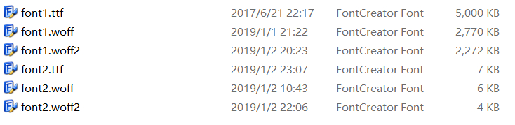
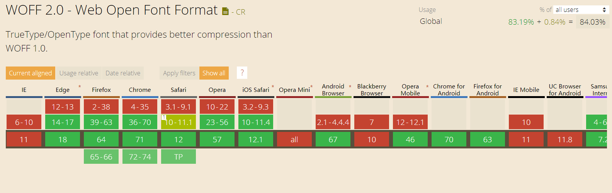

如果你想在网页中引入一些花式字体，比如这样：


可以试试下面几个技巧来优化字体加载速度：

## 使用 CDN 加速字体资源加载

你可以把字体托管在各大 CDN 服务商的云储存中，或者使用各种公共 CDN 来分发你的字体。特别是后者，如果用户浏览过的其他网页也使用过这种字体，那么浏览器就可以从缓存中读取，而不用重新下载。

## 使用 WOFF2 优化字体体积

WOFF2 采用自定义预处理和压缩算法，提供的文件大小压缩率比其他格式高大约 30%。下面是一张 ttf vs woff vs woff2 的比较图：



可以看到 woff2 在体积的控制上还是非常有优势的，这里推荐一个 ttf 转 woff2 的工具，提供 CLI 和 API 两种转换方式。
[button color="dark" icon="fontello fontello-github" url="https://github.com/nfroidure/ttf2woff2"]nfroidure/ttf2woff2[/button]

目前浏览器对 woff2 的兼容性已经相当不错了，可以看到浏览器的支持率达到了 84.03%。移动端 Android 5+/IOS 10+ 的 webview 支持 woff2，目前我测试的几款主流手机浏览器对 woff2 都完美支持。



## 提取部分字体

很多情况下（特别是中文字体体积在通常情况下超大），你并不需要使用完整的字体文件，比如我的签名：


对于这样的静态页面，可以提取所需的字体来减小引入的字体文件体积，这里推荐两个工具：[字蛛](http://font-spider.org/) & [fontmin](http://ecomfe.github.io/fontmin)，并且 fontmin 提供了 _Mac OS X_、_Windows_ 平台下的客户端：[Github: ecomfe/fontmin-app](https://github.com/ecomfe/fontmin-app)

## 内联字体

在字体不大的情况下，使用 data 协议内联是个不错的选择，可以减少请求数，并且完全避免了 FOUT 和 FOIT。

```css
@font-face {
  font-family: AomemoFont-Regular;
  src: url("data:font/woff2;base64,...") format("woff2");
  font-style: normal;
  font-weight: normal;
}
```

这种方式一定程度上拖慢了首屏加载时间，推荐配合提取部分字体使用。
