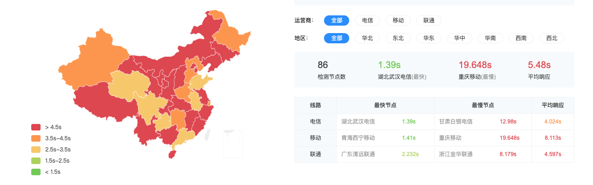
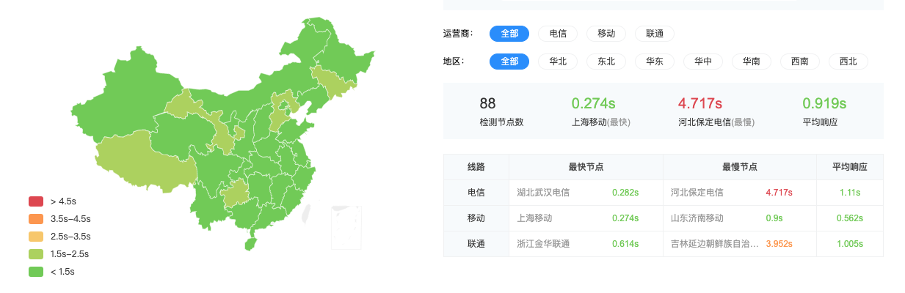

在上一篇文章 [从 Typecho 到 Hugo 的选择与迁移]() 中提到了 Hugo 很适合使用 Serverless 的方式部署并拓展功能。本文就通过博主 Cloudflare 和 Vercel 的使用经验对他们的网站托管（Cloudflare pages vs Vercel）和函数计算（Cloudflare workers vs Vercel function）服务进行简单的介绍和对比

<!--more-->

## 网站托管

Cloudflare pages 和 Vercel 都是十分强大的网站托管服务，提供以下基本特性：

- 支持从 Github、GitLab 等导入代码
- 支持多种预设框架自动构建，没有预置的框架可以手动提供构建命令和输出路径
- 支持绑定自定义域名
- 支持 CDN
- 支持生成预览版本

### Cloudflare pages


- 集成 Cloudflare Access，可以自定义访问策略
- 集成 Cloudflare Web Analytics，提供开箱即用的访问统计
- 其他 Cloudflare 提供的功能，详情可以参考我之前写过的一篇文章：[个人网站 CDN 选用指北]()


Cloudflare pages 提供的功能简单但是一般情况下已经足够了，它的主要优点是可以和 Cloudflare 的其他服务结合使用，如 DNS、CDN、WAF、Apps 等

### Vercel


- 丰富的可配置项：可以通过配置文件修改缓存规则、响应头、url 格式等，甚至配置路由规则（类似 Nginx 的 redirect 和 rewrite）
- 提供多种插件：Slack、MongoDB、Logtail 等
- 集成 Analytics，但是仅支持 Next.js、Nuxt.js、Gatsby
- 预览构建结果：提供文件管理器查看构建出的文件
- 提供易读易记的域名：格式类似这样：projectname-git-branch-username.vercel.app，在调试的时候很方便


Vercel 提供的功能要比 Cloudflare 丰富一些，但是它最吸引我的地方是它在国内的访问速度，下面放一下我的博客在 Cloudflare pages 和 Vercel 的访问速度对比图：

可以看出 Vercel 要远比 Cloudflare pages 快，甚至 Vercel 最慢的响应时间比 Cloudflare pages 平均响应时间还短。。。

另外 Vercel 支持配置无限量的路由规则，相比之下 Cloudflare pages 免费版只支持 5 条

## 函数计算

### Cloudflare workers


- 提供在线编辑器，可以方便的调试代码
- 添加新的 worker 无需重新部署网站
- 提供详细的用量、性能统计
- 支持 cron 触发器
- 提供开箱即用的 KV 存储



- 只支持 js


如果你只使用 js 的话 Cloudflare workers 比 Vercel function 要方便和好用很多

### Vercel function


- 支持多种语言：nodejs、php、python、ruby、go
- 支持包管理工具引入第三方库，如 go mod
- 提供实时 log 查看



- 必须重新部署整个网站才能发布对 function 的新增或修改
- 不提供在线编辑器，只能部署好后通过 log 调试
- 存储功能需要第三方服务支持


Vercel function 在对语言的支持上要强大很多，借助于对第三方数据库的集成你甚至可以部署 Typecho 或 WordPress。缺点是 Vercel function 与网站托管功能强耦合，必须重新部署整个网站才能发布对 function 的新增或修改，并且 function 不能使用独立的域名
