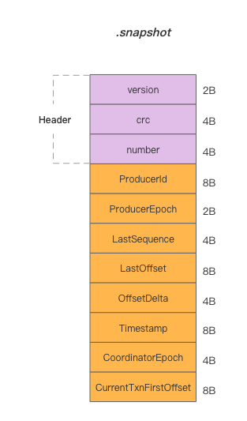
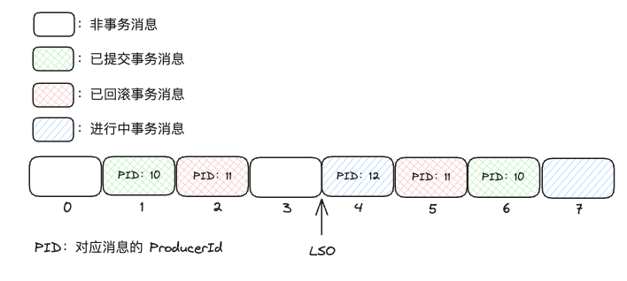

本文介绍 Kafka 和 RocketMQ 中的事务原理，提供的 ACID 保证，以及适用的场景与限制。

<!--more-->

## 事务

在讨论消息队列中的事务之前，需要先明确我们讨论事务的时候是在说什么：

> A transaction is a way for an application to group several reads and writes together into a logical unit. Conceptually, all the reads and writes in a transaction are executed as one operation: either the entire transaction succeeds (commit) or it fails (abort, rollback).
>
> -- Designing Data Intensive Applications

DDIA 中对事务的定义是这样的：事务是一种将多个读写操作组合成一个逻辑单元的方式，要么同时成功，要么同时失败。而事务所提供的安全保证通常由 ACID 来描述

### ACID 的含义

- **原子性（Atomicity）**

  事务是一个不可分割的工作单位，事务中的操作要么全部成功，要么全部失败。原子性并不解决并发问题，只是保证了不会有部分成功的场景出现。

- **一致性（Consistency）**

  一致性这个词在不同的上下文中有不同的含义：
  
  对于 CAP 理论来说，一致性是指在分布式系统中，所有节点上的数据是一致的即强一致性。而消息队列中的一致性是指最终一致性，即事务提交后所有节点上的数据最终会达到一致的状态。

- **隔离性（Isolation）**

  隔离性指的是多个事务并发执行时，一个事务的执行不应影响其他事务的执行。本文中讨论的隔离性是指读已提交（Read Committed）的隔离级别，即没有脏读。
  
  对于数据库系统，一般采用 MVCC 来实现隔离性，即一个数据会同时拥有多个值，根据当前所属的事务决定读取旧值还是新值。对于消息队列来说，不同消息之间没有关联，并且一旦写入就不能修改，隔离性的实现相对容易，下文会讨论 Kafka 如何使用位点来实现读已提交（Read Committed）的隔离级别。

- **持久性（Durability）**

  持久性最好理解，事务一旦提交或回滚，其结果就是永久性的。持久性的保证一般是通过将事务的操作写入到日志文件中来实现的，消息队列的事务实现也不例外，稍后会进行详细的讨论。

## Kafka 事务

首先从 Demo 开始，来看一下如何使用 Kafka 客户端完成一个事务：

```scala
// 事务初始化
val props = new Properties()
...
props.put(ProducerConfig.TRANSACTIONAL_ID_CONFIG, transactionalId)
props.put(ProducerConfig.ENABLE_IDEMPOTENCE_CONFIG, "true")

val producer = new KafkaProducer(props)
producer.initTransactions()
producer.beginTransaction()

// 消息发送
producer.send(RecordUtils.create(topic1, partition1, "message1"))
producer.send(RecordUtils.create(topic2, partition2, "message2"))

// 事务提交或回滚
producer.commitTransaction()
```

### 生产者幂等性

在创建 Kafka 生产者时设置了 `enable.idempotence` 参数，用于开启生产者幂等性。Kafka 的发送幂等是通过序列号来实现的，每个消息都会被分配一个序列号，序列号是递增的，这样就可以保证消息的顺序性。当生产者发送消息时，会将消息的序列号和消息内容一起写入到日志文件中，下次收到非预期序列号的消息就会返回 OutOfOrderSequenceException 异常。


设置 `enable.idempotence` 参数后，生产者会检查以下三个参数的值是否合法（ProducerConfig#postProcessAndValidateIdempotenceConfigs）

- `max.in.flight.requests.per.connection` 必须小于 5
- `retries` 必须大于 0
- `acks` 必须设置为 all


Kafka 将消息的序列号信息保存在分区维度的 `.snapshot` 文件中，格式如下（ProducerStateManager#ProducerSnapshotEntrySchema）：



我们可以发现，该文件中保存了 ProducerId、ProducerEpoch 和 LastSequence。所以幂等的约束为：相同分区、相同 Producer（id 和 epoch） 发送的消息序列号需递增。即 Kafka 的生产者幂等性只在单连接、单分区生效，Producer 重启或消息发送到其他分区就失去了幂等性的约束。


`.snapshot` 文件在 log segment 滚动时更新，发生重启后通过读取 `.snapshot` 文件和最新的日志文件即可恢复 Producer 的状态。Broker 的重启或分区迁移并不会影响幂等性。


### 事务初始化

Kafka Producer 启动后我们使用两个 API 来初始化事务：`initTransactions` 和 `beginTransaction`。

回顾一下我们的 Demo，在发送消息时是发送到两个不同分区中，这两个分区可能在不同的 Broker 上，所以我们需要一个全局的协调者 TransactionCoordinator 来记录事务的状态。

所以，在 `initTransactions` 中，Producer 首先发送 **ApiKeys.FIND_COORDINATOR** 请求获取 TransactionCoordinator。

之后即可向其发送 **ApiKeys.INIT_PRODUCER_ID** 请求获取 ProducerId 及  ProducerEpoch（也是上文中用于幂等的字段）。此步骤生成的 id 和 epoch 会写入内部 Topic `__transaction_state` 中，并且将事务的状态置为 `Empty`。


`__transaction_state` 是 compation Topic，其中消息的 key 为客户端设置的 `transactional.id`（详见 TransactionStateManager#appendTransactionToLog）。

区别于 ProducerId 是服务端生成的内部属性；TransactionId 由用户设置，用于标识业务视角认为的“同一个应用”，启动具有相同 TransactionId 的新 Producer 会使得未完成的事务被回滚并且来自旧 Producer（具有较小 epoch）的请求被拒绝掉。


后续 `beginTransaction` 用于开始一个事务，该方法会创建一个 Producer 内部事务状态，标识这一个事务的开始，并不会有 RPC 产生。

### 消息发送

上一节说到 `beginTransaction` 只是更改 Producer 内部状态，那么在第一条消息发送时才隐式开启了事务：

首先，Producer 会发送 **ApiKeys.ADD_PARTITIONS_TO_TXN** 请求到 TransactionCoordinator。TransactionCoordinator 会将这个分区加入到事务中，并更改事务的状态为 `Ongoing`，这些信息被持久化到 `__transaction_state` 中。

然后 Producer 使用 **ApiKeys.PRODUCE** 请求正常发送消息到对应的分区中。这条消息的可见性控制在下文消息消费一节中会详细讨论。

### 事务提交与回滚

当所有消息发送完成后，Producer 可以选择提交或回滚事务，此时：

- TransactionCoordinator：具有当前事务所有相关分区的信息
- 其他 Broker：已经将消息持久化到日志文件中

接下来 Producer 调用 `commitTransaction` 会发送 **ApiKeys.END_TXN** 请求将事务状态更改为 `PrepareCommit`（回滚事务对应状态 `PrepareAbort`）并持久化到 `__transaction_state` 中，此时从 Producer 的视角来看整个事务已经结束了。

TransactionCoordinator 会异步向各个 Broker 发送 **ApiKeys.WRITE_TXN_MARKERS** 请求，当所有参加事务的 Broker 都返回成功后，TransactionCoordinator 会将事务状态更改为 `CompleteCommit`（回滚事务对应状态 `CompleteAbort`）并持久化到 `__transaction_state` 中。

### 消息的消费

某个分区的消息可能是事务消息与非事务消息混杂的，如下图所示：



在 Broker 处理 **ApiKeys.PRODUCE** 请求时，完成消息持久化会更新 LSO（log stable offset）到第一条未提交的事务消息的 offset。这样在消费者消费消息时，可以通过 LSO 来判断消息是否可见：如果设置了 `isolation.level` 为 read_committed 则只会消费 LSO 之前的消息。

但是我们可以发现 LSO 之前存在已回滚的消息（图中红色矩形）这些消息应该被过滤掉：在 Broker 处理 **ApiKeys.WRITE_TXN_MARKERS** 请求时，会将已回滚的消息索引写入到 `.txnindex` 文件中（LogSegmentKafka#updateTxnIndex）。

后续 Consumer 消费消息时还会收到对应区间的已取消事务消息列表，上图区间中的该列表为：

| ProducerId | StartOffset | EndOffset |
|:----------:|:-----------:|:---------:|
|     11     |      2      |     5     |

代表 offset 在 [2, 5] 之间且由 id 为 11 的 Producer 发送的消息都已回滚。


上文我们讨论了 `__transaction_state` 的实现确保同一时间，同一 TransactionId 有且只有一个事务在进行中。所以可以使用 ProducerId 和 offset 区间定位回滚的消息不回发生冲突。


### Kafka 事务提供的 ACID 保证

- **原子性（Atomicity）**

  Kafka 通过对 `__transaction_state` Topic 的写入实现了事务状态的转移，保证了事务要么同时提交，要么同时回滚。

- **一致性（Consistency）**

  在事务进入 `PrepareCommit` 或 `PrepareAbort` 阶段时， TransactionCoordinator 异步向所有参与事务的 Broker 提交或回滚事务。这使得 Kafka 的事务做不到强一致性，只能通过不断重试保证最终一致性。

- **隔离性（Isolation）**

  Kafka 通过 LSO 机制和 `.txnindex` 文件来避免脏读，实现读已提交（Read Committed）的隔离级别。

- **持久性（Durability）**

  Kafka 通过将事务状态写入到 `__transaction_state` Topic 和消息写入到日志文件中来保证持久性。

### Kafka 事务的场景与限制

Kafka 目前用于流处理的场景：相当于一个有向无环图（DAG，Directed acyclic graph）每个节点是一个 Kafka Topic，每条边是一个流处理操作。在这样的场景下，有两种操作：

- 消费上游消息并提交位点（相当于将位点写入 __consumer_offsets Topic）
- 处理消息并发送到下游 Topic

对于由两种操作构成的一组处理流程需要具备事务语义，这样我们就可以不重复（Exactly Once）的处理上游消息并将结果可靠的存储在下游 Topic 中。

但是，Kafka 事务并不能支持业务方事务，强限制上游的消费和下游写入都需要是同一个 Kafka 集群，否则就不具备原子性保障。
