## 从消息的生命周期看可观测能力

RocketMQ 的可观测能力是围绕着消息的生命周期构建的，下图是生产者、消费者和服务端交互的流程：

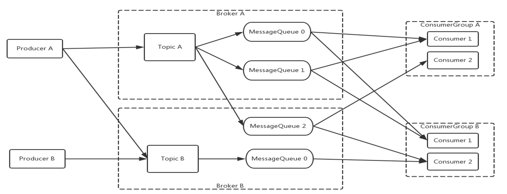

RocketMQ 的消息是按照队列的方式分区有序储存的。RocketMQ 的队列模型使得生产者、消费者和读写队列都是多对多的映射关系，彼此之间都可以无限水平扩展。对比传统的消息队列如 RabbitMQ 是很大的优势。尤其是在流式处理场景下有天然优势，能够保证同一队列的消息被相同的消费者处理，对于批量处理、聚合处理更友好

接下来我们来看一下消息的整个生命周期中需要关注的重要节点：

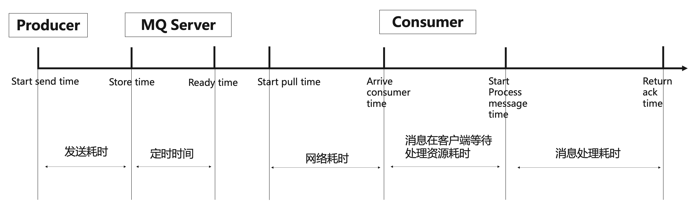

首先是消息发送：发送耗时是指一条消息从生产者开始发送到服务端接收到并储存在硬盘上的时间。如果是定时消息，需要到达指定的定时时间才能被消费者可见

RocketMQ 提供了消息堆积的特性，即消息发送到服务端后并不一定立即被拉取，可以按照客户端的消费能力进行投递

从消费者的角度上看，有三个需要关注的阶段：

- 拉取消息：消息从开始拉取到抵达客户端的网络和服务端处理耗时
- 消息排队：等待处理资源，即从消息抵达客户端到开始处理消息
- 消息消费：从开始处理消息到最后提交位点/返回 ACK

消息在生命周期的任何一个阶段，都可以清晰地被定义并且被观测到，这就是 RocketMQ 可观测的核心理念

## RocketMQ 4.x Metrics 实现 -- Exporter

RocketMQ 团队贡献的 RocketMQ exporter 已被 Prometheus 官方的开源 Exporter 生态所收录，提供了 Broker、Producer、Consumer 各个阶段丰富的监控指标

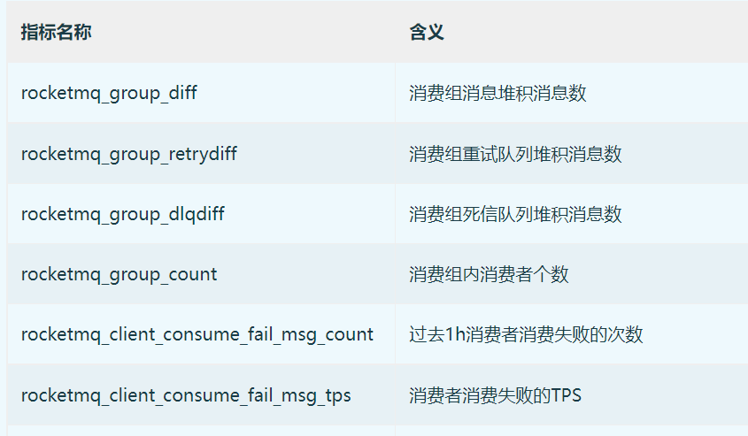

### Exporter 原理解析

RocketMQ expoter 获取监控指标的流程如下图所示，Expoter 通过 MQAdminExt 向 RocketMQ 集群请求数据。获取的数据转换成 Prometheus 需要的格式，然后通过 /metics 接口暴露出来

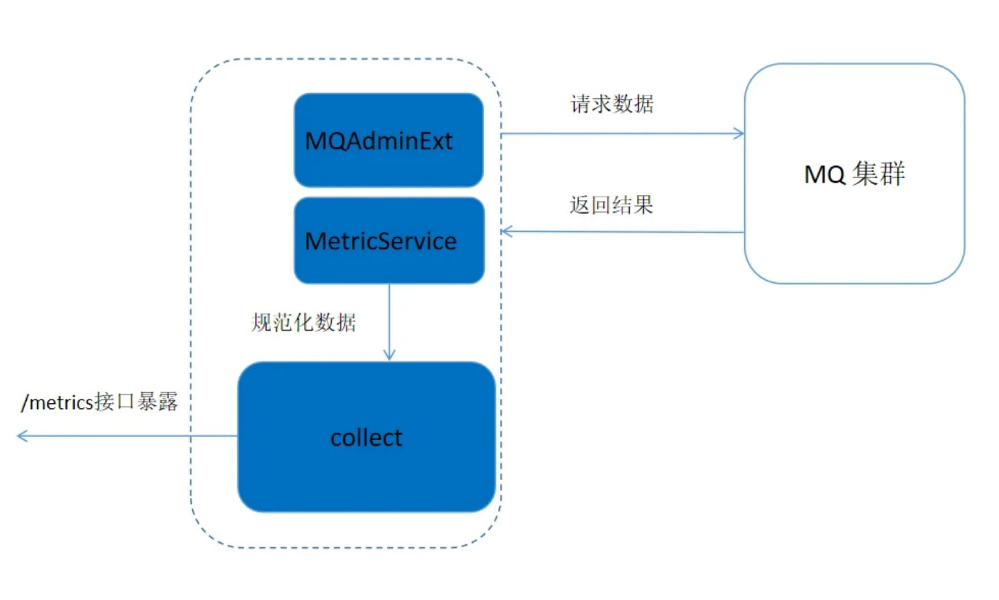

## RocketMQ 5.x 原生 Metrics 实现

随着 RocketMQ 的演进，exporter 模式逐渐暴露出一些缺陷：

- 无法支持 RocketMQ 5.x 中新加入的 proxy 等模块的可观测需求
- 指标定义不符合 Prometheus 规范
- 大量 RPC 调用给 Broker 带来额外的压力

为解决以上问题，我们在 RocketMQ 中推出了基于 OpenTelemtry 的 Metrics 方案

### 基于 OpenTelemtry 的 Metrics

### 指标定义

OpenTelemetry 是 CNCF 的一个可观测性项目，旨在提供可观测性领域的标准化方案，解决观测数据的数据模型、采集、处理、导出等的标准化问题，提供与三方 vendor 无关的服务

RocketMQ 在设计新的 Metrics 方案是决定遵守社区规范。新 metrics 的指标完全重新设计，数据类型选用兼容 promethues 的 Counter、Guage、Histogram，并且遵循 promthues 指标命名规范，与 exporter 的指标不兼容。指标覆盖 broker、proxy、producer、consumer，对消息生命周期的全阶段提供监控

### 上报方式

我们提供了两种指标上报的方式：Pull 和 Push

Pull 模式旨在与 Prometheus 兼容。特别是在 K8S 部署环境中，Prometheus 可以直接从 broker/proxy 提供的 endpoint 中拉取 metrics 数据，无需部署额外的组件

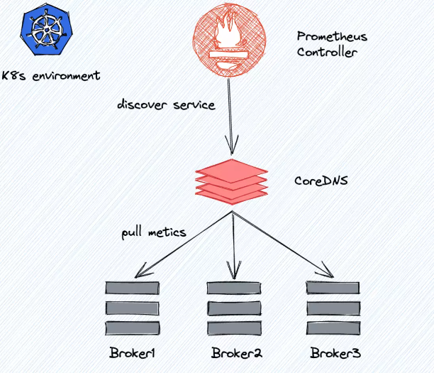

OpenTelemetry 推荐使用 Push 模式，这意味着它需要部署一个 collector 来传输指标数据

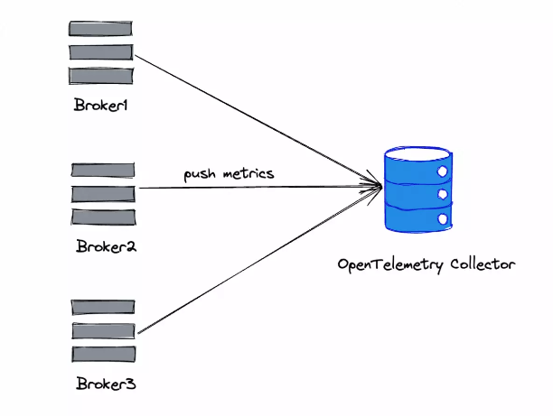

OpenTelemetry 官方提供了 collector 的实现，支持对指标做自定义操作如过滤、富化

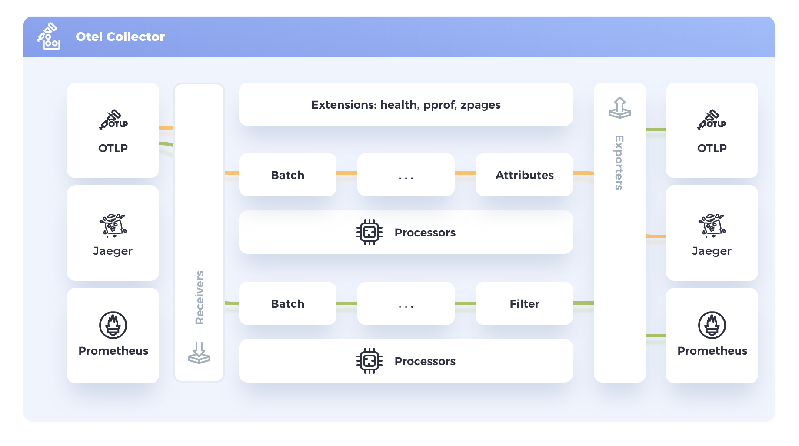

#### 兼容 Exporter

新的 Metrics 也支持对 Exporter 的兼容，现在使用 exporter 的用户无需变更部署架构即可接入新 Metrics。而且控制面应用（如 Promethues）和数据面应用（如 RocketMQ）有可能隔离部署。因此借助 Exporter 作为代理来获取新的 Metrics 数据也不失为一种好的选择

我们在 Exporter 中实现一个 OpenTelemetry collector: Broker 将 Metrics 数据导出到 Exporter，而 Exporter 为 Prometheus 访问提供了一个新的 endpoint

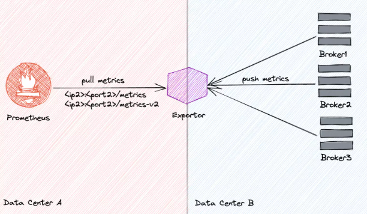

## 构建监控体系最佳实践

丰富的指标覆盖与对社区标准的遵循使得我们可以轻而易举的构建出我们的监控体系，本文主要以如下流程介绍

集群监控/巡检 -> 触发告警 -> 排查分析

### 集群状态监控与巡检

我们将指标采集到 Promethues 后就可以基于这些指标配置监控，这里给出一些示例：

接口监控：
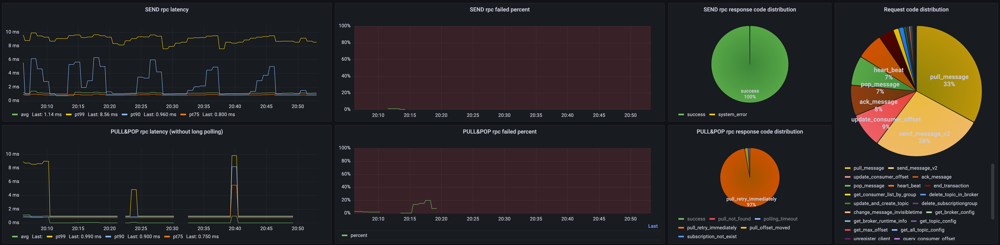

客户端监控：
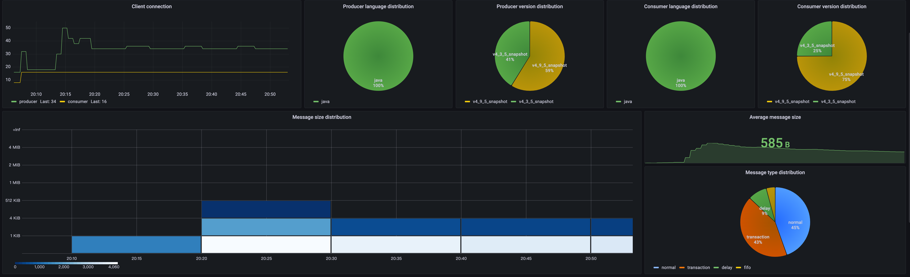

Broker 监控：
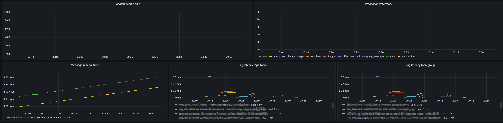

### 告警配置

有了完善的监控就可以对需要关注的指标配置告警：

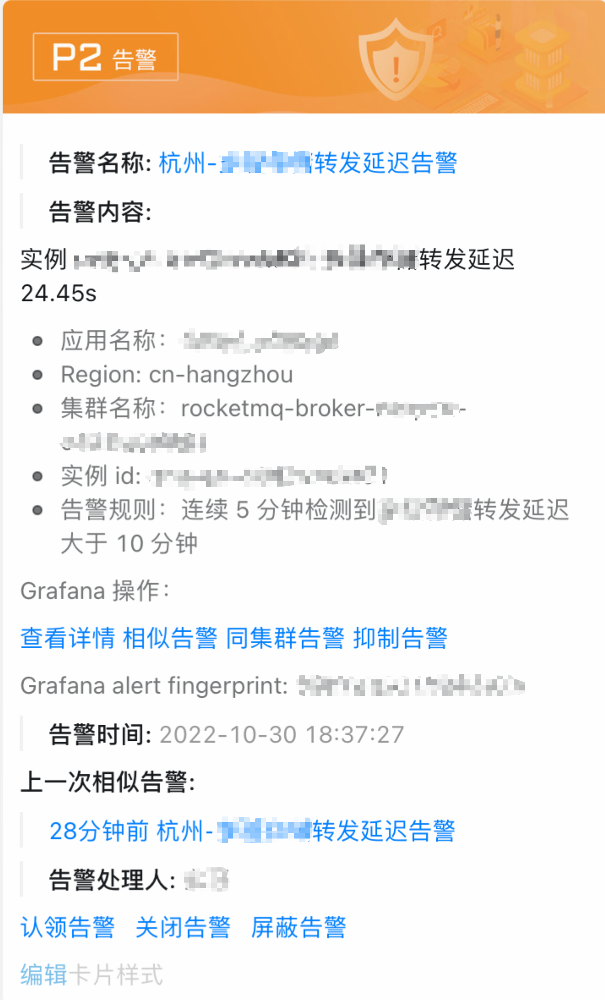

收到告警后可以联动监控查看具体原因：

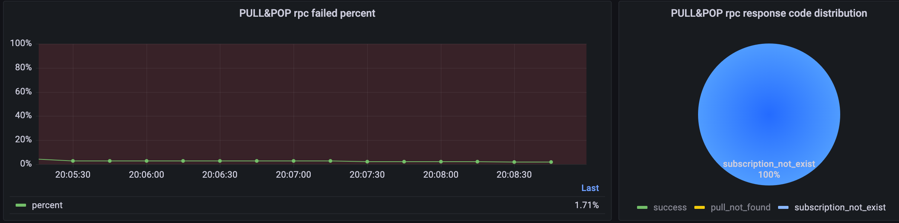

### 问题排查分析

我们以消息堆积的为例来看一下如何基于 Metrics 分析线上问题

#### 从消息生命周期看堆积问题

对于堆积问题，我们主要关注消息生命周期中的两个阶段：

- 就绪消息：就绪消息是可供消费但还未被拉取的消息，即在服务端堆积的消息
- 处理中消息：处理中的消息是被客户端拉取但是还未被消费的消息

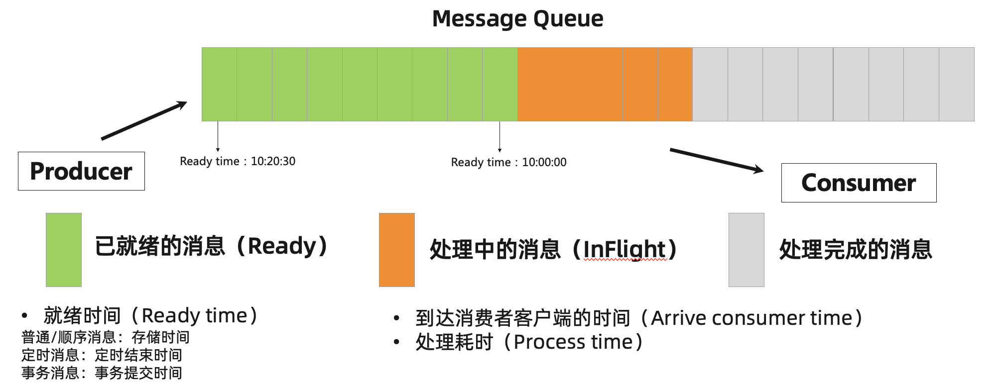

#### 多维度指标分析

关于就绪消息和处理中消息我们提供了 `rocketmq_consumer_ready_messages` 和 `rocketmq_consumer_inflight_messages` 这两个指标，结合其他指标与客户端配置综合分析即可判断出消息堆积的根因

- case 1：就绪消息持续上涨，处理中消息达到客户端堆积上限

这是最常见的堆积场景，客户端处理中的消息量（`rocketmq_consumer_inflight_messages`）达到了客户端配置的阈值，即消费者的消费能力低于消息发送量，此时需要增加消费者数量或者等待业务高峰过去后再消化堆积的消息

- case 2：就绪消息几乎为 0，处理中消息持续上涨

这个 case 多出现在使用 RocketMQ 4.x 客户端的场景，此时消费位点是顺序提交的，如果某条消息的消费卡住会导致位点无法提交看起来的现象是消息在客户端大量堆积。可以结合消费轨迹和 `rocketmq_process_time` 这个指标抓出消费慢的消息分析上下游链路，找到根因

- case 3: 就绪消息持续上涨，处理中消息几乎为 0

此种场景说明客户端没有拉取到消息，一般有如下几种情况：

  - 鉴权问题：检查 ACL 配置，如果使用公有云产品请检查 AK、SK 配置
  - 消费者 hang 住：尝试打印线程堆栈或 gc 信息判断是否是进程 hang 住
  - 服务端响应慢：结合 RPC 等相关指标，查看拉取消息接口调用量与耗时检查是否为服务端问题，如磁盘 IO 被打满了
