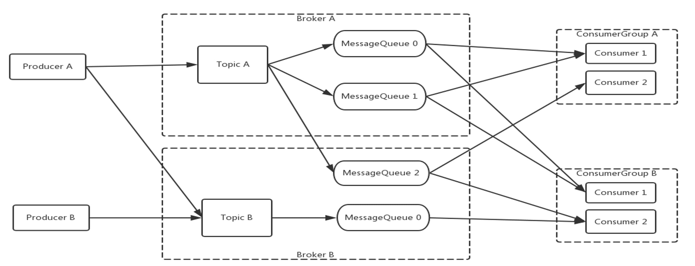
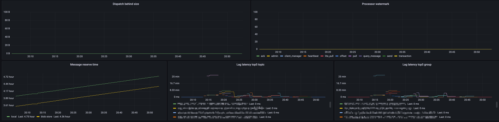

## 从消息的生命周期看可观测能力

在进入主题之前先来看一下 RocketMQ 生产者、消费者和服务端交互的流程：

RocketMQ 的消息是按照队列的方式分区有序储存的，这种队列模型使得生产者、消费者和读写队列都是多对多的映射关系，彼此之间可以无限水平扩展。对比传统的消息队列如 RabbitMQ 是很大的优势，尤其是在流式处理场景下能够保证同一队列的消息被相同的消费者处理，对于批量处理、聚合处理更友好

接下来我们来看一下消息的整个生命周期中需要关注的重要节点：

首先是消息发送：发送耗时是指一条消息从生产者开始发送到服务端接收到并储存在硬盘上的时间。如果是定时消息，需要到达指定的定时时间才能被消费者可见

服务端收到消息后需要根据消息类型进行处理，对于定时/事务消息只有到了定时时间/事务提交才对消费者可见。RocketMQ 提供了消息堆积的特性，即消息发送到服务端后并不一定立即被拉取，可以按照客户端的消费能力进行投递

从消费者的角度上看，有三个需要关注的阶段：

- 拉取消息：消息从开始拉取到抵达客户端的网络和服务端处理耗时
- 消息排队：等待处理资源，即从消息抵达客户端到开始处理消息
- 消息消费：从开始处理消息到最后提交位点/返回 ACK

消息在生命周期的任何一个阶段，都可以清晰地被定义并且被观测到，这就是 RocketMQ 可观测的核心理念。而本文要介绍的 Metrics 就践行了这种理念，提供覆盖消息生命周期各个阶段的监控埋点。借助 Metrics 提供的原子能力我们可以搭建适合业务需要的监控系统：

- 日常巡检与监控预警
- 宏观趋势/集群容量分析
- 故障问题诊断

## RocketMQ 4.x Metrics 实现 -- Exporter

RocketMQ 团队贡献的 RocketMQ exporter 已被 Prometheus 官方的开源 Exporter 生态所收录，提供了 Broker、Producer、Consumer 各个阶段丰富的监控指标



### Exporter 原理解析

RocketMQ expoter 获取监控指标的流程如下图所示，Expoter 通过 MQAdminExt 向 RocketMQ 集群请求数据。获取的数据转换成 Prometheus 需要的格式，然后通过 /metics 接口暴露出来



随着 RocketMQ 的演进，exporter 模式逐渐暴露出一些缺陷：

- 无法支持 RocketMQ 5.x 中新加入的 Proxy 等模块的可观测需求
- 指标定义不符合开源规范，难以和其他开源可观测组件搭配使用
- 大量 RPC 调用给 Broker 带来额外的压力
- 拓展性差，增加/修改指标需要先修改 Broker 的 admin 接口

为解决以上问题，RocketMQ 社区决定拥抱社区标准，在 RocketMQ 5.x 中推出了基于 OpenTelemtry 的 Metrics 方案

## RocketMQ 5.x 原生 Metrics 实现

### 基于 OpenTelemtry 的 Metrics

OpenTelemetry 是 CNCF 的一个可观测性项目，旨在提供可观测性领域的标准化方案，解决观测数据的数据模型、采集、处理、导出等的标准化问题，提供与三方 vendor 无关的服务

在讨论新的 Metrics 方案时 RocketMQ 社区决定遵守 OpenTelemetry 规范，完全重新设计新 metrics 的指标定义：数据类型选用兼容 Promethues 的 Counter、Guage、Histogram，并且遵循 Promethues 推荐的指标命名规范，不兼容旧有的 rocketmq-exporter 指标。新指标覆盖 broker、proxy、producer、consumer 等各个 module，对消息生命周期的全阶段提供监控能力

### 指标上报方式

我们提供了三种指标上报的方式：

- Pull 模式：适合自运维 K8s 和 Promethues 集群的用户
- Push 模式：适合希望对 metrics 数据做后处理或接入云厂商的可观测服务的用户
- Exporter 兼容模式：适合已经在使用 Exporter 和有跨数据中心（或其他网络隔离环境）传输 metrics 数据需求的用户

#### Pull

Pull 模式旨在与 Prometheus 兼容。在 K8s 部署环境中无需部署额外的组件，prometheus 可以通过社区提供的 K8s 服务发现机制（创建 PodMonitor、ServiceMonitor CDR）自动获取要拉取的 broker/proxy 列表，并从他们提供的 endpoint 中拉取 metrics 数据



#### Push

OpenTelemetry 推荐使用 Push 模式，这意味着它需要部署一个 collector 来传输指标数据



OpenTelemetry 官方提供了 collector 的实现，支持对指标做自定义操作如过滤、富化，可以利用社区提供的插件实现自己的 collector。并且云厂商提供的可观测服务（如 AWS CloudWatch、阿里云 SLS）大多已经拥抱了 OpenTelemetry 社区，可以直接将数据推送到它们提供的 collector 中，无需额外的组件进行桥接



#### 兼容 RocketMQ Exporter

新的 Metrics 也提供对 RocketMQ Exporter 的兼容，现在使用 exporter 的用户无需变更部署架构即可接入新 Metrics。而且控制面应用（如 Promethues）和数据面应用（如 RocketMQ）有可能隔离部署。因此借助 Exporter 作为代理来获取新的 Metrics 数据也不失为一种好的选择

RocketMQ 社区在 Exporter 中嵌入了一个 OpenTelemetry collector 实现，Broker 将 Metrics 数据导出到 Exporter，Exporter 提供了一个新的 endpoint（下图中的 metrics-v2）供 Prometheus 拉取



## 构建监控体系最佳实践

丰富的指标覆盖与对社区标准的遵循使得可以轻而易举的借助 RocketMQ 的 Metrics 能力构建出适合业务需求的监控体系，这个章节主要以一个典型的流程介绍构建监控体系的最佳实践：

集群监控/巡检 -> 触发告警 -> 排查分析

### 集群状态监控与巡检

我们将指标采集到 Promethues 后就可以基于这些指标配置监控，这里给出一些示例：

接口监控：
监控接口调用情况，可以据此快速抓出异常的请求对症下药
下图给出一些相关示例：所有 RPC 的耗时（avg、pt90、pt99 等）、成功率、失败原因、接口调用与返回值分布情况等

客户端监控：
监控客户端的使用情况，发现非预期的客户端使用如超大消息发送、客户端上下线、客户端版本治理等
下图给出一些相关示例：客户端连接数、客户端语言/版本分布、发送的消息大小/类型分布

Broker 监控：
监控 Broker 的水位和服务质量，及时发现集群容量瓶颈
下图给出一些相关示例：Dispatch 延迟、消息保留时间、线程池排队、消息堆积情况

以上的示例只是 Metrics 的冰山一角，需要根据业务需要灵活组合不同的指标配置监控与巡检

### 告警配置

有了完善的监控就可以对需要关注的指标配置告警，比如可以配置 Broker 监控中 Dispatch 延迟这个指标的告警：



收到告警后可以联动监控查看具体原因，关联发送接口的失败率可以发现有 1.7% 的消费发送失败，对应的报错是没有创建订阅组：

### 问题排查分析

最后以消息堆积这个场景为例来看一下如何基于 Metrics 分析线上问题

#### 从消息生命周期看堆积问题

正如本文开篇所述，排查 RocketMQ 的问题需要结合消息的生命周期综合分析，如果片面的认定是服务端/客户端的故障未免会误入歧途

对于堆积问题，我们主要关注消息生命周期中的两个阶段：

- 就绪消息：就绪消息是可供消费但还未被拉取的消息，即在服务端堆积的消息
- 处理中消息：处理中的消息是被客户端拉取但是还未被消费的消息

#### 多维度指标分析堆积问题

对于堆积问题，RocketMQ 提供了消费延迟相关指标 `rocketmq_consumer_lag_latency` 可以基于这个指标配置告警。告警的阈值需要根据当前业务对消费延迟的容忍程度灵活指定

触发告警后就需要对消息堆积在还是就绪消息和处理中消息进行分析，RocketMQ 提供了 `rocketmq_consumer_ready_messages` 和 `rocketmq_consumer_inflight_messages` 这两个指标，结合其他消费相关指标与客户端配置综合分析即可判断出消息堆积的根因：

- case 1：就绪消息持续上涨，处理中消息达到客户端堆积上限

这是最常见的堆积场景，客户端处理中的消息量 `rocketmq_consumer_inflight_messages` 达到了客户端配置的阈值，即消费者的消费能力低于消息发送量。如果业务要求尽可能实时的消费消息就需要增加消费者机器数量，如果业务对消息延迟不是很敏感可以等待业务高峰过去后再消化堆积的消息

- case 2：就绪消息几乎为 0，处理中消息持续上涨

这个 case 多出现在使用 RocketMQ 4.x 客户端的场景，此时消费位点是顺序提交的，如果某条消息的消费卡住会导致位点无法提交。看起来的现象是消息在客户端大量堆积，即处理中消息持续上涨。可以结合消费轨迹和 `rocketmq_process_time` 这个指标抓出消费慢的消息分析上下游链路，找到根因优化消费逻辑

- case 3: 就绪消息持续上涨，处理中消息几乎为 0

此种场景说明客户端没有拉取到消息，一般有如下几种情况：

- 鉴权问题：检查 ACL 配置，如果使用公有云产品请检查 AK、SK 配置
- 消费者 hang 住：尝试打印线程堆栈或 gc 信息判断是否是进程卡死
- 服务端响应慢：结合 RPC 相关指标查看拉取消息接口调用量与耗时、硬盘读写延迟。检查是否为服务端问题，如硬盘 IOPS 被打满了等等
